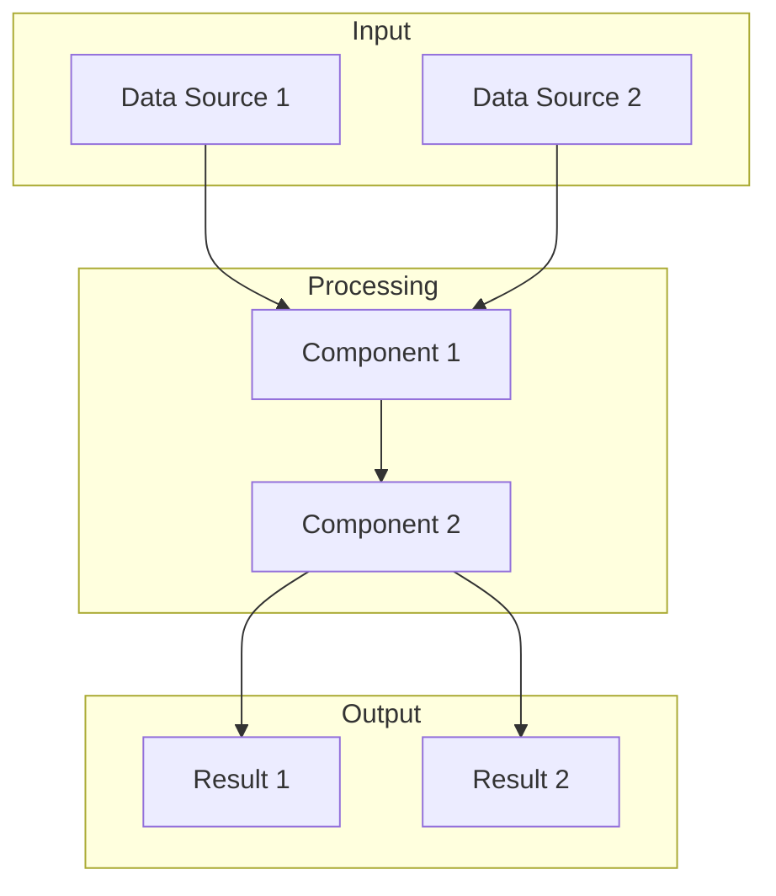
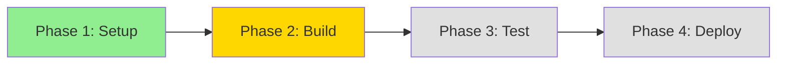
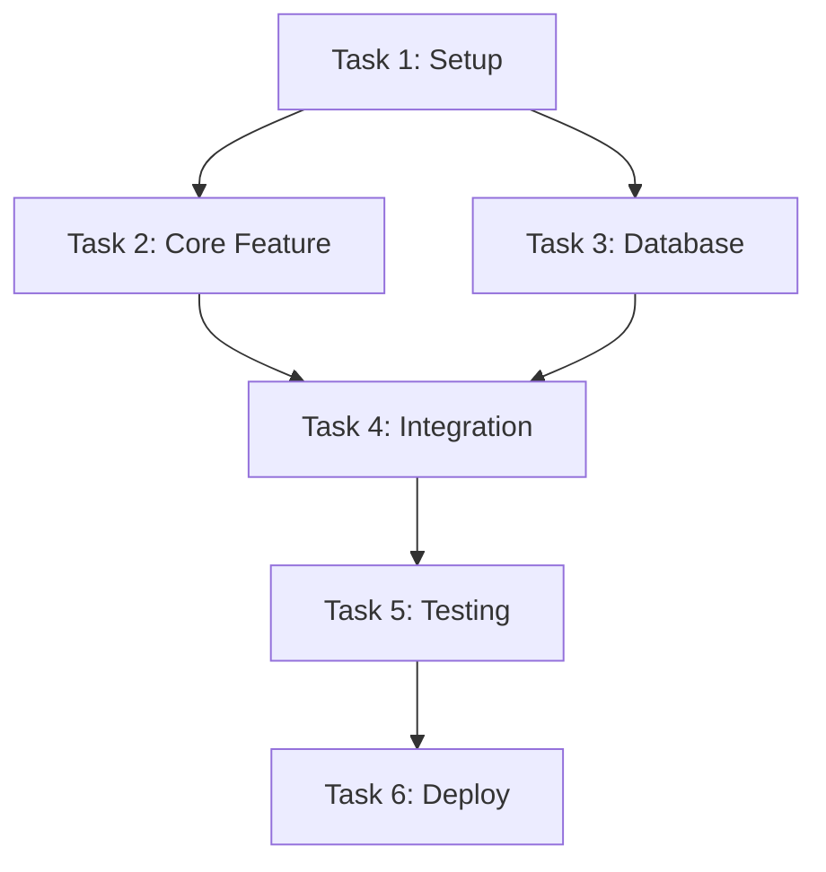
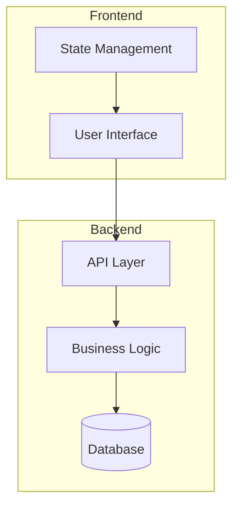
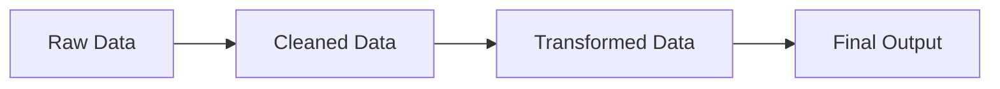
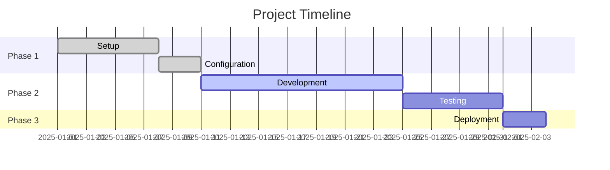
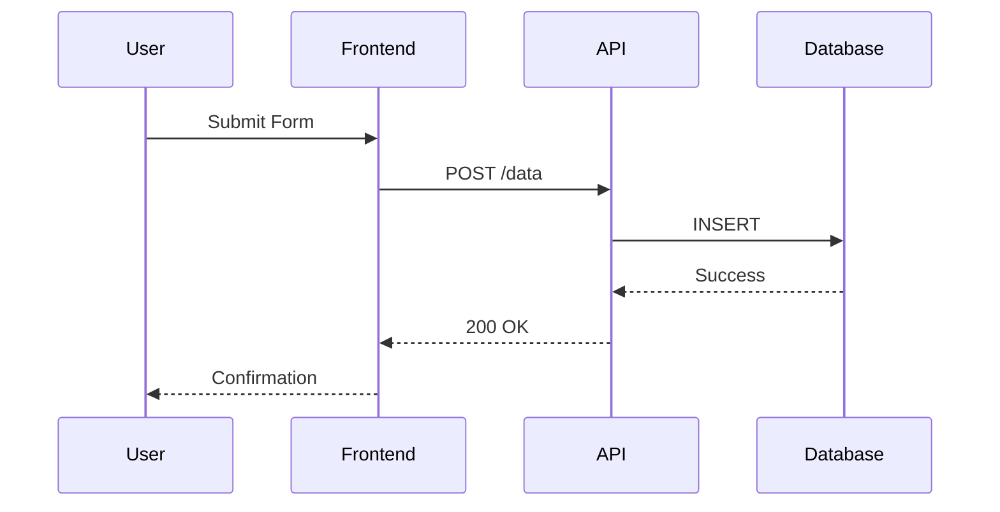
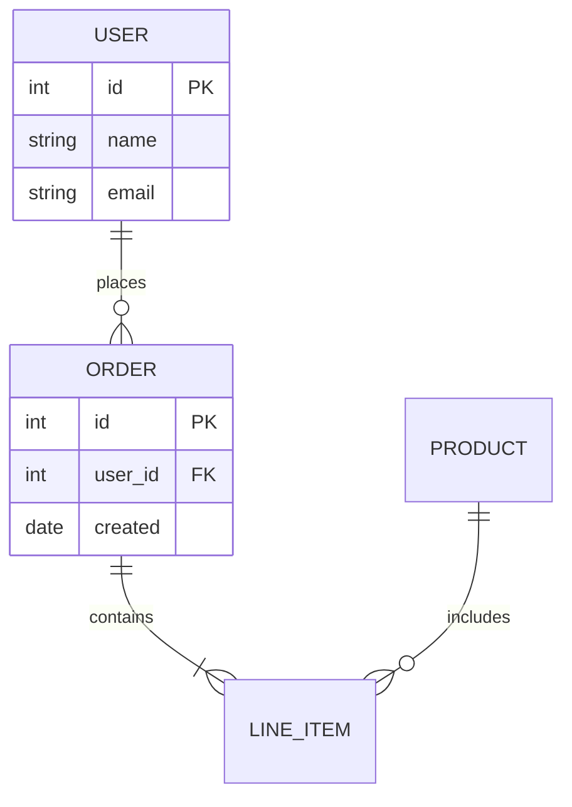
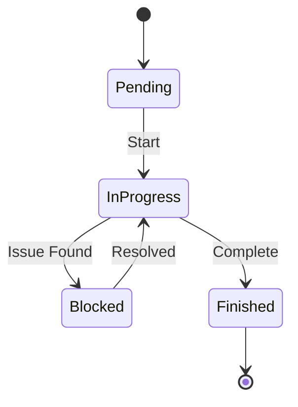

# Mermaid Overview Template

Use this template to create visual project overviews with Mermaid diagrams.

---

# Project Overview: [Project Name]

**Last Updated:** [Date]

## High-Level Architecture

## Phase Flow

**Legend:**
- Green: Completed
- Yellow: In Progress
- Gray: Pending

## Task Dependencies

## Component Diagram

## Data Flow

## Timeline / Gantt

## Sequence Diagram (for workflows)

## Entity Relationship (for data models)

## State Diagram (for status flows)

---

## Usage Notes

1. **Keep diagrams simple** - If it's too complex, break into multiple diagrams
2. **Use subgraphs** to group related components
3. **Add styling** to show status (colors)
4. **Update regularly** - Diagrams should reflect current state
5. **Include legend** when using colors or symbols
