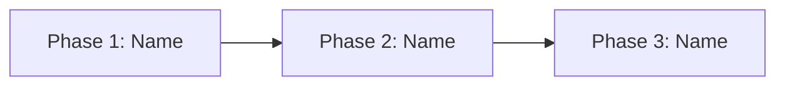

# Project Phases Template

Use this template for projects with distinct phases.

---

# Project Phases: [Project Name]

**Last Updated:** [Date]

## Overview

[Brief description of how the project is structured into phases]

## Phase Summary

| Phase | Name | Status | Tasks | Progress |
|-------|------|--------|-------|----------|
| 1 | [Name] | Active | 3/5 | 60% |
| 2 | [Name] | Pending | 0/4 | 0% |
| 3 | [Name] | Pending | 0/3 | 0% |

## Phase Definitions

### Phase 1: [Phase Name]

**Status:** Active / Completed / Pending
**Target Completion:** [Date]

**Description:**
[What this phase accomplishes]

**Inputs:**
- [What this phase receives/requires]
- [Prerequisites]

**Outputs:**
- [What this phase produces]
- [Deliverables]

**Components:**
- **Component 1.1**: [Name] - [Description]
- **Component 1.2**: [Name] - [Description]

**Related Tasks:** [task-1, task-2, task-3]

**Success Criteria:**
- [ ] [Criterion 1]
- [ ] [Criterion 2]

---

### Phase 2: [Phase Name]

**Status:** Pending
**Target Completion:** [Date]

**Description:**
[What this phase accomplishes]

**Inputs:**
- [What this phase receives]

**Outputs:**
- [What this phase produces]

**Components:**
- **Component 2.1**: [Name] - [Description]

**Related Tasks:** []

**Success Criteria:**
- [ ] [Criterion 1]

**Dependencies:** Phase 1 must be complete

---

### Phase 3: [Phase Name]

**Status:** Pending
**Target Completion:** [Date]

**Description:**
[What this phase accomplishes]

**Inputs:**
- [What this phase receives]

**Outputs:**
- [Final deliverables]

**Components:**
- **Component 3.1**: [Name] - [Description]

**Related Tasks:** []

**Success Criteria:**
- [ ] [Criterion 1]

**Dependencies:** Phase 2 must be complete

---

## Phase Flow Diagram

## Change Log

| Date | Change | Reason |
|------|--------|--------|
| [Date] | Initial phase structure created | Project kickoff |
| [Date] | [Change description] | [Reason] |
