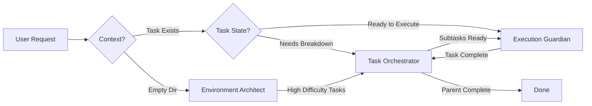

# Claude Code Agent Architecture

## Overview

The Claude Code environment uses a **3-agent architecture** with zero overlap and clear compartmentalization. Each agent owns a specific lifecycle phase, ensuring no conflicts and maximum clarity.

## Design Principles

### 1. Lifecycle-Based Separation
Each agent owns exactly one phase of the project lifecycle:
- **Initialization Phase** → Environment Architect
- **Planning Phase** → Task Orchestrator
- **Execution Phase** → Execution Guardian

### 2. Exclusive Ownership
- Each script is owned by exactly ONE agent
- Each command is owned by exactly ONE agent
- No shared responsibilities or overlapping triggers

### 3. State-Based Exclusivity
Task state determines which agent can act:
- **No .claude/ folder** → Only Environment Architect
- **Task status: Pending/Broken Down** → Only Task Orchestrator
- **Task status: In Progress** → Only Execution Guardian
- **Task status: Finished** → No agent modifies

## The Three Agents

### Environment Architect
**Purpose**: Create new project environments from specifications

**Key Characteristics**:
- First agent to act in any project
- Only operates on empty/new directories
- Never touches existing tasks
- Completes and exits after environment creation

**Ownership**:
- Scripts: bootstrap.py, pattern-matcher.py, test-templates.py
- Commands: smart-bootstrap.md, bootstrap.md
- Phase: Before project structure exists

### Task Orchestrator
**Purpose**: Manage task hierarchy and breakdown

**Key Characteristics**:
- Handles all task organization operations
- Breaks down high-difficulty tasks
- Manages parent-child relationships
- Never executes actual work

**Ownership**:
- Scripts: task-manager.py, schema-validator.py, dependency-analyzer.py, breakdown-suggester.py
- Commands: breakdown.md, sync-tasks.md
- Phase: Task planning and organization

### Execution Guardian
**Purpose**: Oversee task execution with quality gates

**Key Characteristics**:
- Enforces validation gates
- Manages checkpoints and recovery
- Tracks progress and confidence
- Never modifies task structure

**Ownership**:
- Scripts: validation-gates.py, checkpoint-manager.py, metrics-dashboard.py
- Commands: complete-task.md, validate-assumptions.md, check-risks.md
- Phase: Active task execution

## Workflow Sequence



## Handoff Protocol

### Environment Architect → Task Orchestrator
**Trigger**: Environment created with difficulty ≥7 tasks
**Data Passed**: Task IDs, difficulty scores, initial structure
**Message**: "Environment created with N high-difficulty tasks requiring breakdown"

### Task Orchestrator → Execution Guardian
**Trigger**: Breakdown complete, subtasks ready
**Data Passed**: Subtask IDs, dependencies, recommended sequence
**Message**: "Breakdown complete. N subtasks ready for execution"

### Execution Guardian → Task Orchestrator
**Trigger**: Subtask completed
**Data Passed**: Completed task ID, parent ID, metrics
**Message**: "Task X completed. Check parent Y for auto-completion"

## Conflict Prevention

### Rule 1: Mutual Exclusion by Phase
```python
if not exists(".claude/"):
    only_agent = "environment-architect"
elif task.status in ["Pending", "Broken Down"]:
    only_agent = "task-orchestrator"
elif task.status == "In Progress":
    only_agent = "execution-guardian"
else:
    only_agent = None
```

### Rule 2: No Shared Operations
Every operation belongs to exactly one agent:

| Operation | Environment Architect | Task Orchestrator | Execution Guardian |
|-----------|---------------------|-------------------|-------------------|
| Template Detection | ✓ | | |
| Environment Generation | ✓ | | |
| Task Breakdown | | ✓ | |
| Dependency Analysis | | ✓ | |
| Validation Gates | | | ✓ |
| Checkpoints | | | ✓ |

### Rule 3: Clear State Transitions
```
[Empty] --Architect--> [Initialized]
[Initialized] --Orchestrator--> [Planned]
[Planned] --Guardian--> [Executing]
[Executing] --Guardian--> [Complete]
[Complete] --Orchestrator--> [Parent Updated]
```

## Decision Tree

```python
def select_agent(context):
    if is_empty_directory(context):
        return "environment-architect"

    if not has_task(context):
        return None  # No agent needed

    task = get_task(context)

    if needs_breakdown(task):
        return "task-orchestrator"

    if needs_execution(task):
        return "execution-guardian"

    if needs_sync(task):
        return "task-orchestrator"

    return None  # Default behavior
```

## Benefits of This Architecture

### 1. Zero Conflicts
- No overlapping responsibilities
- No competing agents for same operation
- Clear ownership boundaries

### 2. Simple Mental Model
- Users know which agent handles what
- Predictable behavior
- Easy to debug issues

### 3. Maintainability
- Only 3 agents to maintain
- Clear separation of concerns
- Modular design

### 4. Scalability
- Can enhance agents independently
- No ripple effects between agents
- Clean interfaces

### 5. Performance
- No redundant operations
- Efficient handoffs
- Minimal coordination overhead

## Implementation Status

### Phase 1: Foundation (Current)
- [x] Agent definitions created
- [x] Ownership matrix defined
- [x] Architecture documented
- [ ] Commands updated to use agents
- [ ] Basic testing completed

### Phase 2: Integration (Next)
- [ ] Handoff protocol implemented
- [ ] Conflict prevention validated
- [ ] Performance metrics collected
- [ ] User feedback incorporated

### Phase 3: Optimization (Future)
- [ ] Learning patterns implemented
- [ ] Cross-project intelligence
- [ ] Advanced error recovery
- [ ] Predictive capabilities

## Usage Examples

### Example 1: New Project Bootstrap
```bash
User: "Create environment from spec: requirements.md"

System: [Detects empty directory]
System: [Activates Environment Architect]
Environment Architect: "Analyzing specification..."
Environment Architect: "Detected power-query template (92% confidence)"
Environment Architect: "Generated environment with 5 initial tasks"
Environment Architect: "Task 003 has difficulty 8, needs breakdown"
Environment Architect: [Handoff to Task Orchestrator]
Task Orchestrator: "Breaking down task 003 into subtasks..."
```

### Example 2: Task Execution
```bash
User: "Complete task 001_2"

System: [Task exists, status = Pending]
System: [Activates Execution Guardian]
Execution Guardian: "Running pre-execution validation gates..."
Execution Guardian: "All gates PASSED, beginning execution"
Execution Guardian: "Creating checkpoint before risky operation"
Execution Guardian: "Task completed successfully"
Execution Guardian: [Handoff to Task Orchestrator]
Task Orchestrator: "Checking if parent 001 can be auto-completed"
```

### Example 3: Task Breakdown
```bash
User: "Break down task 005"

System: [Task difficulty = 9]
System: [Activates Task Orchestrator]
Task Orchestrator: "Analyzing task complexity..."
Task Orchestrator: "Creating 4 subtasks with dependencies"
Task Orchestrator: "Subtasks can execute in parallel groups"
Task Orchestrator: [Handoff to Execution Guardian]
```

## Monitoring & Metrics

### Key Performance Indicators
- **Environment Architect**: Template detection accuracy, generation time
- **Task Orchestrator**: Breakdown quality, parallelization rate
- **Execution Guardian**: Gate enforcement, recovery success

### Health Metrics
```json
{
  "agents": {
    "environment-architect": {
      "invocations": 42,
      "success_rate": 0.95,
      "avg_time": "4.2s"
    },
    "task-orchestrator": {
      "invocations": 156,
      "success_rate": 0.89,
      "avg_subtasks": 4.3
    },
    "execution-guardian": {
      "invocations": 203,
      "gate_enforcement": 1.0,
      "recovery_rate": 0.82
    }
  }
}
```

## Future Enhancements

### Near Term
- Implement learning patterns
- Add performance profiling
- Enhance error messages

### Medium Term
- Cross-project intelligence
- Predictive breakdown
- Proactive risk detection

### Long Term
- Multi-agent coordination
- Distributed execution
- Self-optimization