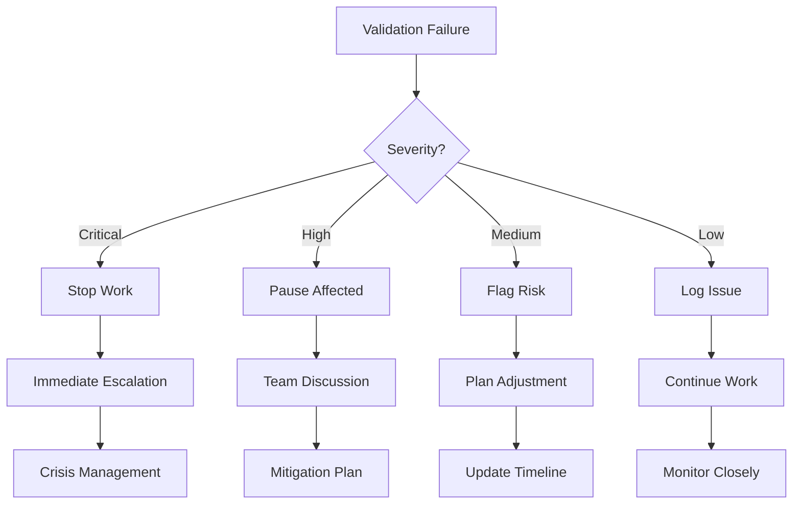

# Validation Checkpoint System

## Overview

Quality gates at critical project phases ensure work meets standards before progressing. Each checkpoint validates specific criteria, preventing errors from propagating and maintaining project quality.

## Checkpoint Phases

### Phase 1: Project Setup Validation

**When**: After environment creation, before task execution
**Purpose**: Ensure proper foundation

#### Validation Criteria
```yaml
Environment:
  ✓ .claude/ folder structure created
  ✓ CLAUDE.md file exists and is valid
  ✓ Task management system initialized
  ✓ Required commands present

Requirements:
  ✓ Requirements documented
  ✓ Success criteria defined
  ✓ Constraints identified
  ✓ Stakeholders listed

Technical:
  ✓ Template selected appropriately
  ✓ Dependencies documented
  ✓ Technology stack defined
  ✓ Development environment ready

Tasks:
  ✓ Initial tasks created
  ✓ Difficulty scores assigned
  ✓ Dependencies mapped
  ✓ No circular dependencies
```

#### Validation Actions
```python
def validate_setup():
    checks = {
        'structure': check_folder_structure(),
        'documentation': verify_documentation(),
        'tasks': validate_task_system(),
        'dependencies': check_no_circular_deps()
    }

    if all(checks.values()):
        return "PASS: Ready to begin execution"
    else:
        return f"FAIL: Fix these issues: {failed_checks(checks)}"
```

### Phase 2: Task Execution Validation

**When**: During task work, at natural breakpoints
**Purpose**: Catch issues early

#### Validation Criteria
```yaml
Before Starting Task:
  ✓ Dependencies completed
  ✓ Requirements clear
  ✓ Assumptions documented
  ✓ Confidence score set

During Task:
  ✓ Code follows standards
  ✓ Tests written (if applicable)
  ✓ Documentation updated
  ✓ No security vulnerabilities

After Task:
  ✓ Acceptance criteria met
  ✓ Files match affected list
  ✓ Assumptions validated
  ✓ Notes updated
```

#### Validation Actions
```python
def validate_task_execution(task_id):
    task = load_task(task_id)

    pre_checks = {
        'deps_met': all_dependencies_complete(task),
        'confidence_set': task.confidence > 0,
        'assumptions_logged': len(task.assumptions) > 0 or task.difficulty < 3
    }

    post_checks = {
        'criteria_met': verify_acceptance_criteria(task),
        'files_correct': verify_files_affected(task),
        'notes_updated': task.notes != initial_notes
    }

    return combine_validation_results(pre_checks, post_checks)
```

### Phase 3: Milestone Validation

**When**: At project milestones (sprint end, major feature complete)
**Purpose**: Ensure cumulative quality

#### Validation Criteria
```yaml
Progress:
  ✓ Milestone tasks completed
  ✓ No critical blockers
  ✓ Timeline on track
  ✓ Budget within limits

Quality:
  ✓ Code review passed
  ✓ Tests passing
  ✓ Documentation complete
  ✓ Performance acceptable

Risk:
  ✓ No critical assumptions pending
  ✓ Technical debt manageable
  ✓ Security scan clean
  ✓ Backup/recovery tested
```

#### Validation Actions
```python
def validate_milestone(milestone_id):
    results = {
        'progress': check_milestone_progress(),
        'quality': run_quality_checks(),
        'risk': assess_risk_level(),
        'readiness': evaluate_next_phase_readiness()
    }

    generate_milestone_report(results)
    return results
```

### Phase 4: Completion Validation

**When**: Before marking project/phase complete
**Purpose**: Ensure deliverables ready

#### Validation Criteria
```yaml
Deliverables:
  ✓ All requirements implemented
  ✓ Tests comprehensive
  ✓ Documentation complete
  ✓ Deployment successful

Quality:
  ✓ Code review complete
  ✓ Security audit passed
  ✓ Performance benchmarks met
  ✓ Accessibility standards met

Handover:
  ✓ Knowledge transfer complete
  ✓ Support documentation ready
  ✓ Monitoring configured
  ✓ Rollback plan tested
```

## Checkpoint Triggers

### Automatic Triggers
```python
triggers = {
    'time_based': {
        'daily': ['security_scan', 'assumption_check'],
        'weekly': ['progress_review', 'risk_assessment'],
        'sprint': ['milestone_validation', 'retrospective']
    },
    'event_based': {
        'task_complete': 'validate_task',
        'pr_created': 'code_review',
        'deployment': 'integration_tests',
        'milestone': 'comprehensive_validation'
    },
    'threshold_based': {
        'confidence < 50': 'risk_review',
        'velocity < 20': 'momentum_check',
        'blockers > 3': 'escalation',
        'tech_debt > limit': 'refactoring_review'
    }
}
```

### Manual Triggers
- Team member concern
- Stakeholder request
- External change
- Unexpected behavior

## Validation Criteria Details

### Code Quality Criteria
```python
code_quality_checks = {
    'syntax': 'No syntax errors',
    'linting': 'Passes linting rules',
    'complexity': 'Cyclomatic complexity < 10',
    'coverage': 'Test coverage > 80%',
    'security': 'No known vulnerabilities',
    'performance': 'Meets performance targets',
    'accessibility': 'WCAG 2.1 AA compliant'
}
```

### Documentation Criteria
```python
documentation_checks = {
    'readme': 'README.md exists and current',
    'api': 'API endpoints documented',
    'setup': 'Setup instructions complete',
    'architecture': 'System design documented',
    'decisions': 'ADRs for major decisions',
    'changelog': 'CHANGELOG updated'
}
```

### Testing Criteria
```python
testing_checks = {
    'unit': 'Unit tests pass',
    'integration': 'Integration tests pass',
    'e2e': 'End-to-end tests pass',
    'performance': 'Load tests acceptable',
    'security': 'Security tests pass',
    'regression': 'No regression detected'
}
```

## Error Prevention Strategies

### Proactive Measures

1. **Early Detection**
   ```python
   def early_warning_system():
       indicators = {
           'momentum_declining': check_velocity_trend(),
           'assumptions_risky': count_unvalidated_critical(),
           'confidence_dropping': track_confidence_changes(),
           'blockers_increasing': monitor_blocker_growth()
       }
       alert_if_concerning(indicators)
   ```

2. **Pattern Recognition**
   ```python
   def detect_risk_patterns():
       patterns = {
           'repeated_failures': same_error_multiple_times(),
           'cascade_risk': related_tasks_failing(),
           'scope_creep': requirements_keep_changing(),
           'tech_debt_spiral': shortcuts_accumulating()
       }
       return patterns
   ```

3. **Automated Checks**
   - Pre-commit hooks
   - CI/CD pipelines
   - Automated testing
   - Security scanning
   - Dependency checking

### Reactive Measures

1. **Quick Response**
   ```python
   def respond_to_validation_failure(failure):
       severity = assess_severity(failure)

       if severity == 'critical':
           stop_work()
           escalate_immediately()
           activate_crisis_protocol()
       elif severity == 'high':
           pause_affected_work()
           convene_team_meeting()
           develop_mitigation_plan()
       else:
           log_issue()
           add_to_backlog()
           continue_with_caution()
   ```

2. **Root Cause Analysis**
   ```python
   def analyze_failure(failure):
       root_cause = {
           'immediate': what_broke(),
           'contributing': what_led_to_break(),
           'systemic': why_not_caught_earlier(),
           'process': what_process_failed()
       }
       return root_cause
   ```

## Escalation Procedures

### Escalation Matrix

| Severity | Impact | Response Time | Escalate To | Actions |
|----------|--------|---------------|-------------|---------|
| Critical | Project failure | Immediate | Project Lead + Stakeholders | Stop work, all-hands meeting |
| High | Major delay | Within 2 hours | Project Lead | Team meeting, mitigation plan |
| Medium | Minor delay | Within 1 day | Team Lead | Adjust plan, document |
| Low | No delay | Within 1 week | Document only | Track for retrospective |

### Escalation Process



### Communication Templates

**Critical Escalation**:
```
CRITICAL VALIDATION FAILURE

What Failed: [Specific checkpoint]
Impact: [Project/timeline/budget impact]
Root Cause: [Initial assessment]
Immediate Actions: [What we're doing now]
Required Decisions: [What we need from you]
Recovery Options: [Possible paths forward]
```

**High Priority Issue**:
```
HIGH PRIORITY VALIDATION ISSUE

Checkpoint: [Which validation]
Issue: [What didn't pass]
Risk: [Potential impact]
Proposed Solution: [Our recommendation]
Timeline Impact: [Expected delay]
Approval Needed: [Yes/No - for what]
```

## Quality Gate Enforcement

### Hard Gates (Must Pass)
- Security vulnerabilities
- Data loss risks
- Legal compliance
- Critical functionality
- Performance SLAs

### Soft Gates (Should pass)
- Code style
- Documentation completeness
- Test coverage targets
- Technical debt limits
- Optimization goals

### Gate Override Process
```python
def request_gate_override(gate, reason):
    override_request = {
        'gate': gate,
        'reason': reason,
        'risk_assessment': evaluate_override_risk(),
        'mitigation': how_to_minimize_risk(),
        'approver': who_can_approve(gate),
        'conditions': when_to_revisit()
    }

    if approver.approve(override_request):
        log_override(override_request)
        add_tech_debt_item(gate)
        schedule_revisit(override_request.conditions)
        return True
    return False
```

## Checkpoint Metrics

### Success Metrics
- First-time pass rate
- Average issues per checkpoint
- Time to resolution
- Override frequency
- Regression rate

### Quality Trends
```python
def track_quality_trends():
    metrics = {
        'pass_rate': checkpoints_passed / total_checkpoints,
        'improvement': issues_this_sprint < issues_last_sprint,
        'resolution_time': average_time_to_fix(),
        'prevention_rate': issues_prevented / issues_possible
    }
    return metrics
```

## Integration with Belief Tracking

### Confidence Impact
- Passed checkpoint: +5-10 confidence
- Failed checkpoint: -10-20 confidence
- Override used: -5 confidence

### Momentum Impact
- Smooth passage: Maintain/increase velocity
- Minor issues: Slight velocity decrease
- Major failure: Phase shift to stalling

### Assumption Validation
- Each checkpoint validates relevant assumptions
- Failed checkpoints invalidate related assumptions
- Passed checkpoints increase assumption confidence

## Best Practices

1. **Run Early, Run Often**: Don't wait for perfect
2. **Automate Everything**: Manual checks are error-prone
3. **Document Failures**: Learn from issues
4. **No Surprise Failures**: Warning signs should appear first
5. **Fast Feedback**: Quick validation, quick fixes
6. **Clear Criteria**: No ambiguity in pass/fail
7. **Proportional Response**: Match response to severity
8. **Continuous Improvement**: Refine checkpoints based on misses