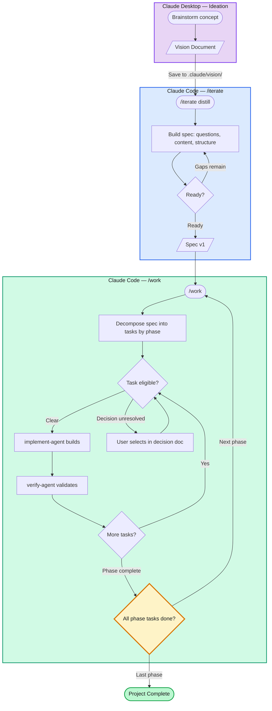

# Claude Code Environment

A structured development environment for Claude Code using the **Spec → Execute → Verify** workflow.

**Designed for Claude Opus 4.6.** The difficulty scale, task breakdown thresholds, and agent workflows are calibrated for Opus-level reasoning.

## Quick Start

1. **Create your spec:** Run `/iterate` in Claude Code to define what you're building
2. **Build:** Run `/work` to decompose tasks and start implementation
3. **Track progress:** Open `.claude/dashboard.md` to see what needs your attention

## Essential Files

| File / Directory | What It Does |
|-----------------|--------------|
| `CLAUDE.md` | Instructions for Claude Code — how it should behave in your project |
| `spec_v{N}.md` | Your project specification — the source of truth for what gets built |
| `dashboard.md` | Your communication channel with Claude — decisions, tasks, progress |
| `tasks/` | Task data (JSON files managed by `/work`) |
| `commands/` | Slash commands (`/work`, `/iterate`, `/status`, etc.) |
| `agents/` | Specialist agents (implement-agent builds, verify-agent validates) |
| `support/` | Reference docs, decisions, workspace, archived specs |
| `vision/` | Vision/design documents from ideation (optional) |

## Commands

| Command | Description |
|---------|-------------|
| `/work` | Main entry point — checks spec, decomposes tasks, routes to agents |
| `/work complete` | Complete current in-progress task (or `/work complete {id}`) |
| `/iterate` | Structured spec review (checks gaps, asks questions, suggests content) |
| `/status` | Quick read-only view of project state |
| `/breakdown {id}` | Split complex tasks into subtasks |
| `/health-check` | Validate system health and check for template updates |
| `/setup-check` | Validate template configuration (run after cloning) |

## Core Concepts

| Concept | What It Is | Example | Resolved By |
|---------|-----------|---------|-------------|
| **Phase** | Sequential project stage. Phase N+1 blocked until Phase N complete. | "Build pilot first, then production" | All phase tasks finish, next phase unlocks |
| **Decision** | Choice with multiple viable options. Blocks dependent tasks. | "Postgres or SQLite?" | User checks selection in decision doc |
| **Human Task** | Action only the user can do. `/work` skips it. | "Configure the API keys" | User completes it and marks done |
| **Inflection Point** | A decision that changes *what* gets built. | "Monolith or microservices?" | After selection, `/work` pauses and suggests `/iterate` to revisit spec |

## How It Works

The dashboard (`.claude/dashboard.md`) is your primary interface during development:

- Claude tracks tasks, produces deliverables, and runs verification autonomously
- When Claude needs your input, it appears in the dashboard — with links to relevant files, checkboxes to confirm actions, and space for feedback
- You click through to files when needed, then signal completion back through the dashboard

Two specialist agents check each other's work:
- **implement-agent** executes tasks and produces deliverables
- **verify-agent** validates the implementation independently

This eliminates the blind spots of self-validation.

## Workflow

## Where to Find Things

| Looking for... | Location |
|---------------|----------|
| What to do next | `dashboard.md` |
| Project requirements | `spec_v{N}.md` |
| Task details | `tasks/task-*.json` |
| Decision records | `support/decisions/decision-*.md` |
| Reference documentation | `support/reference/` |
| Scratch/draft documents | `support/workspace/` |
| Previous spec versions | `support/previous_specifications/` |
