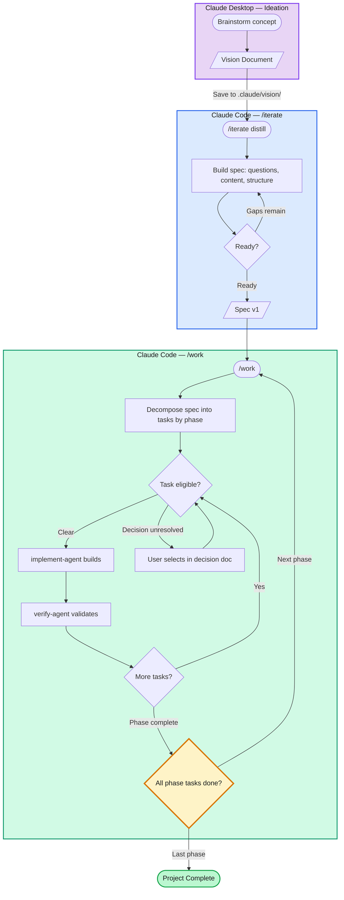

# Claude Code Environment

A structured development environment for Claude Code using the **Spec → Execute → Verify** workflow.

**Designed for Claude Opus 4.7.** The difficulty scale, task breakdown thresholds, and agent workflows are calibrated for Opus-level reasoning.

## Quick Start

1. **Ideate:** Brainstorm your project in Claude Desktop (or any tool), save the result to `.claude/vision/`
2. **Create your spec:** Run `/iterate distill` in Claude Code to extract a buildable spec from your vision document
3. **Build:** Run `/work` to decompose tasks and start implementation
4. **Track progress:** Open `.claude/dashboard.md` to see what needs your attention

## Design Philosophy

This environment is domain-agnostic. While many examples reference software concepts, the workflow applies equally to research projects, procurement, renovation, event planning, or any spec-driven work. The dashboard, task tracking, decisions, and verification adapt to whatever you are building.

## Instruction Files

Your project uses three instruction sources. Understanding the split is important:

| File | Purpose | Who Edits |
|------|---------|-----------|
| `.claude/CLAUDE.md` | Environment workflow instructions (how the system works) | Template only — do not edit |
| `./CLAUDE.md` (project root) | Project-specific instructions (tech stack, conventions, gotchas) | You or Claude |
| `.claude/rules/*.md` | Modular workflow rules (task management, spec workflow, etc.) | Template only — do not edit |

**`.claude/CLAUDE.md`** — Contains the minimal core: model requirements, navigation pointers, and critical invariants. Updated automatically when you sync with the template. Don't edit this file; if you need project-specific instructions, put them in the root `./CLAUDE.md`.

**`./CLAUDE.md` (root)** — Your project-specific instructions for Claude. Add your tech stack, naming conventions, build commands, and gotchas here. Keep it under 100 lines (warning) / 200 lines (hard limit). If sections get verbose, extract them to `.claude/support/reference/project-{name}.md` and link from the root file.

**`.claude/rules/*.md`** — Environment workflow rules broken into topic files. Template-owned rules (like `task-management.md`) update with the template. You can add project-specific rule files with the `project-` prefix (e.g., `project-api-rules.md`) — these are never touched by template sync.

## Essential Files

| File / Directory | What It Does |
|-----------------|--------------|
| `./CLAUDE.md` | Your project-specific instructions for Claude |
| `.claude/CLAUDE.md` | Environment instructions (template-owned, do not edit) |
| `.claude/rules/` | Modular workflow rules (template-owned + project-specific) |
| `spec_v{N}.md` | Your project specification — the source of truth for what gets built |
| `dashboard.md` | Your communication channel with Claude — decisions, tasks, progress |
| `tasks/` | Task data (JSON files managed by `/work`) |
| `commands/` | Slash commands (`/work`, `/iterate`, `/status`, etc.) |
| `agents/` | Specialist agents (implement-agent builds, verify-agent validates, research-agent investigates) |
| `support/` | Reference docs, decisions, workspace, archived specs |
| `vision/` | Vision/design documents from ideation (required before spec creation) |

## File Ownership

Understanding which files are yours to edit vs. which are managed by the template:

**Template-owned** (updated via template sync, don't edit):
- `.claude/CLAUDE.md`, `.claude/rules/{template-rules}.md`
- `.claude/commands/*.md`, `.claude/agents/*.md`
- `.claude/support/reference/*.md` (except `project-*.md`)

**Project-owned** (yours, created during project work):
- `./CLAUDE.md` (root), `.claude/rules/project-*.md`
- `.claude/spec_v{N}.md`, `.claude/tasks/`, `.claude/dashboard.md`
- `.claude/support/decisions/`, `.claude/support/workspace/`
- `.claude/support/reference/project-*.md` (extracted from root CLAUDE.md)
- `.claude/vision/*.md`, `.claude/support/feedback/`

## Commands

| Command | Description |
|---------|-------------|
| `/work` | Main entry point — checks spec, decomposes tasks, routes to agents |
| `/work pause` | Graceful wind-down — preserve context for next session |
| `/work complete` | Complete current in-progress task (or `/work complete {id}`) |
| `/iterate` | Structured spec review and refinement (checks gaps, asks questions, proposes spec changes) |
| `/review` | Implementation quality review (architecture, integration, patterns — advisory) |
| `/status` | Quick read-only view of project state |
| `/research` | Investigate options for decisions (spawns research-agent) |
| `/feedback` | Capture and review project improvement ideas |
| `/breakdown {id}` | Split complex tasks into subtasks |
| `/health-check` | Validate system health and check for template updates |

## Core Concepts

| Concept | What It Is | Example | Resolved By |
|---------|-----------|---------|-------------|
| **Phase** | Sequential project stage. Phase N+1 blocked until Phase N complete. | "Build pilot first, then production" | All phase tasks finish, next phase unlocks |
| **Decision** | Choice with multiple viable options. Blocks dependent tasks. | "Postgres or SQLite?" | User checks selection in decision doc |
| **Human Task** | Action only the user can do. `/work` skips it. | "Configure the API keys" | User completes it and marks done |
| **Inflection Point** | A decision that changes *what* gets built. | "Monolith or microservices?" | After selection, `/work` pauses and suggests `/iterate` to revisit spec |

## How It Works

The dashboard (`.claude/dashboard.md`) is your primary interface during development:

- Claude tracks tasks, produces deliverables, and runs verification autonomously
- When Claude needs your input, it appears in the dashboard — with links to relevant files, checkboxes to confirm actions, and space for feedback
- You click through to files when needed, then signal completion back through the dashboard

Specialist agents with separated concerns ensure quality:
- **implement-agent** executes tasks and produces deliverables
- **verify-agent** validates the implementation independently (separate context, no implementation memory)
- **research-agent** investigates options and populates decision records

This eliminates the blind spots of self-validation.

## Workflow

```mermaid
flowchart TD
    subgraph DESKTOP["Claude Desktop — Ideation"]
        D1(["Brainstorm concept"])
        D2[/"Vision Document"/]
        D1 --> D2
    end

    D2 -->|"Save to .claude/vision/"| S1

    subgraph SPEC["Claude Code — /iterate"]
        S1(["/iterate distill"])
        S2["Build spec: questions, content, structure"]
        S3{"Ready?"}
        S4[/"Spec v1"/]

        S1 --> S2 --> S3
        S3 -->|"Gaps remain"| S2
        S3 -->|"Ready"| S4
    end

    S4 --> W1

    subgraph EXEC["Claude Code — /work"]
        W1(["/work"])
        W2["Decompose spec into tasks by phase"]
        W3{"Task eligible?"}
        W4["implement-agent builds"]
        W5["verify-agent validates"]
        W6{"More tasks?"}

        W1 --> W2 --> W3
        W3 -->|"Decision unresolved"| W3B["User selects in decision doc"]
        W3B --> W3
        W3 -->|"Clear"| W4 --> W5 --> W6
        W6 -->|"Yes"| W3
        W6 -->|"Phase complete"| PHASE
    end

    PHASE{"All phase tasks done?"}
    PHASE -->|"Next phase"| W1
    PHASE -->|"Last phase"| DONE(["Project Complete"])

    classDef desktop fill:#e8d5f5,stroke:#7c3aed,stroke-width:2px,color:#1a1a1a
    classDef spec fill:#dbeafe,stroke:#2563eb,stroke-width:2px,color:#1a1a1a
    classDef exec fill:#d1fae5,stroke:#059669,stroke-width:2px,color:#1a1a1a
    classDef phase fill:#fef3c7,stroke:#d97706,stroke-width:3px,color:#1a1a1a
    classDef done fill:#bbf7d0,stroke:#16a34a,stroke-width:2px,color:#1a1a1a

    class DESKTOP desktop
    class SPEC spec
    class EXEC exec
    class PHASE phase
    class DONE done
```

## Known Constraints

**Output token cap:** Claude Code subscription (Max/Team) caps output at 32K tokens per response. Thinking and tool call arguments share this budget. The environment handles this internally — agents split large artifacts across multiple responses — but if you see truncated files (incomplete dashboard, partial JSON), this is likely why.

- Set `MAX_THINKING_TOKENS=8000` (or similar) if output truncation is frequent — this reserves more of the 32K budget for actual output
- Large projects (50+ tasks) may see dashboard truncation during regeneration; the environment falls back to a two-pass write

**Effort defaults:** Max/Team subscriptions default to medium reasoning effort. The environment uses "ultrathink" for phase-level verification where deep reasoning matters most. If you want elevated reasoning more broadly, you can say "ultrathink" in your prompt.

## Where to Find Things

| Looking for... | Location |
|---------------|----------|
| What to do next | `dashboard.md` |
| Project requirements | `spec_v{N}.md` |
| Task details | `tasks/task-*.json` |
| Decision records | `support/decisions/decision-*.md` |
| Reference documentation | `support/reference/` |
| Scratch/draft documents | `support/workspace/` |
| Feedback and ideas | `support/feedback/` |
| Previous spec versions | `support/previous_specifications/` |
