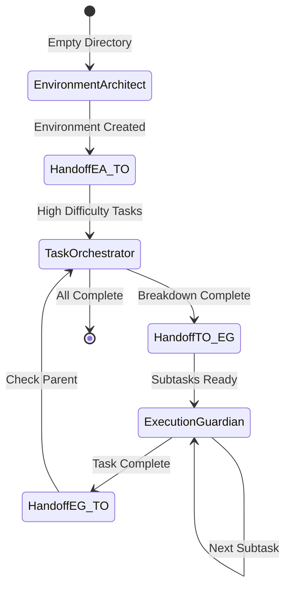

# Agent Handoff Protocol

## Overview

The handoff protocol ensures smooth transitions between agents while maintaining clear boundaries and preventing conflicts. Each handoff is explicit, documented, and includes all necessary context for the receiving agent.

## Core Principles

1. **Explicit Handoffs**: No implicit transitions - every handoff is declared
2. **Complete Context**: All required data passed to receiving agent
3. **No Overlap Period**: Sending agent completes before receiver starts
4. **Acknowledgment Required**: Receiving agent confirms receipt
5. **Fallback Strategy**: Clear protocol if handoff fails

## Handoff Types

### 1. Environment Architect → Task Orchestrator

**Trigger Conditions**:
- Environment successfully created
- One or more tasks with difficulty ≥7 exist
- Initial task extraction complete

**Handoff Message Format**:
```markdown
HANDOFF: Environment Architect → Task Orchestrator
================================================
STATUS: Environment initialization complete

CREATED:
- Template: [template_name]
- Initial tasks: [count]
- Directories: .claude/{commands,context,tasks,reference}

HIGH-DIFFICULTY TASKS REQUIRING BREAKDOWN:
- Task 003: "Implement authentication system" (difficulty: 8)
- Task 007: "Build data pipeline" (difficulty: 9)

RECOMMENDED ACTION: Break down high-difficulty tasks before execution

HANDOFF DATA:
{
  "task_ids": ["003", "007"],
  "difficulties": [8, 9],
  "template": "power-query",
  "assumptions": ["Python 3.8+", "Git initialized"]
}
================================================
```

**Receiving Agent Actions**:
1. Acknowledge receipt
2. Load task data
3. Analyze breakdown requirements
4. Begin breakdown process

### 2. Task Orchestrator → Execution Guardian

**Trigger Conditions**:
- Task breakdown complete
- All subtasks created and validated
- Dependencies resolved
- Ready for execution

**Handoff Message Format**:
```markdown
HANDOFF: Task Orchestrator → Execution Guardian
================================================
STATUS: Task breakdown complete

PARENT TASK:
- ID: 003
- Title: "Implement authentication system"
- Status: Broken Down

SUBTASKS READY FOR EXECUTION:
- 003_1: "Design auth schema" (difficulty: 4)
- 003_2: "Create user model" (difficulty: 3)
- 003_3: "Implement login endpoint" (difficulty: 5)
- 003_4: "Add session management" (difficulty: 5)

EXECUTION STRATEGY:
- Sequential: 003_1 → 003_2
- Parallel possible: [003_3, 003_4] after 003_2
- Critical path: 003_1 → 003_2 → 003_3

DEPENDENCIES:
{
  "003_1": [],
  "003_2": ["003_1"],
  "003_3": ["003_2"],
  "003_4": ["003_2"]
}

RECOMMENDED STARTING TASK: 003_1
================================================
```

**Receiving Agent Actions**:
1. Acknowledge receipt
2. Validate pre-execution gates for first task
3. Begin execution monitoring
4. Track progress and confidence

### 3. Execution Guardian → Task Orchestrator

**Trigger Conditions**:
- Subtask completed successfully
- Parent task may need auto-completion
- Task overview needs synchronization

**Handoff Message Format**:
```markdown
HANDOFF: Execution Guardian → Task Orchestrator
================================================
STATUS: Task execution complete

COMPLETED TASK:
- ID: 003_2
- Title: "Create user model"
- Final Status: Finished
- Confidence: 85%
- Duration: 45 minutes

VALIDATION RESULTS:
- Pre-execution gates: PASSED
- Post-execution gates: PASSED
- Checkpoints created: 2
- Errors encountered: 0

PARENT TASK INFO:
- Parent ID: 003
- Sibling tasks: [003_1, 003_2, 003_3, 003_4]
- Siblings complete: [003_1, 003_2]
- Siblings pending: [003_3, 003_4]

ACTION REQUIRED: Check if parent 003 can be auto-completed

METRICS UPDATE:
{
  "completed_count": 2,
  "remaining_count": 2,
  "avg_confidence": 0.87,
  "total_duration": "1.5 hours"
}
================================================
```

**Receiving Agent Actions**:
1. Acknowledge receipt
2. Check all sibling status
3. Update parent if all complete
4. Sync task overview

## Handoff State Machine



## Data Transfer Specifications

### Required Fields by Handoff Type

#### EA → TO Handoff
```json
{
  "handoff_type": "environment_to_planning",
  "timestamp": "ISO-8601",
  "from_agent": "environment-architect",
  "to_agent": "task-orchestrator",
  "data": {
    "task_ids": ["string"],
    "difficulties": [number],
    "template_used": "string",
    "assumptions_made": ["string"],
    "confidence_score": number
  }
}
```

#### TO → EG Handoff
```json
{
  "handoff_type": "planning_to_execution",
  "timestamp": "ISO-8601",
  "from_agent": "task-orchestrator",
  "to_agent": "execution-guardian",
  "data": {
    "parent_task_id": "string",
    "subtask_ids": ["string"],
    "dependency_graph": {},
    "execution_order": ["string"],
    "parallel_groups": [["string"]]
  }
}
```

#### EG → TO Handoff
```json
{
  "handoff_type": "execution_to_planning",
  "timestamp": "ISO-8601",
  "from_agent": "execution-guardian",
  "to_agent": "task-orchestrator",
  "data": {
    "completed_task_id": "string",
    "parent_task_id": "string",
    "execution_metrics": {
      "duration": "string",
      "confidence_final": number,
      "gates_passed": ["string"],
      "checkpoints_created": number
    }
  }
}
```

## Conflict Resolution

### Scenario: Simultaneous Agent Activation

**Problem**: Two agents triggered for same operation
**Resolution Protocol**:
1. Check task state (definitive authority)
2. Apply phase-based priority
3. First agent completes, second yields

```python
def resolve_conflict(agent1, agent2, context):
    if not exists(".claude/"):
        return "environment-architect"

    task = get_task(context)
    if task.status in ["Pending", "Broken Down"]:
        return "task-orchestrator"
    elif task.status == "In Progress":
        return "execution-guardian"

    # Fallback to phase priority
    phase_priority = {
        "environment-architect": 1,
        "task-orchestrator": 2,
        "execution-guardian": 3
    }
    return min(agent1, agent2, key=lambda a: phase_priority[a])
```

### Scenario: Failed Handoff

**Problem**: Receiving agent doesn't acknowledge
**Recovery Protocol**:

1. **Retry with backoff**:
   ```python
   retries = [1, 2, 5, 10]  # seconds
   for delay in retries:
       if attempt_handoff():
           return success
       wait(delay)
   ```

2. **Fallback to manual**:
   ```markdown
   HANDOFF FAILED: Manual intervention required
   - Sending agent: [name]
   - Receiving agent: [name]
   - Context: [preserved in handoff-failed.json]
   - User action: Manually invoke receiving agent
   ```

3. **State preservation**:
   ```json
   {
     "failed_at": "timestamp",
     "from_agent": "sender",
     "to_agent": "receiver",
     "preserved_context": {},
     "retry_count": 3
   }
   ```

## Handoff Validation

### Pre-Handoff Checklist

#### Sending Agent Must Verify:
- [ ] Current work complete
- [ ] State persisted to files
- [ ] No pending operations
- [ ] Data package complete
- [ ] Handoff message formatted

#### Receiving Agent Must Verify:
- [ ] Prerequisites met
- [ ] Required data present
- [ ] No conflicting state
- [ ] Can proceed with operation
- [ ] Acknowledgment sent

### Handoff Quality Gates

```python
def validate_handoff(handoff_data):
    checks = {
        "has_required_fields": check_required_fields(handoff_data),
        "data_integrity": validate_data_integrity(handoff_data),
        "state_consistency": check_state_consistency(handoff_data),
        "no_orphaned_tasks": check_no_orphans(handoff_data),
        "valid_transition": check_valid_transition(handoff_data)
    }

    if all(checks.values()):
        return "HANDOFF_VALID"
    else:
        failed = [k for k, v in checks.items() if not v]
        return f"HANDOFF_INVALID: {failed}"
```

## Common Handoff Patterns

### Pattern 1: Bootstrap → Breakdown → Execute
```
1. EA creates environment with task difficulty 8
2. EA → TO: "High difficulty task needs breakdown"
3. TO creates 4 subtasks
4. TO → EG: "Subtasks ready for execution"
5. EG executes each subtask
6. EG → TO: "All subtasks complete"
7. TO marks parent complete
```

### Pattern 2: Execute → Check Parent → Execute Next
```
1. EG completes subtask 001_1
2. EG → TO: "Check if parent ready"
3. TO: "Parent not ready, 2 subtasks remain"
4. TO → EG: "Continue with 001_2"
5. EG executes 001_2
```

### Pattern 3: Parallel Execution Coordination
```
1. TO identifies parallel subtasks [A, B, C]
2. TO → EG: "Execute A, B, C in parallel"
3. EG completes A
4. EG → TO: "A complete, continuing B and C"
5. EG completes B and C
6. EG → TO: "All parallel tasks complete"
```

## Handoff Logging

All handoffs are logged for audit and debugging:

```json
{
  "handoff_log": [
    {
      "timestamp": "2024-12-17T10:30:00Z",
      "from": "environment-architect",
      "to": "task-orchestrator",
      "trigger": "high_difficulty_tasks",
      "data_size": 256,
      "success": true,
      "duration_ms": 45
    },
    {
      "timestamp": "2024-12-17T10:35:00Z",
      "from": "task-orchestrator",
      "to": "execution-guardian",
      "trigger": "breakdown_complete",
      "data_size": 512,
      "success": true,
      "duration_ms": 62
    }
  ]
}
```

## Best Practices

### DO:
- Always include complete context in handoffs
- Validate data before sending
- Acknowledge receipt explicitly
- Log all handoff attempts
- Preserve state for recovery

### DON'T:
- Assume implicit handoffs
- Skip validation checks
- Overlap agent operations
- Modify data during handoff
- Proceed without acknowledgment

## Testing Handoffs

### Test Scenarios

1. **Happy Path**: Normal handoff flow
2. **High Load**: Multiple rapid handoffs
3. **Failure Recovery**: Handoff retry logic
4. **Data Validation**: Corrupt data handling
5. **Timeout**: Slow acknowledgment

### Test Harness

```python
def test_handoff(from_agent, to_agent, test_data):
    # Setup
    setup_test_environment()

    # Execute
    result = perform_handoff(from_agent, to_agent, test_data)

    # Verify
    assert result.success
    assert result.acknowledged
    assert result.data_valid
    assert no_state_corruption()

    # Cleanup
    cleanup_test_environment()
```

## Monitoring & Metrics

### Key Metrics
- Handoff success rate: >99%
- Average handoff time: <100ms
- Failed handoff recovery: <5 seconds
- Data corruption rate: 0%
- Acknowledgment rate: 100%

### Alert Thresholds
- Failed handoff: Immediate alert
- Slow handoff (>1s): Warning
- Multiple retries: Investigation needed
- Data validation failure: Critical alert