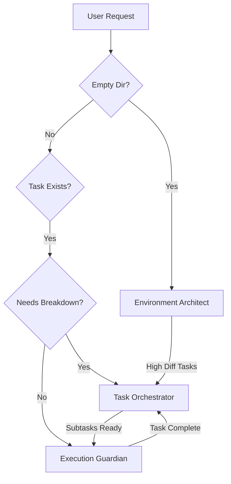

# Claude Code Agent System

## Overview

The Claude Code environment uses a **3-agent architecture** designed for maximum efficiency with zero overlap. Each agent owns a specific lifecycle phase, ensuring clear boundaries and preventing conflicts.

## The Three Agents

### 1. Environment Architect
- **Role**: Project initialization and template selection
- **Phase**: Before project structure exists
- **Trigger**: Empty directory or bootstrap request
- **Key Files**:
  - Definition: `environment-architect.md`
  - Scripts: `bootstrap.py`, `pattern-matcher.py`
  - Commands: `smart-bootstrap.md`, `bootstrap.md`

### 2. Task Orchestrator
- **Role**: Task hierarchy and breakdown management
- **Phase**: Task planning and organization
- **Trigger**: Tasks with difficulty ≥7 or breakdown request
- **Key Files**:
  - Definition: `task-orchestrator.md`
  - Scripts: `task-manager.py`, `dependency-analyzer.py`, `breakdown-suggester.py`
  - Commands: `breakdown.md`, `sync-tasks.md`

### 3. Execution Guardian
- **Role**: Task execution with validation gates
- **Phase**: Active task execution
- **Trigger**: Task completion request or validation needed
- **Key Files**:
  - Definition: `execution-guardian.md`
  - Scripts: `validation-gates.py`, `checkpoint-manager.py`, `metrics-dashboard.py`
  - Commands: `complete-task.md`, `validate-assumptions.md`, `check-risks.md`

## Quick Start

### Using Agents

1. **For new projects**:
   ```
   "Create environment from spec: requirements.md"
   → Automatically invokes Environment Architect
   ```

2. **For task breakdown**:
   ```
   "Break down task 003"
   → Automatically invokes Task Orchestrator
   ```

3. **For task execution**:
   ```
   "Complete task 001"
   → Automatically invokes Execution Guardian
   ```

### Manual Agent Invocation

Use the unified agent command:
```
Run: .claude/commands/use-agent.md
```

This will:
1. Analyze current context
2. Select appropriate agent
3. Execute agent workflow
4. Handle any handoffs

## Agent Workflow



## Key Features

### Exclusive Ownership
- Each script belongs to exactly ONE agent
- Each command belongs to exactly ONE agent
- No shared responsibilities

### Automatic Handoffs
- Environment Architect → Task Orchestrator (when high-difficulty tasks created)
- Task Orchestrator → Execution Guardian (when subtasks ready)
- Execution Guardian → Task Orchestrator (when subtask complete, check parent)

### Conflict Prevention
- State-based exclusivity (task status determines agent)
- Phase-based separation (initialization → planning → execution)
- Clear boundaries enforced

## Configuration

### Agent Configuration (`../agent-config.json`)
- Ownership matrix defining script/command ownership
- Trigger conditions for each agent
- Handoff rules and protocols
- Performance metrics tracking

### Customization
To modify agent behavior:
1. Edit agent definition files (e.g., `environment-architect.md`)
2. Update `agent-config.json` for ownership changes
3. Test changes with `use-agent.md`

## Documentation

### Core Documentation
- **Architecture**: `../agent-docs/architecture.md` - System design and principles
- **Handoff Protocol**: `../agent-docs/handoff-protocol.md` - Inter-agent communication
- **Agent Command**: `../commands/use-agent.md` - Unified invocation interface

### Agent-Specific Docs
- Each agent has comprehensive documentation in its definition file
- Includes workflows, decision logic, boundaries, and integration points

## Testing Agents

### Test Environment Architect
1. Start with empty directory
2. Provide specification file
3. Verify template detection and environment generation

### Test Task Orchestrator
1. Create task with difficulty ≥7
2. Request breakdown
3. Verify subtask creation and dependencies

### Test Execution Guardian
1. Start task execution
2. Verify validation gates run
3. Check checkpoint creation and completion

## Performance Metrics

Agents track performance automatically:
- **Environment Architect**: Template detection accuracy, generation time
- **Task Orchestrator**: Breakdown quality, parallelization rate
- **Execution Guardian**: Gate enforcement, recovery success

View metrics in `agent-config.json` under `performance_metrics`.

## Troubleshooting

### Common Issues

1. **Wrong agent activated**
   - Check task status and current context
   - Review trigger conditions in `agent-config.json`

2. **Handoff failed**
   - Check handoff data completeness
   - Review handoff protocol documentation

3. **Agent boundary violation**
   - Verify ownership matrix
   - Check agent definition boundaries section

### Debug Mode

Enable detailed logging:
```json
{
  "debug_mode": true,
  "log_level": "verbose"
}
```

## Benefits

1. **Zero Conflicts**: No overlapping responsibilities
2. **Clear Mental Model**: Predictable agent behavior
3. **Maintainability**: Only 3 agents to manage
4. **Scalability**: Can enhance agents independently
5. **Performance**: Efficient handoffs, minimal overhead

## Future Enhancements

- Pattern learning across projects
- Predictive breakdown suggestions
- Proactive risk detection
- Cross-project intelligence

## Quick Reference

| Operation | Agent | Command |
|-----------|-------|---------|
| Create new project | Environment Architect | `smart-bootstrap.md` |
| Break down task | Task Orchestrator | `breakdown.md` |
| Execute task | Execution Guardian | `complete-task.md` |
| Sync overview | Task Orchestrator | `sync-tasks.md` |
| Validate task | Execution Guardian | `validate-assumptions.md` |

## Support

For issues or questions:
- Review agent definition files for detailed workflows
- Check architecture documentation for design principles
- Use `use-agent.md` for automatic agent selection