# Dashboard

<!-- DASHBOARD META
generated: 2026-01-28T14:30:00Z
task_hash: sha256:a3f8c91d2e7b4056890cd1ef23456789abcdef0123456789abcdef0123456789
task_count: 12
verification_debt: 1
drift_deferrals: 0
-->

<!-- SECTION TOGGLES -->
**Sections:**
- [x] Action Required
- [x] Progress
- [x] Tasks
- [x] Decisions
- [x] Notes
- [x] Timeline
- [x] Custom Views
<!-- END SECTION TOGGLES -->

> **This is a format example** using a fictional renovation project. It will be replaced with your actual project data when you run `/work`.

**Community Center Renovation** · Execute · Started 2026-01-15

**50% complete** — 12 tasks · 2 decisions

---

## 🚨 Action Required

### Verification Debt

⛔ **Verification debt: 1 task** — must resolve before completion

| Task | Title | Issue |
|------|-------|-------|
| 6 | Order materials | Awaiting verification |

*Run `/work` to trigger verification.*

### Decisions

| Decision | Question | Doc |
|----------|----------|-----|
| DEC-002 | Hardwood vs luxury vinyl for main hall? | [decision-002.md](support/decisions/decision-002-flooring.md) |

*Open the doc, review options, check your selection, then run `/work`.*

### Your Tasks

| Task | What To Do | Where |
|------|------------|-------|
| 8 | Obtain building permit from city hall | [permit-application.pdf](support/documents/permit-application.pdf) |

<!-- FEEDBACK:8 -->
**Task 8 — Feedback:**
Applied in person on 2026-01-25. Expect 2-week processing time.
<!-- END FEEDBACK:8 -->

### Reviews

- [ ] **Plumbing code compliance?** — blocking question needs answer before Phase 3 → [questions.md](support/questions/questions.md)
- [ ] **2 pending questions** → [questions.md](support/questions/questions.md)

---

## 📊 Progress

| Phase | Done | Total | Status |
|-------|------|-------|--------|
| 1 — Planning | 4 | 4 | Complete |
| 2 — Construction | 2 | 5 | Active |
| 3 — Finishing | 0 | 3 | Blocked (DEC-002) |

### Timeline

| Date | Item | Status | Notes |
|------|------|--------|-------|
| ~~2026-01-28~~ | ⚠️ OVERDUE: Task 6 — Order materials | Awaiting Verification | Vendor: Acme Surfaces |
| 2026-02-05 | Task 9 — Rough plumbing | In Progress | |
| 2026-02-10 | Task 10 — Electrical inspection | Pending | ❗ Human task |
| 2026-02-15 | External: Flooring delivery | Waiting | Contact: Bob at FloorCo |

**Critical path:** [🤖 Rough plumbing | ❗ Resolve DEC-002] → [❗ Electrical inspection | 🤖 Install flooring] → 👥 Final walkthrough → Done *(5 steps)*

### Project Overview

```mermaid
graph LR
    P1["✅ Planning (4/4)"]
    P1 --> T6["🤖 Order materials"]
    P1 --> T8["❗ Building permit"]
    P1 --> T9["🤖 Rough plumbing"]
    DEC002{"❓ Flooring decision"}
    T9 --> T10["❗ Electrical inspection"]
    DEC002 --> T10
    DEC002 --> T11["🤖 Install flooring"]
    T10 --> T12["👥 Final walkthrough"]
    T11 --> T12
```

**This week:** 1 completed · 1 started · 0 created

---

## 📋 Tasks

### Phase 1: Planning

| ID | Title | Status | Diff | Owner | Deps |
|----|-------|--------|------|-------|------|
| 1 | Site assessment and measurements | Finished | 3 | claude | — |
| 2 | Architectural drawings | Finished | 4 | claude | 1 |
| 3 | Budget estimation | Finished | 3 | claude | 1 |
| 4 | Contractor selection research | Finished | 2 | claude | — |

*Phase 1: 4/4 complete (100%)*

### Phase 2: Construction

| ID | Title | Status | Diff | Owner | Deps |
|----|-------|--------|------|-------|------|
| 5 | Demolition plan | Finished | 3 | claude | 2 |
| 6 | Order materials | Awaiting Verification | 4 | claude | 3 |
| 7 | Structural reinforcement | Finished | 5 | claude | 5 |
| 8 | Obtain building permit | Pending | 2 | human | 2 |
| 9 | Rough plumbing | In Progress | 4 | claude | 5 |

*Phase 2: 2/5 complete (40%) — 1 awaiting verification, 1 human task pending*

### Phase 3: Finishing

| ID | Title | Status | Diff | Owner | Deps |
|----|-------|--------|------|-------|------|
| 10 | Electrical inspection | Pending | 2 | human | 9, DEC-002 |
| 11 | Install flooring | Pending | 4 | claude | DEC-002 |
| 12 | Final walkthrough and punch list | Pending | 3 | both | 10, 11 |

*Phase 3: 0/3 complete (0%) — blocked by DEC-002*

*6/12 tasks complete (50%)*

---

## 📋 Decisions

| ID | Decision | Status | Selected |
|----|----------|--------|----------|
| DEC-001 | Contractor selection | Decided | BuildRight Construction |
| DEC-002 | Main hall flooring | Pending | [Review options](support/decisions/decision-002-flooring.md) |

---

## 👁️ Custom Views

<!-- CUSTOM VIEWS INSTRUCTIONS -->

**Materials Procurement:** Track materials procurement status as a table with columns: Material, Vendor, Ordered, Delivered, Cost. Source data from task notes mentioning material orders.

**Inspection Schedule:** Show upcoming and completed inspections as a table with columns: Inspection, Inspector, Date, Status. Include the building permit inspection from task 8 and electrical inspection from task 10.

<!-- END CUSTOM VIEWS INSTRUCTIONS -->

### Materials Procurement

| Material | Vendor | Ordered | Delivered | Cost |
|----------|--------|---------|-----------|------|
| Hardwood flooring (TBD) | Pending DEC-002 | — | — | ~$12,000 |
| Copper piping (3/4" & 1/2") | PlumbSupply Co | 2026-01-20 | 2026-01-25 | $2,340 |
| Structural steel beams | Acme Surfaces | 2026-01-18 | 2026-01-22 | $4,800 |
| Electrical panel (200A) | PowerGrid Dist. | 2026-01-28 | Pending | $1,650 |
| Drywall sheets (4x8) | BuildRight Supply | 2026-02-01 | Pending | $890 |

*5 materials tracked · 2 delivered · 1 pending decision · Est. total: ~$21,680*

### Inspection Schedule

| Inspection | Inspector | Date | Status |
|------------|-----------|------|--------|
| Structural reinforcement sign-off | City Building Dept. | 2026-01-24 | Passed |
| Rough plumbing pressure test | Licensed plumber (TBD) | ~2026-02-08 | Upcoming |
| Electrical panel & wiring | City Electrical Inspector | 2026-02-10 | Pending (Task 10) |
| Final occupancy walkthrough | City Building Dept. | TBD | Blocked (Phase 3) |

*1 of 4 inspections passed · Next: plumbing pressure test (~Feb 8)*

---

## 💡 Notes

**Quick links:**
- **Questions** — blocking & unresolved items from work sessions → [questions.md](support/questions/questions.md)
- **Decisions** — comparison records and research → [decisions/](support/decisions/)

<!-- USER SECTION -->

[Your notes here — ideas, questions, reminders]

<!-- END USER SECTION -->

---
*2026-01-28 14:30 UTC · 12 tasks · ⚠️ 0 drift deferrals, 1 verification debt*
