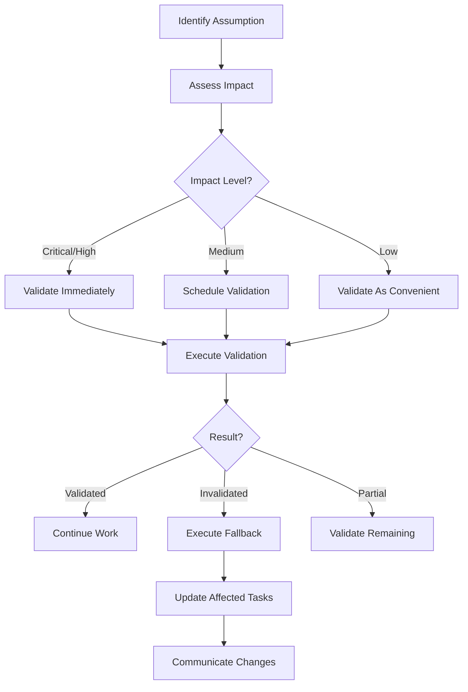

# Assumption Management System

## Overview

Assumptions are beliefs we hold about the project environment, requirements, dependencies, or implementation that haven't been fully validated. This system tracks, validates, and manages the impact of assumptions throughout the project lifecycle.

## Assumption Structure

### Core Assumption Object

```json
{
  "id": "a-unique-id",
  "description": "Clear statement of what we're assuming",
  "category": "requirement|technical|dependency|resource|timeline",
  "confidence": 80,
  "status": "pending|validated|invalidated",
  "impact": "low|medium|high|critical",
  "validation_method": "How we'll verify this assumption",
  "validation_trigger": "When/what triggers validation",
  "validated_date": null,
  "validated_by": "Method or person that validated",
  "fallback_plan": "What to do if assumption is false",
  "affected_tasks": ["task-ids"],
  "notes": "Additional context or validation results"
}
```

## Assumption Categories

### Requirement Assumptions
Beliefs about what the user needs or expects:
- "User needs real-time updates"
- "Response time under 200ms is acceptable"
- "Mobile support is not required initially"

### Technical Assumptions
Beliefs about technical feasibility or behavior:
- "Database can handle 1000 concurrent connections"
- "API rate limit won't be exceeded"
- "Library supports required features"

### Dependency Assumptions
Beliefs about external systems or teams:
- "Authentication service will be available"
- "Design assets will be provided on time"
- "Third-party API won't change"

### Resource Assumptions
Beliefs about available resources:
- "Server has sufficient memory"
- "Team member will remain available"
- "Budget covers all tool licenses"

### Timeline Assumptions
Beliefs about scheduling and deadlines:
- "No scope changes during sprint"
- "Testing environment available by date X"
- "Deployment window remains open"

## Impact Levels

### Critical Impact
**Definition**: Project fails or major rework if wrong
**Examples**:
- Core technology doesn't support requirements
- Legal/compliance requirement missed
- Fundamental architecture flaw

**Response**: Validate immediately, have contingency plan

### High Impact
**Definition**: Significant delays or rework if wrong
**Examples**:
- Performance requirements not met
- Integration approach doesn't work
- Key feature impossible to implement

**Response**: Validate early, prepare alternatives

### Medium Impact
**Definition**: Moderate adjustments needed if wrong
**Examples**:
- UI framework limitation discovered
- Data format different than expected
- Additional validation logic needed

**Response**: Validate during implementation

### Low Impact
**Definition**: Minor tweaks only if wrong
**Examples**:
- Styling adjustments needed
- Configuration changes required
- Documentation updates needed

**Response**: Validate as convenient

## Validation States

### Pending
- Not yet tested or verified
- Default state for new assumptions
- Requires validation plan

### Validated
- Confirmed true through testing or evidence
- Safe to proceed with dependent work
- Document validation method used

### Invalidated
- Proven false or incorrect
- Triggers fallback plan execution
- May require task re-estimation

### Partial
- Some aspects validated, others not
- Used for complex multi-part assumptions
- Requires detailed notes on what's validated

## Validation Methods

### Code Validation
```python
# Test the assumption directly
def validate_connection_limit():
    connections = []
    try:
        for i in range(1000):
            connections.append(create_connection())
        return "validated"
    except ConnectionError:
        return "invalidated"
```

### Documentation Review
- Check official documentation
- Review API specifications
- Verify version compatibility

### Prototype/Spike
- Build minimal proof of concept
- Test specific functionality
- Measure performance metrics

### Expert Consultation
- Ask domain expert
- Get stakeholder confirmation
- Consult vendor support

### Production Testing
- Deploy to staging environment
- Run load tests
- Monitor actual usage

### Time-Based Observation
- Wait for condition to occur
- Monitor over period
- Track metric trends

## Validation Triggers

### Event-Based Triggers
- **Milestone Reached**: Validate at project checkpoints
- **Dependency Available**: Test when system accessible
- **Requirement Clarified**: Verify when specs finalized
- **Blocker Encountered**: Check related assumptions

### Time-Based Triggers
- **Daily Review**: Check high-impact assumptions
- **Sprint Planning**: Validate sprint assumptions
- **Before Implementation**: Test technical assumptions
- **Post-Deployment**: Verify production assumptions

### Risk-Based Triggers
- **Confidence Drops**: When certainty decreases
- **Related Failure**: When similar assumption fails
- **Change Detected**: When environment changes
- **Pattern Emerges**: When trend becomes visible

## Impact Analysis

### When Assumption Invalidated

1. **Immediate Actions**:
   ```
   1. Document what was discovered
   2. Assess impact on current work
   3. Stop affected work if critical
   4. Notify stakeholders if high impact
   ```

2. **Impact Assessment**:
   ```python
   impact_matrix = {
       'affected_tasks': list_dependent_tasks(),
       'timeline_impact': calculate_delay(),
       'cost_impact': estimate_additional_cost(),
       'quality_impact': assess_quality_risk(),
       'alternatives': identify_workarounds()
   }
   ```

3. **Response Planning**:
   - Execute fallback plan
   - Update affected task estimates
   - Revise project assumptions
   - Communicate changes

### Cascading Effects

When one assumption fails, check related assumptions:

```
Authentication assumption fails
    ↓
Check: Authorization assumptions
Check: Session management assumptions
Check: Security compliance assumptions
Check: User experience assumptions
```

## Fallback Planning

### Fallback Plan Structure

```json
{
  "trigger": "What invalidates the assumption",
  "detection": "How we'll know it's invalid",
  "immediate_action": "First response steps",
  "alternative_approach": "Different solution path",
  "timeline_impact": "Expected delay",
  "resource_needs": "Additional requirements",
  "communication_plan": "Who to notify and how"
}
```

### Example Fallback Plans

**Technical Fallback**:
```json
{
  "assumption": "WebSocket supports 1000+ users",
  "fallback": {
    "trigger": "Load test shows connection limits",
    "immediate_action": "Implement connection pooling",
    "alternative_approach": "Use polling for low-priority updates",
    "timeline_impact": "3-5 days additional work"
  }
}
```

**Resource Fallback**:
```json
{
  "assumption": "Senior developer available throughout",
  "fallback": {
    "trigger": "Developer unavailable",
    "immediate_action": "Document current state thoroughly",
    "alternative_approach": "Redistribute work to team",
    "timeline_impact": "20% velocity reduction"
  }
}
```

## Tracking Assumptions

### Project-Level Tracking

Maintain `.claude/assumptions/project-assumptions.json`:

```json
{
  "assumptions": [
    {
      "id": "pa-001",
      "description": "Production environment matches staging",
      "category": "technical",
      "impact": "high",
      "status": "pending",
      "validation_trigger": "First production deployment"
    }
  ],
  "validation_schedule": {
    "daily": ["pa-001"],
    "weekly": ["pa-002", "pa-003"],
    "milestone": ["pa-004"]
  }
}
```

### Task-Level Tracking

Within each task JSON:

```json
{
  "assumptions": [
    {
      "id": "ta-task42-001",
      "description": "API returns data in JSON format",
      "confidence": 90,
      "status": "pending",
      "impact": "medium",
      "validation_method": "API call test"
    }
  ]
}
```

## Best Practices

### Documentation

1. **Be Specific**: "Database supports JSON fields" not "Database is modern"
2. **Include Evidence**: Link to docs, conversations, or tests
3. **Update Promptly**: Validate or invalidate as soon as known
4. **Track History**: Keep record of validation attempts

### Risk Management

1. **Validate Critical Early**: Test high-impact assumptions first
2. **Have Fallbacks**: Every high/critical assumption needs Plan B
3. **Communicate Uncertainty**: Share low-confidence assumptions
4. **Review Regularly**: Daily check of critical assumptions

### Team Collaboration

1. **Share Assumptions**: Make visible to all team members
2. **Assign Ownership**: Someone responsible for validation
3. **Escalate Failures**: Communicate invalidations quickly
4. **Learn from Patterns**: Track common invalid assumptions

## Integration Points

### With Confidence Scoring
- Each assumption affects task confidence
- Validated assumptions increase confidence
- Invalidated assumptions decrease confidence

### With Momentum Tracking
- Unvalidated assumptions can cause stalling
- Invalidated assumptions may stop momentum
- Validated assumptions can boost velocity

### With Risk Alerts
- Critical pending assumptions trigger alerts
- Invalidated assumptions escalate risk level
- Pattern of failures indicates systemic issues

## Common Assumption Patterns

### Always Validate
These assumptions are frequently wrong:
- "No additional requirements will emerge"
- "External API won't change"
- "Performance will scale linearly"
- "Users will follow happy path"
- "Dependencies have no dependencies"

### Usually Safe
These assumptions are typically valid:
- "Standard library functions work as documented"
- "Development tools remain available"
- "Version control system accessible"
- "Team communication channels open"

### Red Flags
Be extra careful with:
- "We can optimize later"
- "Security can be added after"
- "Documentation can wait"
- "Testing can be reduced if behind schedule"
- "Technical debt won't slow us down"

## Validation Workflow



## Quick Reference

### When to Create Assumptions
- Starting new task
- Encountering unknowns
- Making technical decisions
- Planning timelines
- Defining requirements

### When to Validate
- Before critical decisions
- At natural breakpoints
- When confidence drops
- Before major commits
- At sprint boundaries

### When to Escalate
- Critical assumption invalidated
- Multiple assumptions failing
- No viable fallback
- Timeline impact > 2 days
- Budget impact significant