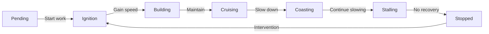

# Momentum Tracking Standard Operating Procedures

## Purpose

Maintain optimal task velocity and prevent work stagnation through systematic momentum monitoring, early intervention, and strategic momentum transfer between related tasks.

## Momentum Monitoring Schedule

### Daily Checks (High Priority Tasks)

**When**: Start of each work day
**What to check**:
- Tasks marked as "In Progress"
- Tasks with dependencies on today's work
- Previously identified at-risk tasks

**Actions**:
```python
daily_momentum_check():
    for task in in_progress_tasks:
        - Check velocity (target: >50)
        - Verify phase alignment with status
        - Review last activity date
        - Identify new blockers
        - Update momentum data
```

### Weekly Review (All Active Tasks)

**When**: Weekly planning session
**What to review**:
- Velocity trends across all tasks
- Phase distribution analysis
- Momentum transfer opportunities
- Stalling pattern detection

**Report Format**:
```markdown
## Weekly Momentum Report
- Average Velocity: X
- Tasks at Risk: Y
- Stalling Tasks: Z
- Transfer Opportunities: N
- Recommended Interventions: [List]
```

### Sprint Checkpoints (Comprehensive)

**When**: Sprint planning/retrospective
**Analysis includes**:
- Historical velocity trends
- Phase transition patterns
- Intervention effectiveness
- Momentum prediction accuracy

## Velocity Calculation Rules

### Base Velocity Factors

```python
velocity_calculation = {
    'status_weight': 40,      # Task status contribution
    'activity_weight': 30,    # Recent activity contribution
    'progress_weight': 20,    # Completion percentage
    'confidence_weight': 10   # Confidence score impact
}
```

### Velocity Scoring

| Factor | Condition | Velocity Impact |
|--------|-----------|-----------------|
| Status | Finished | +100 |
| Status | In Progress | +50 |
| Status | Blocked | -50 |
| Activity | Today | +20 |
| Activity | This week | +10 |
| Activity | >1 week ago | -20 |
| Activity | >2 weeks ago | -40 |
| Progress | >75% complete | +20 |
| Progress | 50-75% complete | +10 |
| Progress | <25% complete | -10 |
| Confidence | >80 | +10 |
| Confidence | <50 | -15 |

## Phase Classification

### Phase Definitions

| Phase | Velocity Range | Characteristics | Health Status |
|-------|---------------|-----------------|---------------|
| **Cruising** | 50-100 | Optimal progress, steady work | ✅ Healthy |
| **Building** | 20-50 | Accelerating, gaining traction | ✅ Healthy |
| **Ignition** | 10-25 | Just started, early momentum | ⚠️ Monitor |
| **Coasting** | 30-60 | Slowing from cruising | ⚠️ Monitor |
| **Stalling** | 5-30 | Nearly stopped, critical | 🔴 At Risk |
| **Stopped** | 0-5 | No progress, blocked | 🔴 Critical |
| **Pending** | 0 | Not yet started | ⏸️ Waiting |

### Phase Transition Rules



## Stalling Detection

### Early Warning Signs

**Velocity Indicators**:
- Velocity drops >30 points in 3 days
- Velocity below 20 for active tasks
- Consecutive velocity decreases (3+ days)

**Activity Indicators**:
- No updates in 3+ days (active task)
- No commits/changes in 5+ days
- Missed check-ins or updates

**Confidence Indicators**:
- Confidence drops below 50
- Multiple assumption invalidations
- Escalating uncertainty

### Stalling Triggers

```python
def detect_stalling(task):
    triggers = []

    # Velocity trigger
    if task.velocity < 20 and task.status == "In Progress":
        triggers.append("velocity_critical")

    # Activity trigger
    days_inactive = calculate_days_since_activity(task)
    if days_inactive > 3:
        triggers.append("activity_stale")

    # Trend trigger
    if velocity_declining_trend(task, days=3):
        triggers.append("velocity_declining")

    # Confidence trigger
    if task.confidence < 50:
        triggers.append("confidence_low")

    return triggers
```

## Intervention Strategies

### By Phase

| Current Phase | Intervention Strategy | Expected Outcome |
|--------------|----------------------|------------------|
| **Stalling** | Immediate attention, remove blockers | Return to Building |
| **Stopped** | Major intervention, possible reassignment | Restart to Ignition |
| **Coasting** | Energy injection, clarify goals | Return to Cruising |
| **Ignition** | Provide support, clear path | Progress to Building |

### Intervention Actions

#### Level 1: Light Touch (Coasting/Ignition)
```
1. Check in with task owner
2. Clarify any ambiguities
3. Offer assistance/resources
4. Set near-term milestone
5. Schedule follow-up
```

#### Level 2: Active Support (Stalling)
```
1. Schedule immediate discussion
2. Identify all blockers
3. Create unblocking plan
4. Assign support resources
5. Daily check-ins until recovery
6. Consider pair work
```

#### Level 3: Major Intervention (Stopped)
```
1. Emergency review meeting
2. Root cause analysis
3. Consider task redesign
4. Possible reassignment
5. Break into smaller tasks
6. Reset expectations
7. Implement new approach
```

### Intervention Timing

```python
intervention_schedule = {
    'immediate': ['stopped', 'blocked'],
    'same_day': ['stalling', 'velocity < 10'],
    'next_day': ['coasting', 'velocity < 30'],
    'weekly': ['building', 'ignition']
}
```

## Momentum Transfer Patterns

### Transfer Opportunities

#### 1. Completion Boost
**Pattern**: Finished task → Dependent tasks
**Effect**: +20-30 velocity to unblocked tasks
```
When: Task completes
Action: Immediately start dependent tasks
Result: Maintain team momentum
```

#### 2. Energy Sharing
**Pattern**: High velocity → Related low velocity
**Effect**: +10-20 velocity through collaboration
```
When: Task cruising, related task stalling
Action: Pair workers temporarily
Result: Knowledge transfer, energy boost
```

#### 3. Sequential Flow
**Pattern**: Complete related tasks in sequence
**Effect**: Sustained momentum across task chain
```
When: Multiple related tasks pending
Action: Queue in logical sequence
Result: Momentum builds through sequence
```

#### 4. Parallel Boost
**Pattern**: Start complementary tasks together
**Effect**: Mutual reinforcement
```
When: Independent but related tasks
Action: Assign to same sprint/person
Result: Synergy and shared context
```

### Transfer Implementation

```python
def apply_momentum_transfer(from_task, to_task, transfer_type):
    if transfer_type == "completion_boost":
        to_task.velocity += 25
        to_task.phase = "ignition"
        to_task.notes += f"Boosted by completion of {from_task.id}"

    elif transfer_type == "energy_sharing":
        velocity_transfer = from_task.velocity * 0.2
        to_task.velocity += velocity_transfer
        to_task.notes += f"Energy transfer from {from_task.id}"

    elif transfer_type == "sequential_flow":
        to_task.velocity = max(30, from_task.velocity * 0.7)
        to_task.phase = "building"

    update_task(to_task)
```

## Monitoring Tools

### Automated Monitoring

```bash
# Daily momentum check
python .claude/analyzers/momentum_tracker.py

# Generate momentum report
python -c "from momentum_tracker import MomentumTracker; tracker = MomentumTracker(); print(tracker.generate_momentum_report())"

# Check specific task
python -c "from momentum_tracker import MomentumTracker; tracker = MomentumTracker(); print(tracker.calculate_velocity(tracker.tasks['42']))"
```

### Manual Monitoring Checklist

```markdown
## Daily Momentum Checklist
- [ ] Run momentum analyzer
- [ ] Review at-risk tasks
- [ ] Check stalling indicators
- [ ] Apply interventions as needed
- [ ] Update momentum data
- [ ] Document interventions
```

## Risk Thresholds

### Automatic Alerts

| Condition | Alert Level | Response Time |
|-----------|-------------|---------------|
| Velocity = 0 (active task) | 🔴 Critical | Immediate |
| Velocity < 10 | 🟠 High | Same day |
| Velocity < 20 | 🟡 Medium | Next day |
| Velocity declining 3+ days | 🟡 Medium | Next day |
| Phase = Stopped | 🔴 Critical | Immediate |
| Phase = Stalling | 🟠 High | Same day |

### Escalation Matrix

```python
escalation_rules = {
    'critical': {
        'notify': ['task_owner', 'project_lead'],
        'action': 'immediate_intervention',
        'meeting': 'required_today'
    },
    'high': {
        'notify': ['task_owner'],
        'action': 'same_day_review',
        'meeting': 'if_no_progress'
    },
    'medium': {
        'notify': ['task_owner'],
        'action': 'next_day_checkin',
        'meeting': 'optional'
    }
}
```

## Reporting Requirements

### Daily Report (If Issues)
```
Subject: Momentum Alert - [Date]

At-Risk Tasks:
- Task X: Velocity 5 (Stalling)
  Action: [Intervention planned]
- Task Y: No activity 5 days
  Action: [Owner check-in scheduled]

Completed Interventions:
- Task Z: Velocity recovered (15→45)
```

### Weekly Summary
```
## Momentum Summary Week [N]

### Metrics
- Average Velocity: X (Target: 50)
- Stalling Tasks: Y (Target: 0)
- Successful Interventions: Z/Total

### Trends
- Improving: [List]
- Declining: [List]
- Stable: [List]

### Recommendations
[Specific actions for next week]
```

## Best Practices

### DO
✅ Check momentum daily for active tasks
✅ Intervene early at first signs of stalling
✅ Use momentum transfer strategically
✅ Document all interventions and outcomes
✅ Celebrate velocity improvements
✅ Learn from successful recoveries

### DON'T
❌ Ignore declining velocity trends
❌ Wait for complete stoppage before acting
❌ Apply same intervention to all situations
❌ Blame individuals for momentum loss
❌ Skip daily monitoring for critical tasks
❌ Forget to transfer momentum from completions

## Quick Reference

### Velocity Health Check
- **>50**: ✅ Healthy
- **30-50**: ⚠️ Monitor
- **10-30**: 🟠 Intervene
- **<10**: 🔴 Critical

### Phase Health Check
- **Cruising/Building**: ✅ Healthy
- **Ignition/Coasting**: ⚠️ Monitor
- **Stalling**: 🟠 Intervene
- **Stopped**: 🔴 Critical

### Intervention Decision Tree
```
Is velocity < 20?
  Yes → Is task active?
    Yes → Immediate intervention
    No → Review priority
  No → Is velocity declining?
    Yes → Monitor closely
    No → Continue normal
```