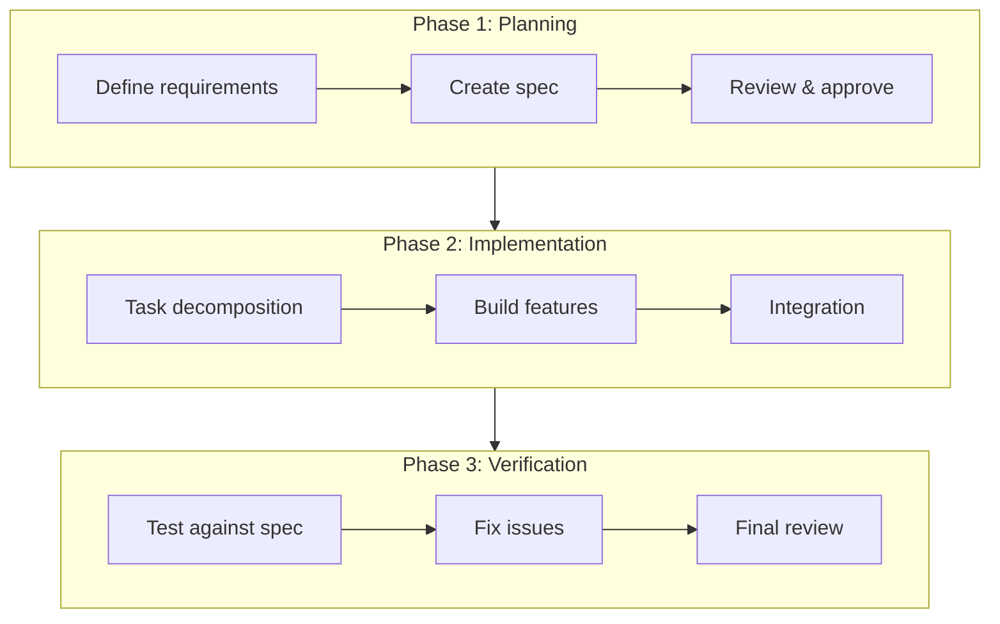
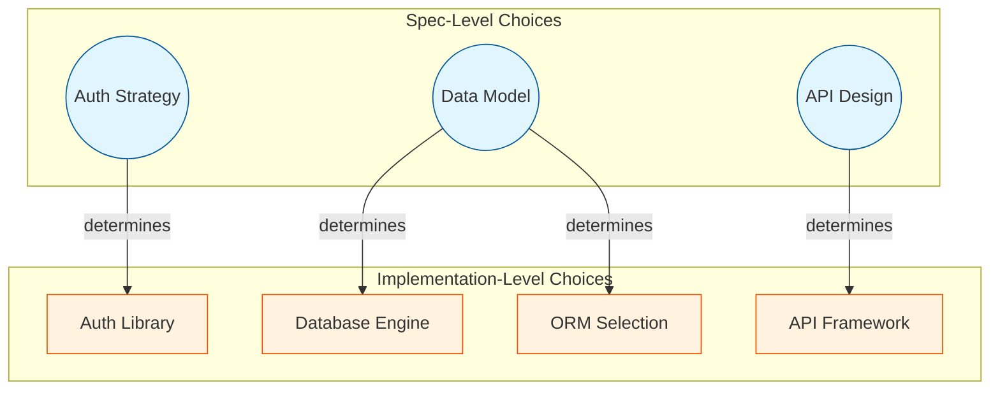
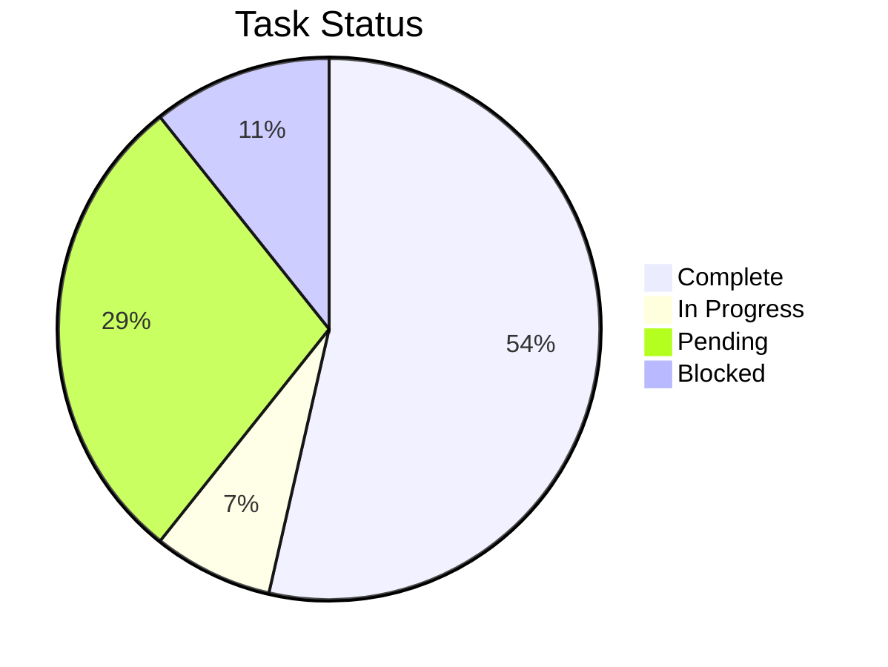
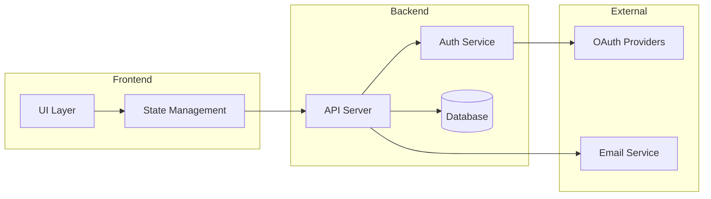
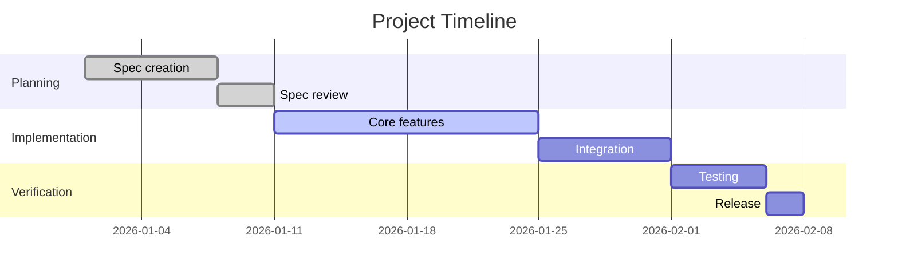
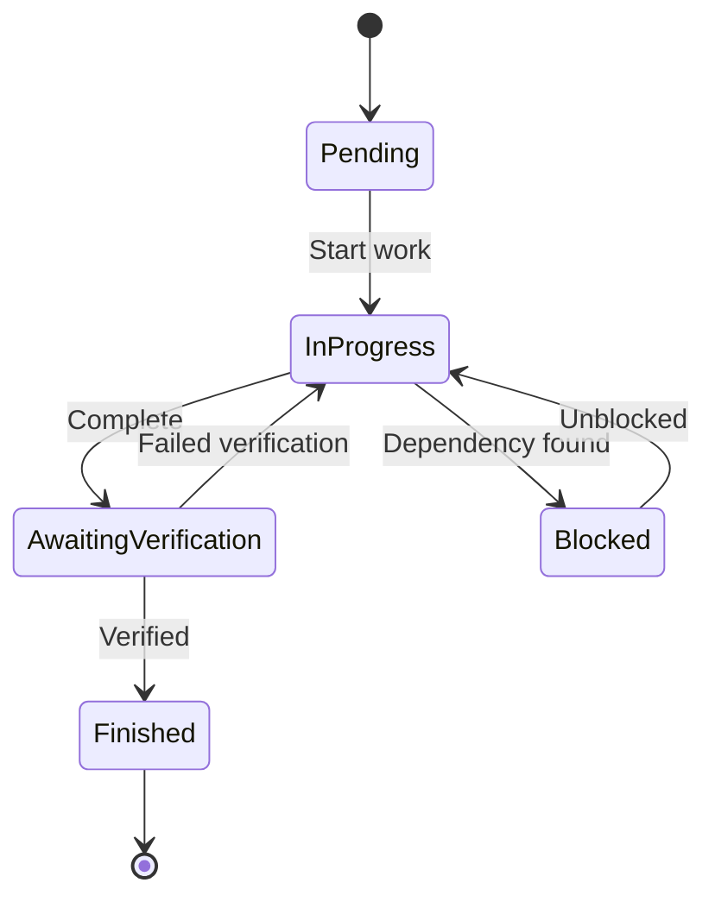
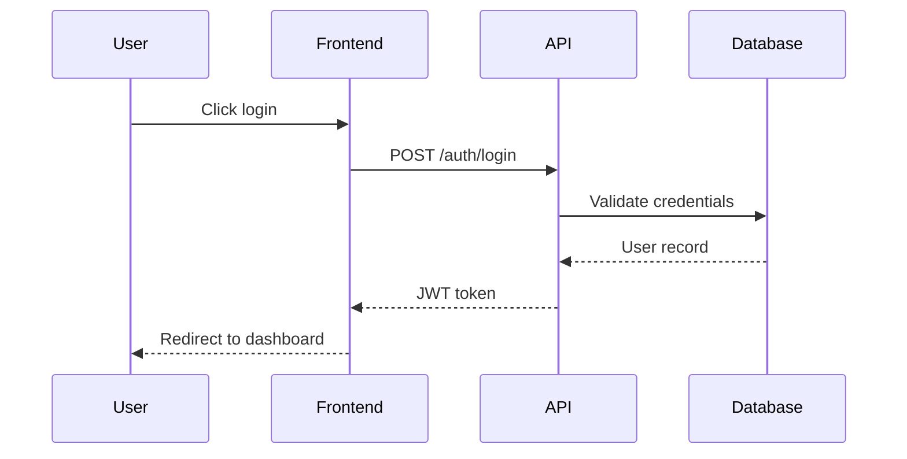
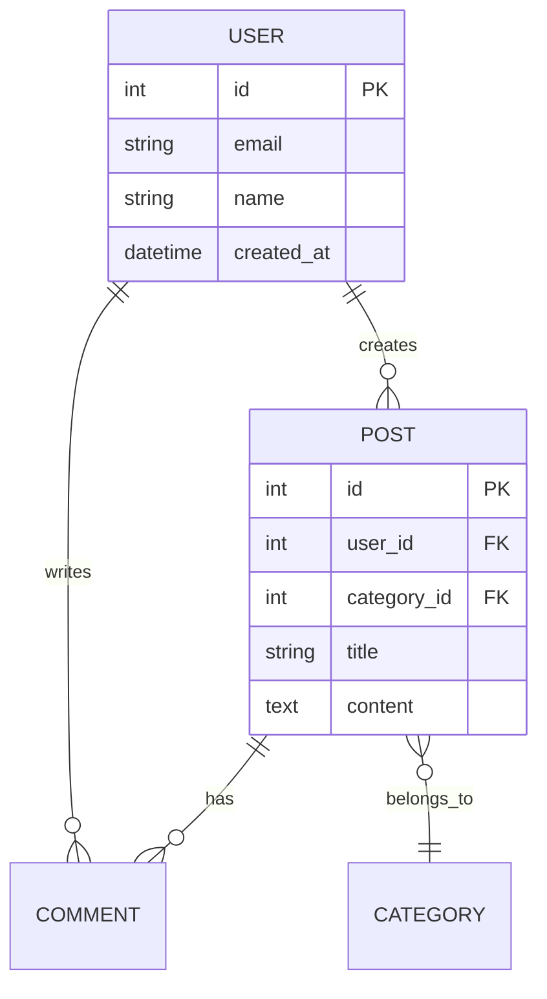

# Dashboard Patterns

Canonical dashboard structure and patterns. This file is the single source of truth for section headings, emojis, and ordering. Both dashboard regeneration (`/work`) and validation (`/health-check`) reference this file.

---

## Canonical Dashboard Template

The dashboard **must** contain these sections in this exact order. Section headings (including emojis) are fixed — do not vary them.

### Metadata Block

Immediately after the `# Dashboard` title, include a hidden metadata block:
```markdown
<!-- DASHBOARD META
generated: 2026-01-28T14:30:00Z
task_hash: sha256:abc123...
task_count: 15
verification_debt: 0
drift_deferrals: 0
-->
```

This enables `/work` Step 1a to detect dashboard staleness.

### Header Line

Below the metadata block, include:
```
*Regenerated by `/work` after task changes. May be stale if tasks were modified outside `/work`.*
```

### Section Definitions

| # | Heading | Emoji | Purpose |
|---|---------|-------|---------|
| 1 | `# Dashboard` | — | Title (followed by metadata block and header line) |
| 2 | `## Project Context` | — | Project metadata table (name, phase with progress, start date) |
| 3 | `## 🚨 Needs Your Attention` | 🚨 | **Primary communication hub** — everything Claude needs from you, with links to files and ways to respond. Decisions pending, human tasks, reviews, verification debt |
| 4 | `## Quick Status` | — | Overall completion %, summary counts by owner |
| 5 | `## 📐 Spec Alignment` | 📐 | Drift status per section, reconciliation debt (NEW) |
| 6 | `## 🛤️ Critical Path` | 🛤️ | Dependency chain to completion with owner indicators |
| 7 | `## 🤖 Claude Status` | 🤖 | In Progress / Ready to Start / Blocked for Claude tasks |
| 8 | `## 📊 Progress This Week` | 📊 | Completed/Started/Created counts, recently completed list |
| 9 | `## 📋 All Decisions` | 📋 | Decision log table (Selected column shows chosen option for decided, link for pending) |
| 10 | `## 📝 All Tasks` | 📝 | Full task table grouped by phase with per-phase summary lines |
| 11 | `## 💡 Notes & Ideas` | 💡 | User-preserved section between `<!-- USER SECTION -->` markers |

### Section Toggle Configuration

Users can control which sections Claude builds by adding a `dashboard_sections` block to the spec frontmatter or to a `dashboard-config` section in `.claude/CLAUDE.md`:

```yaml
# In spec frontmatter or .claude/CLAUDE.md
dashboard_sections:
  project_context: build        # actively create/update
  needs_attention: build
  quick_status: build
  spec_alignment: build         # drift status per section
  critical_path: build
  claude_status: build
  progress: build
  all_decisions: maintain       # preserve existing, minor updates only
  all_tasks: build
  notes: preserve               # always preserved (never overwritten)
```

**Modes:**
| Mode | Behavior |
|------|----------|
| `build` | Actively generate from source data on every regeneration (default) |
| `maintain` | Keep existing content, only update if data changes significantly |
| `exclude` | Skip this section entirely during regeneration |
| `preserve` | Never modify (Notes & Ideas always uses this) |

**Default:** If no configuration exists, all sections default to `build`.

**Where to configure:** Add `dashboard_sections` to the YAML frontmatter in `spec_v{N}.md`, or add a `## Dashboard Configuration` section in `.claude/CLAUDE.md` with the toggles. The spec frontmatter takes precedence.

### Regeneration Rules

When regenerating the dashboard:
1. **Read all `task-*.json` files** — tasks are the source of truth, not the previous dashboard
2. **Read all `decision-*.md` files** — decisions are the source of truth
3. **Preserve the Notes & Ideas section** — content between `<!-- USER SECTION -->` and `<!-- END USER SECTION -->` markers must be kept verbatim
4. **Use the exact headings above** — no emoji substitution, no heading rewording
5. **Separate sections with `---`** horizontal rules

### Regeneration Checklist

Every dashboard regeneration MUST complete these steps. All commands and agents that regenerate the dashboard reference this checklist to ensure consistency.

1. **Read source data**
   - All `task-*.json` files (tasks)
   - All `decision-*.md` files in `.claude/support/decisions/` (decisions)
   - `drift-deferrals.json` (if exists)
   - `verification-result.json` (if exists)

2. **Backup user section**
   - Extract content between `<!-- USER SECTION -->` and `<!-- END USER SECTION -->`
   - Save to `.claude/support/workspace/dashboard-notes-backup.md`
   - Rotate old backups (keep last 3)

3. **Generate dashboard**
   - Use exact section headings from Section Definitions table above
   - Check `dashboard_sections` config (spec frontmatter or `.claude/CLAUDE.md`)
   - Respect `build`/`maintain`/`exclude`/`preserve` modes
   - Enforce atomicity: only tasks with JSON files, only decisions with MD files

4. **Compute and add metadata block** (after `# Dashboard` title)
   ```
   <!-- DASHBOARD META
   generated: [ISO timestamp]
   task_hash: sha256:[hash of sorted task_id:status pairs, sorted lexicographically by task_id]
   task_count: [number]
   verification_debt: [count of tasks needing verification]
   drift_deferrals: [count from drift-deferrals.json]
   -->
   ```

5. **Restore user section**
   - Insert backed-up content between markers
   - If markers missing, append with warning comment: `<!-- WARNING: USER SECTION markers were missing. Content restored below. -->`

6. **Add footer line** (at very end)
   ```
   ---
   *Dashboard generated: [timestamp] | Tasks: N | [status indicator]*
   ```
   - Healthy (0 drift deferrals AND 0 verification debt): `[Spec aligned](# "0 drift deferrals, 0 verification debt")`
   - Issues (any drift deferrals OR any verification debt): `⚠️ N drift deferrals, M verification debt`

### Design Principle: Dashboard as Communication Hub

The dashboard is how Claude communicates with the user during the build phase. Every user-facing action item must be surfaced here — not buried in internal files. The principle is pragmatic: if the user needs to do something, the dashboard tells them what, links to where, and provides a way to signal back.

**Action item contract:**
- Every item in "Needs Your Attention" must be **actionable** — the user can see what to do without guessing
- If the action involves reading or editing a file, include a **link** to that file
- If the action requires confirmation, include a **checkbox** or clear instruction for how to signal completion
- If the action requires feedback, include a **feedback area** or link to where feedback goes

**What this means for regeneration:**
- When Claude creates a human task, the dashboard entry must include enough context to act on it
- When Claude needs a decision, the dashboard links to the decision record and states the question
- When Claude needs a file reviewed, the dashboard links to the file and says what to look for

### Sub-Section Structure

**Needs Your Attention** has four sub-sections:
- `### Verification Debt` — ERROR banner if any debt exists (see format below)
- `### Decisions Pending` — table: ID, Decision, Question, Options Doc (see example below)
- `### Tasks Ready for You` — table: ID, Task, Action, Link (see example below)
- `### Reviews & Approvals` — checklist with links and instructions (see example below)

**Claude Status** has three sub-sections:
- `### In Progress` — current task(s); when a parallel batch is active, shows all tasks in the batch with a batch indicator
- `### Ready to Start` — next available Claude tasks (optionally shows parallelism eligibility)
- `### Blocked` — Claude tasks blocked by dependencies, decisions, or file conflicts with in-progress tasks

### Table Formats

**Project Context:**
```
| Key | Value |
|-----|-------|
| **Project** | [name] |
| **Phase** | Phase 1: [Name] (X/Y tasks) |
| **Started** | [date] |
```

**Quick Status:**
```
**Overall: N% complete** (X of Y tasks)

| Phase | Done | Total | Status |
|-------|------|-------|--------|
| 1. [Name] | X | Y | 🔄 In progress |
| 2. [Name] | 0 | Z | ⏳ Waiting on Phase 1 |

| Total | Done | ❗ You | 🤖 Claude | 👥 Both | Blocked |
|-------|------|--------|-----------|---------|---------|
```

**All Tasks (grouped by phase):**
```markdown
### Phase 1: [Name]

| ID | Title | Status | Diff | Owner | Deps |
|----|-------|--------|------|-------|------|

*Phase 1: X/Y complete (N%)*

### Phase 2: [Name]

| ID | Title | Status | Diff | Owner | Deps |
|----|-------|--------|------|-------|------|

*Phase 2: X/Y complete (N%) — waiting on Phase 1*
```
- Out-of-spec tasks: prefix title with ⚠️
- Deps column can show `Phase 1` and `D-002` as dependency types
- Summary line: `*Summary: X/Y complete (N%)*`

**Tasks Ready for You (action item format):**

Human tasks and action items should include enough context to act on directly from the dashboard. Link to files when the action involves reading or editing, and provide a way to signal completion.

```markdown
### Tasks Ready for You

| ID | Task | Action | Link |
|----|------|--------|------|
| 7 | Configure API keys | Add keys to `.env` and check off | [.env.example](../../.env.example) |
| 11 | Review auth design | Read doc, leave feedback below | [auth-design.md](../decisions/decision-002.md) |

**Task 11 — Feedback:**
<!-- Write your feedback here, then run /work complete 11 -->

```

**Decisions Pending (with links):**
```markdown
### Decisions Pending

| ID | Decision | Question | Options Doc |
|----|----------|----------|-------------|
| D-001 | Auth strategy | OAuth vs JWT vs sessions? | [decision-001.md](../decisions/decision-001.md) |

*Open the decision doc, review options, and check your selection.*
```

**Reviews & Approvals (with links and checkboxes):**
```markdown
### Reviews & Approvals

- [ ] **Review API endpoints** — Claude implemented the REST API. Check it matches your expectations → [src/api/routes.ts](../../src/api/routes.ts)
- [ ] **Approve phase transition** — All execute tasks done. Ready for verification? → Run `/work`
- [ ] **Phase transition** — Phase 1 complete. Review before Phase 2 begins? → Run `/work`
```

**Rules for action items:**
- Always include a link when the action involves a specific file
- Always say what the user should *do* (not just what the status is)
- If feedback is needed, provide a feedback area or tell the user where to write it
- If confirmation is needed, use a checkbox or say which command to run
- Keep descriptions short — the linked file has the details

**Verification Debt (when debt > 0):**
```markdown
### Verification Debt

⛔ **Verification Debt: 3 tasks** — Project cannot complete until resolved

| Task | Title | Issue |
|------|-------|-------|
| 5 | Login flow | Missing verification |
| 8 | API endpoints | Verification failed |
| 12 | Database schema | Missing verification |

*Run `/work` to trigger verification for these tasks.*
```

**Verification Debt (when debt = 0):**
```markdown
### Verification Debt

✅ No verification debt
```

**Verification debt definition:**
- Tasks with `status: "Awaiting Verification"`, OR
- Tasks with `status: "Finished"` that do NOT have a `task_verification` field (legacy tasks), OR
- Tasks with `task_verification.result == "fail"`

All three categories appear in the debt table. Out-of-spec tasks (`out_of_spec: true`) are excluded from verification debt count.

**Spec Alignment:**
```markdown
## 📐 Spec Alignment

| Section | Status | Tasks | Last Reconciled |
|---------|--------|-------|-----------------|
| ## Authentication | ✅ Current | 3 | 2026-01-25 |
| ## API Endpoints | ⚠️ Deferred | 2 | (needs reconciliation) |
| ## Database | ✅ Current | 4 | 2026-01-20 |

**Drift status:** 1 section deferred (2 tasks affected)
```

**Spec Alignment (all current):**
```markdown
## 📐 Spec Alignment

✅ All sections aligned — no drift detected
```

**All Decisions:**
```
| ID | Decision | Status | Selected |
|----|----------|--------|----------|
```
- Decided entries: show selected option name (e.g., "PostgreSQL")
- Pending entries: link to the decision doc (e.g., `[decision-002.md](../decisions/decision-002.md)`)

### Empty State Placeholders

When a section has no data, use italic placeholder text:
- `*No pending decisions*`
- `*No human tasks ready*`
- `*Nothing to review*`
- `*No tasks in progress*` (already plural-compatible)
- `*No Claude tasks ready*`
- `*No Claude tasks blocked*`
- `*No recent completions*`
- `*No decisions yet*`
- `*No tasks yet*`
- `*No tasks defined yet*`

### Parallel Batch Display

When a parallel batch is active, the "In Progress" sub-section shows all tasks in the batch:

**Parallel mode (multiple tasks in progress):**
```markdown
### In Progress

**Parallel batch (3 tasks):**

| Task | Title | Files | Status |
|------|-------|-------|--------|
| 3 | Setup database schema | `src/db/schema.sql` | 🔄 Implementing |
| 4 | Create API routes | `src/api/routes.ts` | 🔄 Implementing |
| 5 | Add auth middleware | `src/middleware/auth.ts` | ✅ Verified |
```

**Sequential mode (single task, default format):**
```markdown
### In Progress

🔄 **Task 3**: Setup database schema
```

**Ready to Start with parallelism info (optional):**
```markdown
### Ready to Start

| Task | Title | Parallel-Eligible? |
|------|-------|--------------------|
| 6 | Add logging | ✅ No file conflicts |
| 7 | Write tests for auth | ⚠️ Conflicts with task 5 (`src/middleware/auth.ts`) |
```

The parallel-eligibility column is informational only — shown when there are tasks in the Ready state and parallel execution is enabled.

**Blocked (with blocking reasons):**
```markdown
### Blocked

| Task | Title | Blocked By |
|------|-------|------------|
| 4 | Run analysis | DEC-001 (Analysis Method) |
| 5 | Calculate effect sizes | DEC-001 (Analysis Method) |
| 7 | Publication charts | DEC-002 + Phase 2 |
```

The "Blocked By" column shows the specific blocker: decision IDs (with short title), phase dependencies, task dependencies, or file conflicts with in-progress tasks. Multiple blockers are joined with `+`.

**Empty state:**
```markdown
### Blocked

*No Claude tasks blocked*
```

---

## Review Item Lifecycle

Items in the **Needs Your Attention → Reviews & Approvals** section follow a defined lifecycle.

### What Creates Review Items

| Source | Item | Example |
|--------|------|---------|
| verify-agent | Out-of-spec task recommendations | "Add unit tests for CI" needing Accept/Reject/Defer |
| `/work` | Phase boundary approvals | "Implementation complete. Ready to verify?" |
| `/work` | Spec drift detected | "2 sections changed, 4 tasks affected" |
| implement-agent | Decision needing user input | Decision record created, awaiting approval |
| Questions system | Blocking questions | `[BLOCKING]` question in questions.md |

### When Items Are Resolved

| Item Type | Resolved When |
|-----------|---------------|
| Out-of-spec recommendations | User selects Accept/Reject/Defer for each |
| Phase boundary approvals | User confirms transition |
| Spec drift notifications | User processes reconciliation UI |
| Pending decisions | Decision status changes from `draft`/`proposed` to `approved`/`implemented` |
| Blocking questions | Question moved to Answered table in questions.md |

### Dashboard Regeneration Rules

Review items are **derived, not stored**. During regeneration:

1. **Scan for unresolved items** — check task files for `out_of_spec: true` without `out_of_spec_approved`, check decision files for `draft`/`proposed` status, check questions.md for unresolved blocking questions
2. **Populate the Reviews & Approvals table** from current data
3. **Never carry forward stale entries** — if the underlying data is resolved, the item disappears on next regeneration
4. **No dangling references** — every review item must link to a concrete file (task JSON, decision MD, or questions.md entry). Never write "see findings below" without the actual content.

### Preventing Staleness

Since the dashboard is regenerated from source files, review items automatically clear when:
- A task is deleted or approved → removed from next regeneration
- A decision is approved → no longer appears as pending
- A question is answered → no longer appears as blocking

No manual cleanup is needed.

---

## Dashboard Footer

Every dashboard ends with a footer line showing generation metadata:

```markdown
---
*Dashboard generated: 2026-01-28 14:30 UTC | Tasks: 15 | [Spec aligned](# "0 drift deferrals, 0 verification debt")*
```

**When issues exist:**
```markdown
---
*Dashboard generated: 2026-01-28 14:30 UTC | Tasks: 15 | ⚠️ 2 drift deferrals, 3 verification debt*
```

This provides at-a-glance health status without scrolling through the full dashboard.

---

## Domain-Specific Sub-Dashboards

*Added: 2026-01-27*

**Context:** When a project has a complex domain area that needs dedicated tracking beyond the main task list - such as workshop management, inventory tracking, customer pipelines, or experiment logs.

**Pattern:** Create a separate markdown file in `.claude/support/` for domain-specific tracking, then link to it from the main dashboard's Notes section.

**Structure:**
```markdown
# [Domain] Dashboard

*Last updated: [date]*

## [Key Metric 1]
| Column | Column | Column |
|--------|--------|--------|
| data   | data   | data   |

## [Key Metric 2]
...

## Quick Actions
- [ ] Action item 1
- [ ] Action item 2
```

**Example - Workshop Management:**
```markdown
# Workshop Management Dashboard

## Upcoming Sessions
| Date | Topic | Registered | Capacity | Status |
|------|-------|------------|----------|--------|
| 2026-02-15 | Intro to ML | 23 | 30 | Open |
| 2026-02-22 | Advanced NLP | 30 | 30 | Full |

## Materials Status
| Workshop | Slides | Exercises | Solutions |
|----------|--------|-----------|-----------|
| Intro to ML | ✅ | ✅ | 🔄 |
| Advanced NLP | ✅ | ⏳ | ⏳ |

## Quick Actions
- [ ] Finalize ML solutions
- [ ] Create NLP exercises
```

**Why:** The main dashboard tracks tasks and project progress. Domain-specific dashboards track operational metrics unique to your project's subject matter. Separating them:
- Keeps the main dashboard focused on development progress
- Allows domain tracking to evolve independently
- Provides a single place to check domain-specific status

**When to use:**
- Project has operational concerns beyond code (events, inventory, experiments)
- You find yourself asking "what's the status of X" where X isn't a development task
- Multiple people need to track domain-specific metrics

**Linking from main dashboard:**
Add to the Notes & Ideas section:
```markdown
## 💡 Notes & Ideas

**Quick Links:**
- [Workshop Dashboard](support/workshop-dashboard.md)
- [Experiment Log](support/experiment-log.md)

[Your notes here...]
```

---

## Critical Path Clarity

*Added: 2026-01-27*

**Context:** When multiple people (or Claude and human) are working on a project and need to know what's blocking progress.

**Pattern:** The Critical Path section shows the sequence of dependent tasks that must complete for the project to finish. Each step indicates who owns it, making handoff points clear.

**Reading the critical path:**
- ❗ **You**: Human action required - Claude is waiting
- 🤖 **Claude**: Claude can proceed - human doesn't need to act
- 👥 **Both**: Collaborative task - coordinate timing

**Example:**
```markdown
## 🛤️ Critical Path

**Next steps to completion:**

1. ❗ **You**: Review API design doc - *blocks step 2*
2. 🤖 **Claude**: Implement API endpoints - *blocks step 3*
3. 👥 **Both**: Integration testing
4. ❗ **You**: Production deployment approval

*4 steps remaining on critical path*
```

**Why:** Without this view, it's easy to lose track of what's actually blocking progress vs. what's parallel work that can wait.

---

## Optional Visualizations

*Added: 2026-01-29*

**Context:** For complex projects, visual diagrams can communicate structure and progress more effectively than tables alone. These are optional additions that projects can adopt when the complexity warrants them.

**Pattern:** Create separate visualization files in `.claude/support/visualizations/` and link from the dashboard or relevant documentation.

### Recommended Visualizations

| File | Purpose | When to Use |
|------|---------|-------------|
| `workflow.md` | Phase diagram showing project stages | Multi-phase projects with distinct stages |
| `dependencies.md` | Choice dependency graph | Projects with many interconnected decisions |
| `architecture.md` | System component diagram | Complex systems with multiple services |
| `progress.md` | Status charts and timeline | Stakeholder communication, status reports |

### Example Structure

```
.claude/support/visualizations/
├── workflow.md          # Phase flow diagram
├── dependencies.md      # Spec-level → Implementation-level choices
├── architecture.md      # System component diagram
└── progress.md          # Status pie chart, Gantt timeline
```

### Linking from Dashboard

Add to the Notes & Ideas section:
```markdown
## 💡 Notes & Ideas

**Project Visualizations:**
- [Workflow Phases](support/visualizations/workflow.md)
- [Decision Dependencies](support/visualizations/dependencies.md)
- [System Architecture](support/visualizations/architecture.md)

[Your notes here...]
```

### Visualization File Template

```markdown
# [Visualization Name]

*Last updated: YYYY-MM-DD*

## Overview

[Brief description of what this visualization shows]

## Diagram

\`\`\`mermaid
[mermaid diagram code]
\`\`\`

## Legend

- **[Symbol/Color 1]**: [Meaning]
- **[Symbol/Color 2]**: [Meaning]

## Notes

[Any context needed to interpret the diagram]
```

### When NOT to Use Visualizations

- Simple projects with linear task lists
- When the dashboard tables already communicate clearly
- When no one will maintain them (stale diagrams are worse than none)

### Maintenance

Visualizations should be updated when:
- System architecture changes significantly
- New major decisions affect the dependency graph
- Project enters a new phase

See [Mermaid Diagram Patterns](#mermaid-diagram-patterns) below for reusable diagram templates.

---

## Mermaid Diagram Patterns

Reusable diagram patterns for project documentation. Copy and adapt as needed.

### Workflow Phases

Shows sequential phases with sub-steps. Good for development workflows, deployment pipelines, or user journeys.



### Decision Dependencies

Shows how choices flow from design to implementation.



### Task Status Distribution



### Component Architecture



### Progress Timeline (Gantt)



### State Machine



### Sequence Diagram



### Entity Relationship



### Diagram Tips

- **One concept per diagram** — if it needs extensive explanation, split it
- **Subgraphs for grouping** — helps readers understand boundaries
- **Consistent colors** — blue for spec/design, orange for implementation, green for complete, red for blocked
- **Update when structure changes** — stale diagrams are worse than none
- **Embed** in decision records when central to understanding; **link** from dashboard when supplementary

| Pattern | Good For |
|---------|----------|
| Workflow Phases | Spec overview, README, process docs |
| Decision Dependencies | Decision records, architecture docs |
| Task Status | Dashboard, status updates |
| Component Architecture | System overview, onboarding docs |
| Progress Timeline | Project planning, stakeholder updates |
| State Machine | Task lifecycle docs, workflow specs |
| Sequence Diagram | API documentation, integration specs |
| Entity Relationship | Database design, data model docs |
