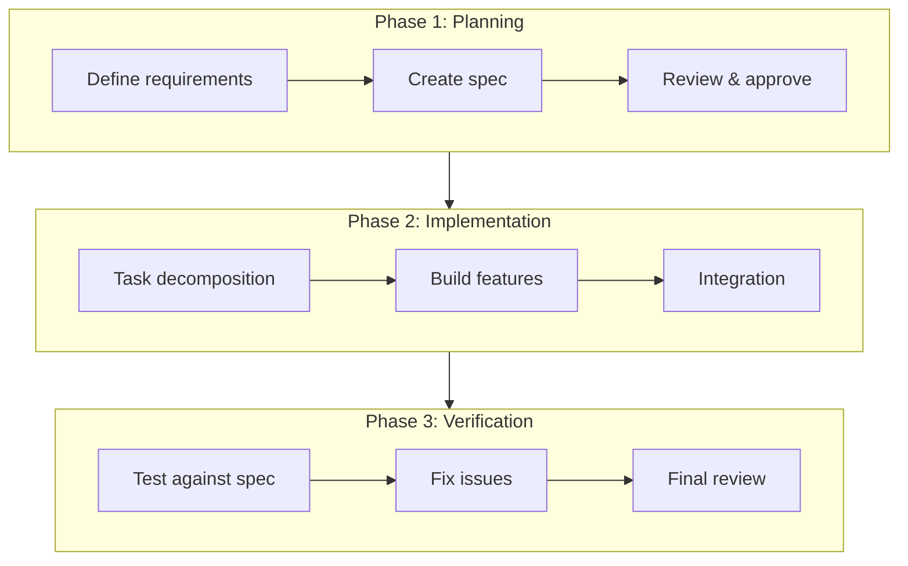
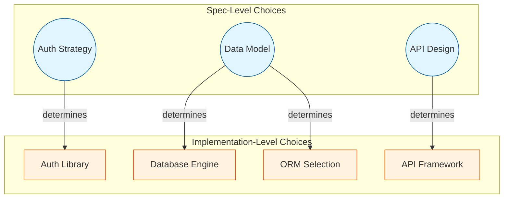
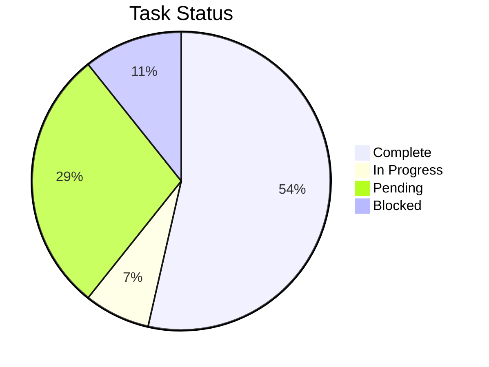
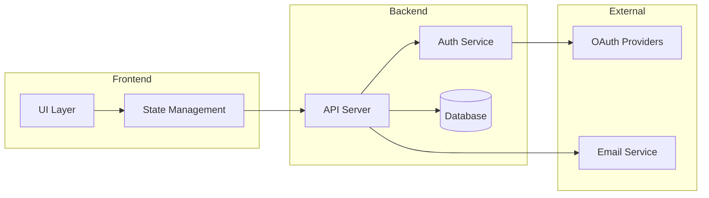
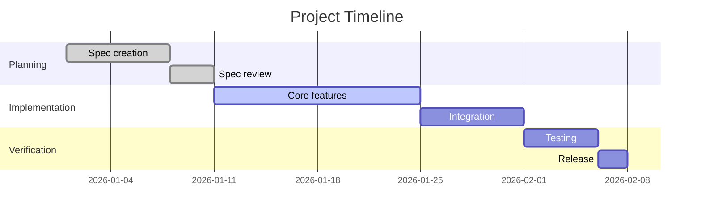
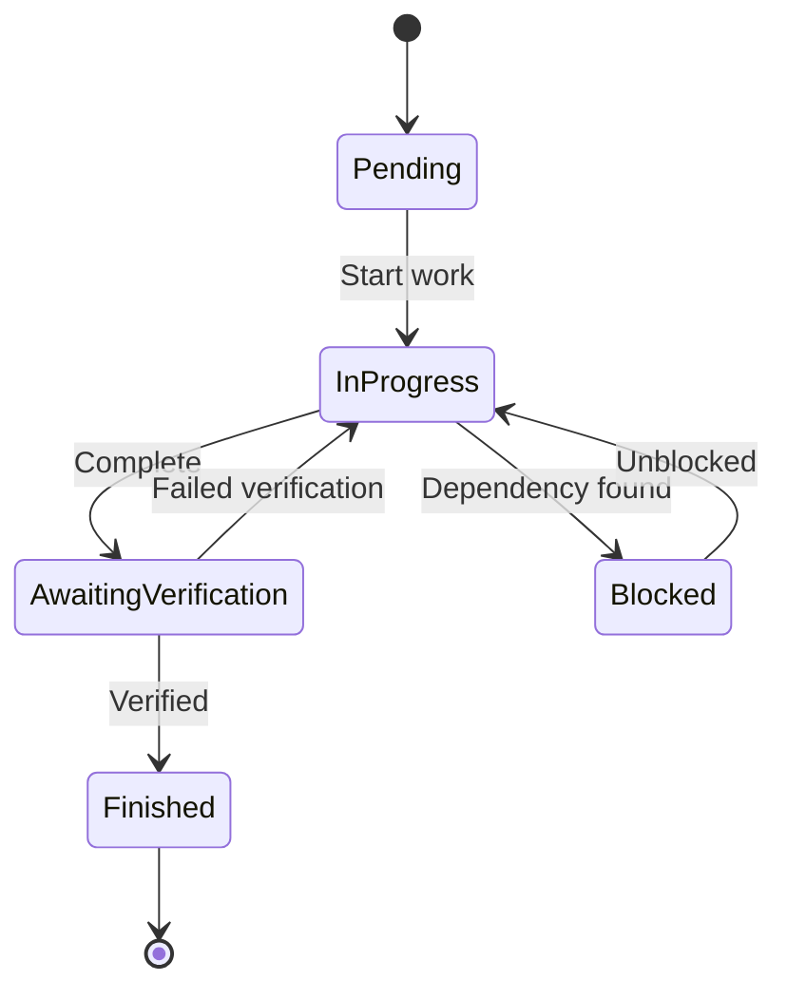
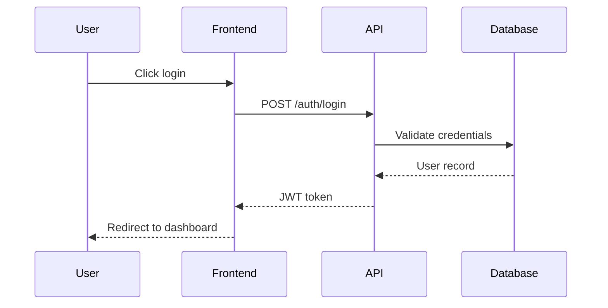
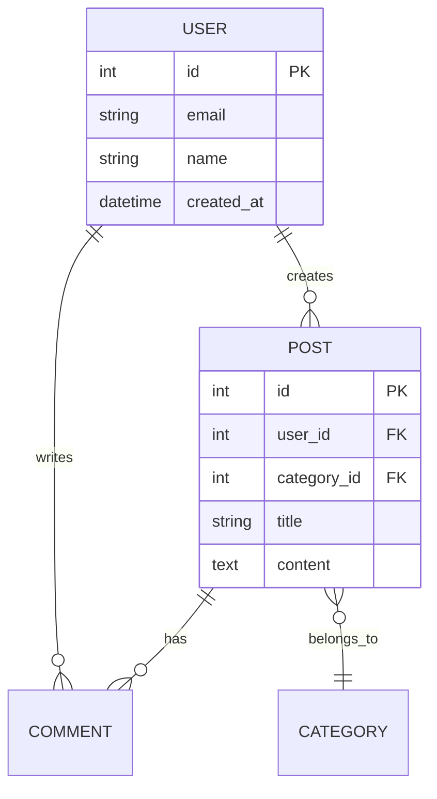

# Extension Patterns

Patterns for structuring complex projects. Phases are implicit from spec structure; decisions are always available.

---

## Overview

The core workflow (Spec → Execute → Verify) handles most projects well. These patterns add structure for projects with additional complexity:

| Pattern | Purpose | When to Use |
|---------|---------|-------------|
| **Phases** | Sequential project stages where Phase N+1 can't begin until Phase N completes | Multi-phase projects with natural boundaries |
| **Decisions** | Tracked choices with comparison matrix, option analysis, and optional weighted scoring | Technical or methodological choices that block downstream work |

Both patterns are lightweight. Phases emerge from spec structure; decisions use the existing decision record format.

---

## Phases

Phases structure a project into sequential stages. Work in Phase N+1 cannot begin until all Phase N tasks are complete.

### Purpose

- Enforce natural project boundaries (prototype → production, data pipeline → visualization)
- Prevent premature work on later stages
- Provide clear progress tracking per stage

### How Phases Work

Phases are implicit — they come from the spec structure, not from special configuration.

1. **Spec defines phases:** Sections in the spec naturally group into phases (e.g., "## Phase 1: Data Pipeline", "## Phase 2: Visualization")
2. **Tasks get a `phase` field:** During decomposition, `/work` assigns each task a phase based on its spec section
3. **Phase ordering is enforced:** Tasks in Phase N+1 remain blocked until all Phase N tasks are "Finished"
4. **Dashboard groups by phase:** All Tasks section shows tasks under phase headers with per-phase progress

### Task Schema

Tasks include a `phase` field:

```json
{
  "id": "11",
  "title": "Chart: enrollment timeline",
  "phase": "2",
  "dependencies": [],
  "decision_dependencies": ["DEC-002"]
}
```

Phase dependencies are checked alongside task dependencies. A task is eligible when:
- All its explicit `dependencies` are "Finished"
- All tasks in earlier phases are "Finished"
- All its `decision_dependencies` are resolved

### Phase Transitions

When all Phase N tasks complete:
- `/work` detects the transition and logs it
- If Phase N+1 needs more detail in the spec, `/work` suggests running `/iterate` to flesh it out
- Dashboard updates to show the new active phase

### No Special Configuration

Unlike the previous stage gates pattern, phases require no frontmatter config, no criteria files, and no folder blocking. Phase membership comes from task metadata, and ordering is enforced through the existing dependency system.

---

## Decisions

Decisions are tracked choices that block downstream work until resolved. They use the existing decision record format with a few additions.

### Purpose

- Document choices with multiple viable options
- Block dependent tasks until a selection is made
- Distinguish between pick-and-go decisions and inflection points

### Decision Records

Decision records live in `.claude/support/decisions/decision-*.md`. They contain:

- **Comparison matrix** — criteria vs options table
- **Option details** — strengths, weaknesses, research notes per option
- **Optional weighted scoring** — for high-stakes decisions
- **Checkbox selection** — user marks their choice directly in the doc

See [decisions.md](decisions.md) for the full format.

### Pick-and-Go vs Inflection Point

| Type | What Happens After Resolution |
|------|-------------------------------|
| **Pick-and-go** | Blocked tasks unblock; `/work` continues normally |
| **Inflection point** | `/work` pauses and suggests running `/iterate` to revisit the spec, because the outcome changes what gets built |

Inflection points are flagged with `inflection_point: true` in the decision frontmatter. Examples:
- "Supervised vs unsupervised analysis" — changes what data you collect, what pipeline you build
- "REST vs GraphQL" might be pick-and-go (same features, different implementation)

### Task Dependencies on Decisions

Tasks can depend on decisions via the `decision_dependencies` field:

```json
{
  "id": "11",
  "title": "Chart: enrollment timeline",
  "decision_dependencies": ["DEC-002"],
  "notes": "Blocked until visualization library is chosen"
}
```

When `/work` detects a task blocked by an unresolved decision:
1. Surfaces the decision: "Decision DEC-002 blocks N tasks. Open the decision doc to make your selection, then run `/work` again."
2. Provides a link to the decision doc
3. Continues with unblocked tasks

### Post-Decision Behavior in `/work`

When `/work` detects a previously-pending decision is now resolved:

1. **Read the decision record** — check `inflection_point` field
2. **If pick-and-go** (`inflection_point: false` or absent):
   - Unblock dependent tasks
   - Continue executing
3. **If inflection point** (`inflection_point: true`):
   - Pause execution
   - Inform user: "Decision DEC-002 was an inflection point. The spec may need updating. Run `/iterate` to review affected sections, then `/work` to continue."
   - Do not proceed until `/iterate` has run

### Dashboard Integration

Decisions appear in the dashboard:

- **All Decisions table:** `ID | Decision | Status | Selected`
  - Decided entries show the selected option name
  - Pending entries link to the decision doc
- **Needs Your Attention:** Pending decisions that block tasks appear here with links
- **Blocked tasks:** Show decision IDs in their dependency column

---

## Domain-Specific Sub-Dashboards

**Context:** When a project has a complex domain area that needs dedicated tracking beyond the main task list — such as workshop management, inventory tracking, customer pipelines, or experiment logs.

**Pattern:** Create a separate markdown file in `.claude/support/` for domain-specific tracking, then link to it from the main dashboard's Notes section.

**Structure:**
```markdown
# [Domain] Dashboard

*Last updated: [date]*

## [Key Metric 1]
| Column | Column | Column |
|--------|--------|--------|
| data   | data   | data   |

## [Key Metric 2]
...

## Quick Actions
- [ ] Action item 1
- [ ] Action item 2
```

**Example — Workshop Management:**
```markdown
# Workshop Management Dashboard

## Upcoming Sessions
| Date | Topic | Registered | Capacity | Status |
|------|-------|------------|----------|--------|
| 2026-02-15 | Intro to ML | 23 | 30 | Open |
| 2026-02-22 | Advanced NLP | 30 | 30 | Full |

## Materials Status
| Workshop | Slides | Exercises | Solutions |
|----------|--------|-----------|-----------|
| Intro to ML | ✅ | ✅ | 🔄 |
| Advanced NLP | ✅ | ⏳ | ⏳ |

## Quick Actions
- [ ] Finalize ML solutions
- [ ] Create NLP exercises
```

**When to use:**
- Project has operational concerns beyond code (events, inventory, experiments)
- You find yourself asking "what's the status of X" where X isn't a development task
- Multiple people need to track domain-specific metrics

**Linking from main dashboard:**
Add to the Notes & Ideas section:
```markdown
## 💡 Notes & Ideas

**Quick Links:**
- [Workshop Dashboard](support/workshop-dashboard.md)
- [Experiment Log](support/experiment-log.md)

[Your notes here...]
```

---

## Optional Visualizations

**Context:** For complex projects, visual diagrams can communicate structure and progress more effectively than tables alone. These are optional additions that projects can adopt when the complexity warrants them.

**Pattern:** Create separate visualization files in `.claude/support/visualizations/` and link from the dashboard or relevant documentation.

### Recommended Visualizations

| File | Purpose | When to Use |
|------|---------|-------------|
| `workflow.md` | Phase diagram showing project stages | Multi-phase projects with distinct stages |
| `dependencies.md` | Choice dependency graph | Projects with many interconnected decisions |
| `architecture.md` | System component diagram | Complex systems with multiple services |
| `progress.md` | Status charts and timeline | Stakeholder communication, status reports |

### Example Structure

```
.claude/support/visualizations/
├── workflow.md          # Phase flow diagram
├── dependencies.md      # Spec-level → Implementation-level choices
├── architecture.md      # System component diagram
└── progress.md          # Status pie chart, Gantt timeline
```

### Linking from Dashboard

Add to the Notes & Ideas section:
```markdown
## 💡 Notes & Ideas

**Project Visualizations:**
- [Workflow Phases](support/visualizations/workflow.md)
- [Decision Dependencies](support/visualizations/dependencies.md)
- [System Architecture](support/visualizations/architecture.md)

[Your notes here...]
```

### Visualization File Template

```markdown
# [Visualization Name]

*Last updated: YYYY-MM-DD*

## Overview

[Brief description of what this visualization shows]

## Diagram

\`\`\`mermaid
[mermaid diagram code]
\`\`\`

## Legend

- **[Symbol/Color 1]**: [Meaning]
- **[Symbol/Color 2]**: [Meaning]

## Notes

[Any context needed to interpret the diagram]
```

### When NOT to Use Visualizations

- Simple projects with linear task lists
- When the dashboard tables already communicate clearly
- When no one will maintain them (stale diagrams are worse than none)

### Maintenance

Visualizations should be updated when:
- System architecture changes significantly
- New major decisions affect the dependency graph
- Project enters a new phase

See [Mermaid Diagram Patterns](#mermaid-diagram-patterns) below for reusable diagram templates.

---

## Mermaid Diagram Patterns

Reusable diagram patterns for project documentation. Copy and adapt as needed.

### Workflow Phases

Shows sequential phases with sub-steps. Good for development workflows, deployment pipelines, or user journeys.



### Decision Dependencies

Shows how choices flow from design to implementation.



### Task Status Distribution



### Component Architecture



### Progress Timeline (Gantt)



### State Machine



### Sequence Diagram



### Entity Relationship



### Diagram Tips

- **One concept per diagram** — if it needs extensive explanation, split it
- **Subgraphs for grouping** — helps readers understand boundaries
- **Consistent colors** — blue for spec/design, orange for implementation, green for complete, red for blocked
- **Update when structure changes** — stale diagrams are worse than none
- **Embed** in decision records when central to understanding; **link** from dashboard when supplementary

| Pattern | Good For |
|---------|----------|
| Workflow Phases | Spec overview, README, process docs |
| Decision Dependencies | Decision records, architecture docs |
| Task Status | Dashboard, status updates |
| Component Architecture | System overview, onboarding docs |
| Progress Timeline | Project planning, stakeholder updates |
| State Machine | Task lifecycle docs, workflow specs |
| Sequence Diagram | API documentation, integration specs |
| Entity Relationship | Database design, data model docs |

---

## Related Files

- [decisions.md](decisions.md) — Decision record format and selection mechanism
- [dashboard.md](../../dashboard.md) — Dashboard template with inline format hints
- [shared-definitions.md](shared-definitions.md) — Vocabulary (Phase, Decision, Inflection Point, Human Task)
- [workflow.md](workflow.md) — Core workflow documentation
