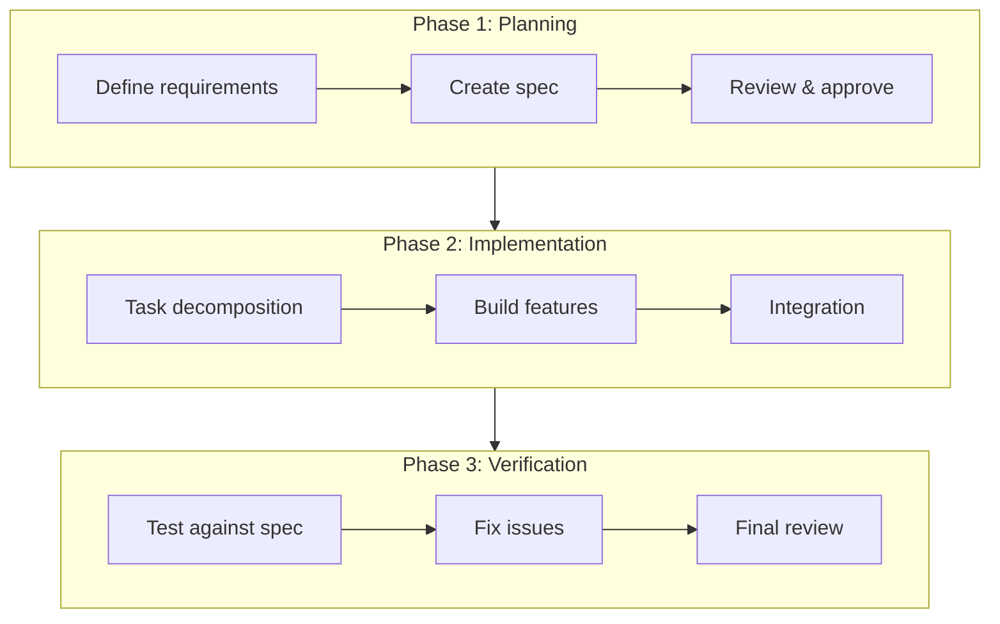
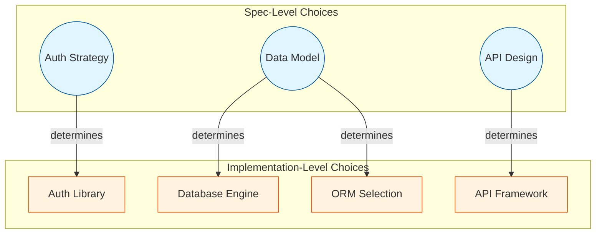
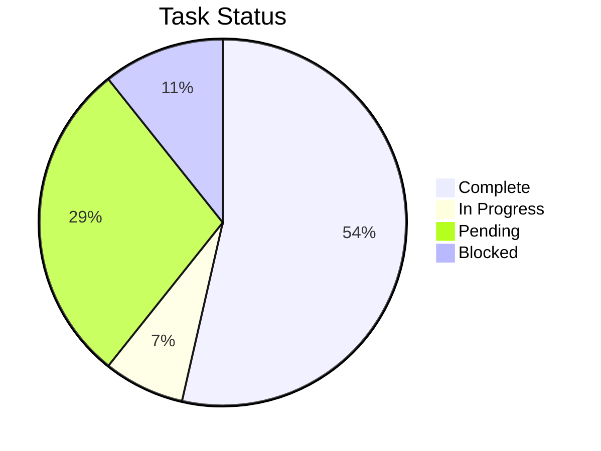
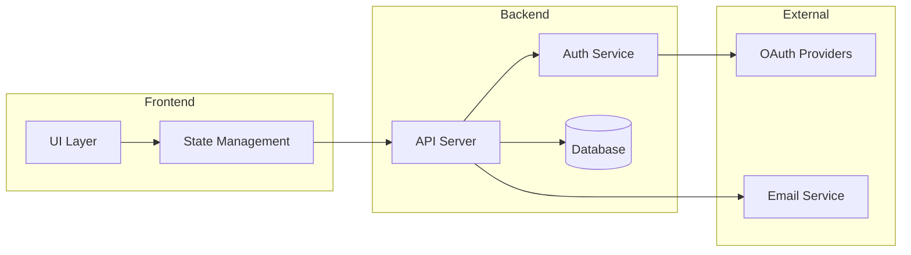
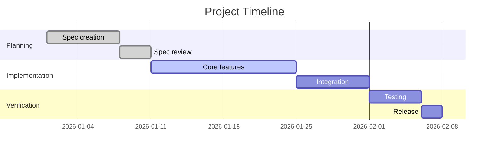
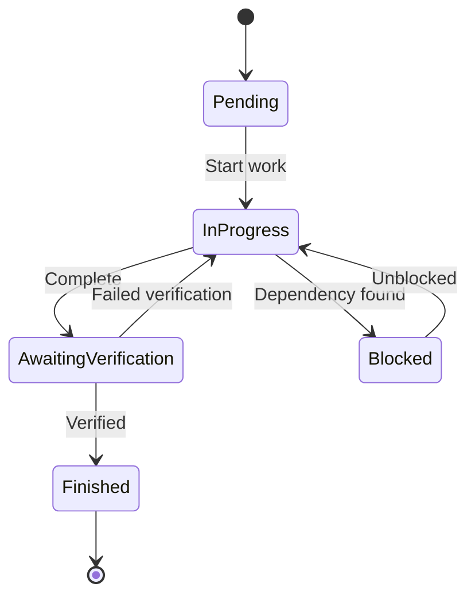
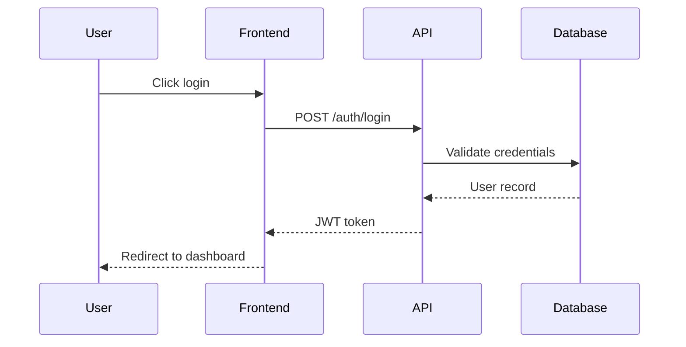
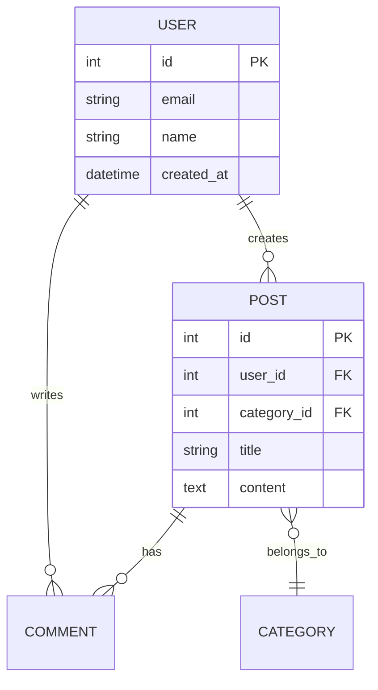

# Mermaid Chart Patterns

Reusable diagram patterns for project documentation. Copy and adapt as needed.

---

## 1. Workflow Phases

Shows sequential phases with sub-steps. Good for documenting development workflows, deployment pipelines, or user journeys.

**Customization points:**
- Phase names and count
- Steps within each phase
- Arrow labels for conditions (`-->|condition|`)

---

## 2. Decision Dependencies

Shows how choices flow from design to implementation. Good for visualizing the relationship between spec-level and implementation-level decisions.

**Customization points:**
- Node shapes: `(( ))` for circles, `[ ]` for rectangles, `{ }` for diamonds
- Colors via `classDef` and `class`
- Relationship labels

---

## 3. Task Status Distribution

Shows task distribution across statuses. Good for quick project health overview.

**Customization points:**
- Title text
- Category names and values
- Use actual task counts from your project

---

## 4. Component Architecture

Shows system components and their relationships. Good for high-level system overview.

**Customization points:**
- Direction: `graph LR` (left-right), `graph TD` (top-down)
- Subgraph groupings
- Node shapes for different component types
- Bidirectional arrows: `<-->`

---

## 5. Progress Timeline (Gantt)

Shows project timeline with phases and dependencies. Good for planning and status communication.

**Customization points:**
- Task status: `done`, `active`, `crit` (critical), or omit for future
- Duration: `7d`, `2w`, or specific dates
- Dependencies: `after taskId`

---

## 6. State Machine

Shows states and transitions. Good for documenting task lifecycles, user flows, or system states.

**Customization points:**
- State names
- Transition labels
- Start `[*]` and end `[*]` markers

---

## 7. Sequence Diagram

Shows interactions over time. Good for API flows, auth sequences, or multi-service interactions.

**Customization points:**
- Participant names
- Arrow types: `->>` (solid), `-->>` (dashed), `-x` (cross)
- Notes: `Note over A,B: text`
- Loops: `loop Every minute`

---

## 8. Entity Relationship

Shows data model relationships. Good for database schema documentation.

**Customization points:**
- Relationship cardinality: `||` (one), `o{` (many), `|{` (one or more)
- Entity attributes with types
- Primary/foreign key markers

---

## Usage Tips

### Keep Diagrams Focused
One concept per diagram. If a diagram needs extensive explanation, split it.

### Use Subgraphs for Grouping
Group related nodes visually. Helps readers understand boundaries.

### Color-Code Consistently
Pick a color scheme and stick to it:
- Blue tones for spec/design elements
- Orange/yellow for implementation details
- Green for complete/success states
- Red for blocked/error states

### Update When Structure Changes
Diagrams go stale. Update them when the system structure they represent changes significantly.

### Embed or Link
- **Embed** in decision records or spec sections when the diagram is central to understanding
- **Link** from dashboard or overview docs when the diagram is supplementary

---

## Where to Use These Patterns

| Pattern | Good For |
|---------|----------|
| Workflow Phases | Spec overview, README, process docs |
| Decision Dependencies | Decision records, architecture docs |
| Task Status | Dashboard, status updates |
| Component Architecture | System overview, onboarding docs |
| Progress Timeline | Project planning, stakeholder updates |
| State Machine | Task lifecycle docs, workflow specs |
| Sequence Diagram | API documentation, integration specs |
| Entity Relationship | Database design, data model docs |
