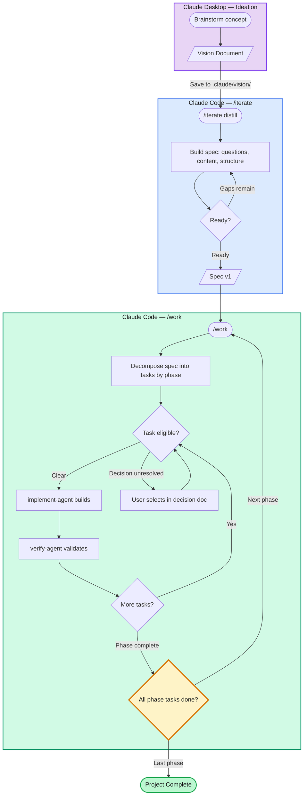

# Claude Code Environment Template

A ready-to-use project template for Claude Code with Spec→Execute→Verify workflow.

**Designed for Claude Opus 4.6.** The difficulty scale, task breakdown thresholds, and agent workflows are calibrated for Opus-level reasoning.

## Using This Template

```bash
# Clone and start a new project
git clone https://github.com/your-username/claude_code_environment.git my-project
cd my-project
rm -rf .git && git init

# Customize
# 1. Edit .claude/CLAUDE.md — delete everything above the --- separator
# 2. Delete this README.md, tests/, and root CLAUDE.md (template maintenance files)
# 3. Run /iterate in Claude Code to create your spec
```

**What ships to your project:** The `.claude/` directory. Everything at root level (this README, tests/, CLAUDE.md) is template maintenance infrastructure — delete it when starting a new project.

## Repository Structure

```
├── README.md                      # This file (template docs, delete in projects)
├── CLAUDE.md                      # Template maintenance context for Claude Code
├── tests/                         # Conceptual test scenarios for template commands
│   ├── README.md
│   └── scenarios/
│       ├── 01-decision-discovery.md
│       ├── 02-decision-blocking.md
│       ├── 03-inflection-point-handoff.md
│       ├── 04-dashboard-skeleton.md
│       ├── 05-phase-transition.md
│       ├── 06-late-decision-antipattern.md
│       └── 07-session-resumption.md
└── .claude/                       # ← This is what ships to new projects
    ├── CLAUDE.md                  # Instructions for Claude Code
    ├── spec_v{N}.md               # Source of truth: requirements
    ├── dashboard.md               # Project Dashboard (auto-generated)
    ├── tasks/                     # Task data
    ├── commands/                  # Slash commands (/work, /iterate, etc.)
    ├── agents/                    # Specialist agents (implement, verify)
    └── support/                   # Reference docs, decisions, workspace
```

## Workflow



### Core Concepts

| Concept | What It Is | Example | Resolved By |
|---------|-----------|---------|-------------|
| **Phase** | Sequential project stage. Phase N+1 blocked until Phase N complete. | "Build pilot first, then production" | All phase tasks finish, next phase unlocks |
| **Decision** | Choice with multiple viable options. Blocks dependent tasks. | "Postgres or SQLite?" | User checks selection in decision doc |
| **Human Task** | Action only the user can do. `/work` skips it. | "Configure the API keys" | User completes it and marks done |
| **Inflection Point** | A decision that changes *what* gets built. | "Monolith or microservices?" | After selection, `/work` pauses and suggests `/iterate` to revisit spec |

### Commands

| Command | Description |
|---------|-------------|
| `/work` | Main entry point — checks spec, decomposes tasks, routes to agents |
| `/work complete` | Complete current in-progress task (or `/work complete {id}`) |
| `/iterate` | Structured spec review (checks gaps, asks questions, suggests content) |
| `/status` | Quick read-only view of project state |
| `/breakdown {id}` | Split complex tasks into subtasks |
| `/health-check` | Validate system health |
| `/update-template` | Check for and apply template updates |
| `/setup-check` | Validate template configuration (run after cloning) |

## Maintaining This Template

See `.claude/CLAUDE.md` (section above the --- separator) for Claude-specific maintenance instructions.

### Testing

Conceptual test scenarios in `tests/scenarios/` verify that command definitions handle decisions, phases, and session resilience correctly. Run them after significant changes to `/work`, `/iterate`, or `/health-check`. See `tests/README.md` for details.

## License

[Your license here]
