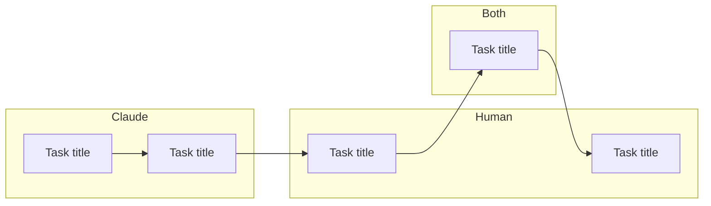
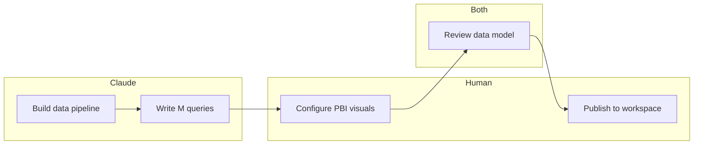

# Generate Handoff Guide

Create a visual overview of Claude vs Human tasks with dependencies.

## Usage
```
/generate-handoff-guide
```

## When to Use
- Projects with UI work Claude can't do (Power BI, Excel, Tableau)
- Tasks requiring human judgment or approval
- Collaborative workflows with clear handoff points

## Process

1. Read all tasks from `.claude/tasks/task-*.json`
2. Filter to tasks with `owner` field set
3. Generate Mermaid diagram showing:
   - Claude tasks grouped together
   - Human tasks grouped together
   - Dependencies as arrows between them
4. Generate human checklist (actionable)
5. Write to `.claude/tasks/handoff-guide.md`

## Output Format

```markdown
# Handoff Guide

Generated: {date}

## Workflow Diagram



## Human Tasks

### Ready Now
- [ ] **Task title** (ID: X)
  - Description or notes

### Waiting On Claude
- [ ] **Task title** (ID: Y) — waiting on: Task Z
  - Description or notes

## Claude Tasks

### Ready Now
- Task title (ID: X) — can start

### Blocked
- Task title (ID: Y) — waiting on: Human task Z

## Handoff Points

1. After Claude completes "Task A" → Human does "Task B"
2. After Human completes "Task C" → Claude does "Task D"
```

## Example

**Tasks:**
```json
{"id": "1", "title": "Build data pipeline", "owner": "claude", "status": "Finished"}
{"id": "2", "title": "Write M queries", "owner": "claude", "dependencies": ["1"]}
{"id": "3", "title": "Configure PBI visuals", "owner": "human", "dependencies": ["2"]}
{"id": "4", "title": "Review data model", "owner": "both", "dependencies": ["3"]}
{"id": "5", "title": "Publish to workspace", "owner": "human", "dependencies": ["4"]}
```

**Generated diagram:**


## Notes

- Tasks without `owner` field default to "claude"
- Only tasks with dependencies create arrows in diagram
- Human checklist shows what's actionable now vs waiting
- Re-run after completing tasks to update the guide
