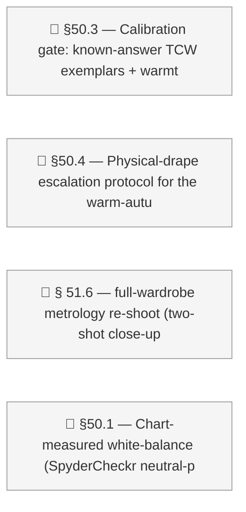

# Dashboard

<!-- DASHBOARD META
generated: 2026-06-23T17:29:45Z
task_count: 269
task_hash: sha256:5a996a888f04e06699e9d335193997bb73bd327030738a9a381913491622059a
spec_version: spec_v15
spec_status: active
spec_fingerprint: sha256:1e14c58e64ded662497170d98c55a40af95e6e1d567147a9b065e12c93bb5d38
template_version: 4.31.0
verification_debt: 0
drift_deferrals: 0
decision_count: 141
decisions_approved: 125
decisions_superseded: 16
decisions_partially_superseded: 0
-->

<strong>Sections</strong>

<!-- SECTION TOGGLES -->
- [x] Action Required
- [x] Progress
- [x] Tasks
- [x] Decisions
- [x] Notes
- [ ] Custom Views
<!-- END SECTION TOGGLES -->

**Personal Style Intelligence System** · Execute · Started 2026-03-20

**99% complete** — 269 tasks · 141 decisions

*Updated 2026-06-23 17:29 — may not reflect changes made outside `/work`*

---

## 🚨 Action Required

**✅ Committed `8c7faeb`** — the AC-011 hosiery rule + Alan Flusser *Dressing the Man* corroboration citations (4 Layer-1 style-principles files) are committed on `retire/stores-grooming-tailors-sources`. Working tree clean. *(Earlier this cycle: drape cluster T852 + T853 + T854 → `b4319b8`.)*

### 👥 Your Tasks — Phase 50 (all `owner: both`, deps met, not started)

- **T855** — §50.1 chart-measured white-balance. **Gated on you:** shoot the **SpyderCheckr** neutral patch in the same indirect daylight as a selfie, then I build the neutral-patch measurement.
- **T810** — §50.3 calibration gate (known-answer TCW exemplars + warmth-bias coaching). Ready to run together when you are.
- **T812** — §50.4 physical-drape escalation for the warm-autumn triangle (DEC-072). Ready; needs your drape input.

### 🔍 Reviews — 5 tasks done, awaiting your sign-off (stale backlog, predates this cycle)

- **T648** — §41.6 swipe-cycle alternatives (L/R swipe on outfit photo) — `owner: both`
- **T686** — §39.2 aspect-outlier detection extended to hanger photos — `owner: both`
- **T694** — §21.9(a) wardrobe photo-key reconciliation script — `owner: claude`
- **T695** — §21.9(b) WardrobeItem.photos widening + 5-site read-helper migration — `owner: claude`
- **T716** — ambient-ingest intent + inbox-scan/dedup/capture mechanic (/reactions) — `owner: claude`

Run `/work complete {id}` to sign off, or tell me what needs fixing.

### ⏸️ On Hold (paused — resume by setting status to Pending)

- **T753** — §46.7 Phase-2 visible /style rule-list + mark-for-edit surface (DEC-120) — deferred
- **T754** — §46.2 monotonic score-rescale follow-up (replace hard `Math.min` clip)

---

## 📊 Progress

| Status | Count |
|--------|-------|
| Finished | 246 |
| Pending | 3 |
| Blocked | 1 |
| On Hold | 2 |
| Absorbed | 17 |

| Phase | Done | Total | Status |
|-------|------|-------|--------|
| Phase 1 — Foundation Layer | 38 | 38 | Complete |
| Phase 2 — App Layer | 31 | 31 | Complete |
| Phase 3 — Grooming Analysis & Enhanced Photo Feedback | 10 | 10 | Complete |
| Phase 4 — Wardrobe Intelligence & Curation | 34 | 34 | Complete |
| Phase 5 — Template & Onboarding | 12 | 12 | Complete |
| Phase 6 — Onboarding UX & Workflow Polish | 24 | 24 | Complete |
| Phase 7 — Live Validation | 2 | 2 | Complete |
| Phase 8 — iPad & Tablet Experience | 10 | 10 | Complete |
| Phase 9 — App Experience Redesign | 31 | 31 | Complete |
| Phase 10 — Feedback Pipeline Enhancements | 7 | 7 | Complete |
| Phase 11 — App Experience Refinement | 21 | 21 | Complete |
| Phase 12 — Decision-Gated Reshaping | 44 | 44 | Complete |
| Phase 13 — In-Store Purchase Evaluation | 15 | 15 | Complete |
| Phase 14 — Template Layout Migration | 5 | 5 | Complete |
| Phase 15 — Facial Aesthetics & Grooming Knowledge Expansion | 9 | 9 | Complete |
| Phase 16 — Device-Scoped Performance Pass | 11 | 11 | Complete |
| Phase 17 — Visual Polish and Delight | 38 | 38 | Complete |
| Phase 18 — Schema-Driven Profile IA and Capture Refactor | 69 | 69 | Complete |
| Phase 19 — Color Palette Visualizer & Lookbook | 22 | 22 | Complete |
| Phase 20 — Onboarding Rewrite & Body-Shape Migration | 47 | 47 | Complete |
| Phase 21 — Post-Phase-19/20 Tech Debt + Onboarding Audit | 13 | 13 | Complete |
| Phase 22 — Shopping Pipeline Signal Layer + Grooming + Web Shopping Evaluation | 12 | 12 | Complete |
| Phase 23 — Seasonal Palette Reference Library | 8 | 8 | Complete |
| Phase 24 — Grooming Expansion: Preferences + Female Pipeline | 2 | 2 | Complete |
| Phase 26 — Per-Request Aesthetic Focus | 3 | 3 | Complete |
| Phase 27 — Workflow Infrastructure | 19 | 19 | Complete |
| Phase 28 — Foundation Layer Hardening | 18 | 18 | Complete |
| Phase 29 — UI Hygiene Sweep | 6 | 6 | Complete |
| Phase 30 — Surface IA & Copy Polish | 4 | 4 | Complete |
| Phase 31 — Layer 2 Retirement Aftermath | 2 | 2 | Complete |
| Phase 32 — AI Plumbing & Palette Library Polish | 4 | 4 | Complete |
| Phase 33 — Wear Log Capture (DEC-066 implementation phase) | 5 | 5 | Complete |
| Phase 34 — Outfits & Feedback Page Decomposition | 3 | 3 | Complete |
| Phase 35 — /reactions Visual Discovery Loop | 3 | 3 | Complete |
| Phase 36 — Onboarding Polish Wave (Post-T456) | 3 | 3 | Complete |
| Phase 37 — Wardrobe Curation Severity + Aggregate Retire View | 3 | 3 | Complete |
| Phase 38 — AsyncSurface Lifecycle Wrapper + Surface Migration | 4 | 4 | Complete |
| Phase 39 — Capture Protocol Hardening | 6 | 6 | Complete |
| Phase 40 — App IA Simplification + /reactions Rethink + Inspiration Catalogue | 64 | 64 | Complete |
| Phase 41 — Phone Companion (Oracle) | 21 | 21 | Complete |
| Phase 42 — Coloring Celebrity Reference Gallery | 2 | 2 | Complete |
| Phase 43 — Suggest Engine Explanation Surface | 5 | 5 | Complete |
| Phase 44 — My Style Trust Surface | 18 | 18 | Complete |
| Phase 45 — App-Wide Provenance (Trust-Chain) Architecture | 34 | 34 | Complete |
| Phase 46 — Personal Style Rules | 19 | 21 | Active |
| Phase 47 — Outfit Colour-Story Coherence (R-C) + Contrast Floor | 13 | 13 | Complete |
| Phase 48 — Body-Zone / Article-Type Substrate | 17 | 17 | Complete |
| Phase 49 — TCW Wholesale Palette Re-Source (D6) | 1 | 1 | Complete |
| Phase 50 — Coloring Determination: Comparative Drape Studio + Provisional Cascade | 11 | 14 | Partially Actionable (3 eligible: 810, 812, 855) |
| Phase 51 — Article Colour Capture Fidelity (the colour input seam) | 5 | 6 | Blocked (awaiting prior phase) |
| Phase 52 — UC1 Wardrobe Diagnostic (two axes + buy synthesis) | 24 | 24 | Complete |
| Phase 53 — Rule-Dossier Back-fill (Thread 3 scaling) | 16 | 16 | Complete |
| Unphased | 8 | 8 | Complete |

### Acceptance Criteria

- [x] (unnamed) — *grep returns no body_shape field; foundation/body/shape.json*
- [x] (unnamed) — *shoulder_hip_balance (4 options) at line 1254; waist_definit*
- [x] (unnamed) — *field-definitions.json:1124, 6 options, unassigned opt-out p*
- [x] (unnamed) — *across_back/bicep/wrist/torso_length/outseam/calf/head_circu*
- [x] (unnamed) — *Lines 4187, 4194 with guidance referencing /grooming consume*
- [x] (unnamed) — *0 matches in field-definitions.json; only registry-consisten*
- [x] (unnamed) — *Lines 2160-2166: multi_enum + ask_user_question_split + mont*
- [x] (unnamed) — *64 occurrences in field-definitions.json (matches '~60 affec*
- [x] (unnamed) — *shared_split_strategies block at root (line 7596); inline bu*
- [x] (unnamed) — *derivation.ts present with computeShoulderToHipRatio/WaistDe*
- [x] (unnamed) — *onboard.md ~671-890 implements 1C silent + 5B legacy transla*
- [x] (unnamed) — *translateLegacyBodyShape exports 7-value enum table; migrati*
- [x] (unnamed) — *onboard.md 178-193 computes mode from .claude/onboarding-pro*
- [x] (unnamed) — *107 + 98 tests covering all formulas, edge cases, all 7 arch*
- [x] (unnamed) — *body-type.md: BT-009 (line 83), BT-010 (99), BT-011 (114) — *
- [x] (unnamed) — *decision-017 § 'Phase 20 Voice Extension' line 365: Moment 9*
- [x] (unnamed) — *T449 Finished + verified; T469 P1+P2 confirmed compact-ack f*
- [x] (unnamed) — *Job queue: /api/grooming/visualizations/jobs/[id], /process;*
- [x] (unnamed) — *T454 Finished. T469 N/A per § 20.10 sniff scope (Sections 1+*
- [x] (unnamed) — *onboard.md 1425 explicit guard 'rendered once per section'; *
- [x] (unnamed) — *onboard.md 521 OPTIONAL_SUBSECTIONS; line 580 dispatcher per*
- [x] (unnamed) — *onboard.md 494 explicit retirement; line 1373 mode-condition*
- [x] (unnamed) — *T456 PASS 2026-04-29 — Erik's hands-on attestation.*
- [x] (unnamed) — *npm test: all listed test files pass + derivation 107/107 + *
- [x] (unnamed) — *T469 rollup GREEN 4/4 (P1 16 PASS, P2 21 PASS, P3 24 PASS, P*
- [x] (unnamed) — *decision-046 frontmatter lines 19-20: spec_revised: true, sp*

**26/26 criteria passed**

### Timeline

| Date | Item | Status | Notes |
|------|------|--------|-------|
| 2026-06-28 | External: dependency | Waiting | Contact: Erik (re-shoot) |

**Critical path:** All tasks can start now

### Project Overview

**This week:** 10 completed · 0 started · 4 created

### Recent Activity

- **2026-06-23** — Task 854 — Finished: §50.2 — Drape studio: pair variety / anti-anchoring (larger 
- **2026-06-23** — Task 853 — Finished: §50.2 — Drape studio: white-balance ON/OFF toggle (A/B the s
- **2026-06-23** — Task 852 — Finished: §50.2 — Drape studio: face/neck-only isolation (mask clothin
- **2026-06-22** — Task 809 — Finished: §50.2 — Drape studio UI: blind glow-pick mechanic + season r
- **2026-06-17** — Task 815 — Finished: § 51.2 — Intake colour-field discipline: dominant-not-averag
- **2026-06-16** — Task 818 — Finished: § 51.5 — Triage tooling: graduate the flip-radius sweep + ne
- **2026-06-16** — Task 817 — Finished: § 51.4 — Protocol addenda (remaining delta): garment detail 

---

## 📋 Tasks

### Phase 1 — Foundation Layer

✅ 38 tasks finished

### Phase 2 — App Layer

✅ 31 tasks finished

### Phase 3 — Grooming Analysis & Enhanced Photo Feedback

✅ 10 tasks finished

### Phase 4 — Wardrobe Intelligence & Curation

✅ 34 tasks finished

### Phase 5 — Template & Onboarding

✅ 12 tasks finished (+2 archived non-finished)

### Phase 6 — Onboarding UX & Workflow Polish

✅ 24 tasks finished

### Phase 7 — Live Validation

✅ 2 tasks finished

### Phase 8 — iPad & Tablet Experience

✅ 10 tasks finished

### Phase 9 — App Experience Redesign

✅ 31 tasks finished

### Phase 10 — Feedback Pipeline Enhancements

✅ 7 tasks finished

### Phase 11 — App Experience Refinement

✅ 21 tasks finished

### Phase 12 — Decision-Gated Reshaping

✅ 44 tasks finished

### Phase 13 — In-Store Purchase Evaluation

✅ 15 tasks finished

### Phase 14 — Template Layout Migration

✅ 5 tasks finished

### Phase 15 — Facial Aesthetics & Grooming Knowledge Expansion

✅ 9 tasks finished

### Phase 16 — Device-Scoped Performance Pass

✅ 11 tasks finished

### Phase 17 — Visual Polish and Delight

✅ 38 tasks finished

### Phase 18 — Schema-Driven Profile IA and Capture Refactor

✅ 69 tasks finished

### Phase 19 — Color Palette Visualizer & Lookbook

✅ 22 tasks finished

### Phase 20 — Onboarding Rewrite & Body-Shape Migration

✅ 47 tasks finished

### Phase 21 — Post-Phase-19/20 Tech Debt + Onboarding Audit

✅ 13 tasks finished

### Phase 22 — Shopping Pipeline Signal Layer + Grooming + Web Shopping Evaluation

✅ 12 tasks finished

### Phase 23 — Seasonal Palette Reference Library

✅ 8 tasks finished

### Phase 24 — Grooming Expansion: Preferences + Female Pipeline

✅ 2 tasks finished

### Phase 26 — Per-Request Aesthetic Focus

✅ 3 tasks finished

### Phase 27 — Workflow Infrastructure

✅ 19 tasks finished

### Phase 28 — Foundation Layer Hardening

✅ 18 tasks finished

### Phase 29 — UI Hygiene Sweep

✅ 6 tasks finished

### Phase 30 — Surface IA & Copy Polish

✅ 4 tasks finished

### Phase 31 — Layer 2 Retirement Aftermath

✅ 2 tasks finished

### Phase 32 — AI Plumbing & Palette Library Polish

✅ 4 tasks finished

### Phase 33 — Wear Log Capture (DEC-066 implementation phase)

✅ 5 tasks finished

### Phase 34 — Outfits & Feedback Page Decomposition

✅ 3 tasks finished

### Phase 35 — /reactions Visual Discovery Loop

✅ 3 tasks finished

### Phase 36 — Onboarding Polish Wave (Post-T456)

✅ 3 tasks finished

### Phase 37 — Wardrobe Curation Severity + Aggregate Retire View

✅ 3 tasks finished

### Phase 38 — AsyncSurface Lifecycle Wrapper + Surface Migration

✅ 4 tasks finished

### Phase 39 — Capture Protocol Hardening

✅ 6 tasks finished

### Phase 40 — App IA Simplification + /reactions Rethink + Inspiration Catalogue

✅ 64 tasks finished

### Phase 41 — Phone Companion (Oracle)

✅ 21 tasks finished (+1 archived non-finished)

### Phase 42 — Coloring Celebrity Reference Gallery

✅ 2 tasks finished

### Phase 43 — Suggest Engine Explanation Surface

✅ 5 tasks finished

### Phase 44 — My Style Trust Surface

✅ 18 tasks finished

### Phase 45 — App-Wide Provenance (Trust-Chain) Architecture

✅ 34 tasks finished

### Phase 46 — Personal Style Rules

✅ 19 tasks finished

| ID | Title | Status | Diff | Owner | Deps |
|----|-------|--------|------|-------|------|
| 753 | §46.7 — Phase 2 (deferred, TRACKED): visible /style rule-list + user-facing mark-for-edit surface | ⏸️ On Hold | 7 | claude | 752, 757, 758, DEC-120 |
| 754 | §46.2 follow-up — monotonic score-rescale (order-preserving) to replace the hard Math.min clip | ⏸️ On Hold | 5 | claude | 746 |

*Phase 46: 19/21 complete (90%) — 2 on hold*

### Phase 47 — Outfit Colour-Story Coherence (R-C) + Contrast Floor

✅ 13 tasks finished

### Phase 48 — Body-Zone / Article-Type Substrate

✅ 17 tasks finished

### Phase 49 — TCW Wholesale Palette Re-Source (D6)

✅ 1 tasks finished

### Phase 50 — Coloring Determination: Comparative Drape Studio + Provisional Cascade

✅ 11 tasks finished

| ID | Title | Status | Diff | Owner | Deps |
|----|-------|--------|------|-------|------|
| 810 | §50.3 — Calibration gate: known-answer TCW exemplars + warmth-bias coaching | Pending | 5 | both | 807, 809 |
| 812 | §50.4 — Physical-drape escalation protocol for the warm-autumn triangle | Pending | 4 | both | 813, DEC-072 |
| 855 | §50.1 — Chart-measured white-balance (SpyderCheckr neutral-patch) + optional solar-daylight fallback | Pending | 6 | both | 809 |

*Phase 50: 11/14 complete (79%) — 3 pending*

### Phase 51 — Article Colour Capture Fidelity (the colour input seam)

| ID | Title | Status | Diff | Owner | Deps |
|----|-------|--------|------|-------|------|
| 814 | § 51.6 — SpyderCheckr 24 colour-capture pipeline + two-shot capture standard (built + validated; metrology re-shoot + § 51.6 gates → T843) (cross-phase) | Finished | 4 | both | — |
| 815 | § 51.2 — Intake colour-field discipline: dominant-not-average hex, functional-neutrality saturation bound, closed color_family enum (retire 'multi'), primary = colour word; re-estimate the plaid scarf as the worked example (cross-phase) | Finished | 4 | claude | 816, DEC-134 |
| 816 | § 51.3 — Pattern block (engine-inert v1): type color.pattern = { type, components: [{ hex }] } + validation; assert no engine path consumes it (cross-phase) | Finished | 4 | claude | DEC-134 |
| 817 | § 51.4 — Protocol addenda (remaining delta): garment detail close-up convention (extend DEC-085 to garments), capture_lighting per-photo metadata for new intakes, texture-as-close-up note (cross-phase) | Finished | 3 | claude | DEC-134, DEC-085 |
| 818 | § 51.5 — Triage tooling: graduate the flip-radius sweep + neutral-vs-chroma lint into a deterministic, read-only, re-runnable tool emitting the severity-ranked robustness map + lint table (cross-phase) | Finished | 5 | claude | DEC-134 |
| 843 | § 51.6 — full-wardrobe metrology re-shoot (two-shot close-up protocol) → measured hexes + three § 51.6 gates (cross-phase) | Blocked | 4 | both | 814 |

*Phase 51: 5/6 complete (83%) — 1 blocked*

### Phase 52 — UC1 Wardrobe Diagnostic (two axes + buy synthesis)

✅ 24 tasks finished

### Phase 53 — Rule-Dossier Back-fill (Thread 3 scaling)

✅ 16 tasks finished

### Unphased

✅ 8 tasks finished

*856/862 tasks complete (99%)*

---

## 📋 Decisions

| ID | Decision | Status | Selected |
|----|----------|--------|----------|
| DEC-001 | Virtual try-on approach | Decided | [Option C+A: Virtual try-on with user's likeness (primary), flat-lay as fallback for failed generations](support/decisions/decision-001-virtual-try-on.md) |
| DEC-002 | AI services for each task category | Decided | [Style knowledge extraction: Gemini 3 Flash (video/YouTube sources) + Claude Opus 4.6 (text-heavy sources and distillation)](support/decisions/decision-002-ai-services.md) |
| DEC-003 | Knowledge processing architecture | Decided | [Option A: Distilled principles (pre-processed rules and guidelines)](support/decisions/decision-003-knowledge-architecture.md) |
| DEC-004 | Local data storage format | Decided | [Option A: Structured files (Markdown + JSON)](support/decisions/decision-004-data-storage.md) |
| DEC-005 | App framework and architecture | Decided | [Option A: Next.js 16 (App Router)](support/decisions/decision-005-app-framework.md) |
| DEC-006 | Seasonal Skin Tone Analysis — Structure and Integration | Decided | [Option C: Hybrid — standalone command + optional grooming step, data in personal-coloring.json](support/decisions/decision-006-seasonal-coloring.md) |
| DEC-007 | Store discovery mechanism for Phase 5 | Decided | [Option D: Hybrid (automated discovery + manual refinement)](support/decisions/decision-007-store-discovery.md) |
| DEC-008 | Outfit suggestion presentation and interaction model | Superseded | [Superseded](support/decisions/decision-008-outfit-suggestion-ux.md) |
| DEC-009 | App navigation architecture | Decided | [Option D: Flat Sidebar + Insights Hub](support/decisions/decision-009-app-navigation.md) |
| DEC-010 | Personalized curation guidance during onboarding | Superseded | [Superseded](support/decisions/decision-010-onboarding-curation-personalization.md) |
| DEC-011 | Personal data separation strategy for multi-user support | Decided | [Option E: Fork-based template with two-directory principle architecture](support/decisions/decision-011-personal-data-separation.md) |
| DEC-012 | Seasonal categorization model | Decided | [Option C: Hybrid — named seasons with temperature range mappings](support/decisions/decision-012-seasonal-model.md) |
| DEC-013 | CC output formatting approach | Decided | [Decided](support/decisions/decision-013-cc-output-formatting.md) |
| DEC-014 | Photo & file workflow design | Decided | [Decided](support/decisions/decision-014-photo-file-workflow.md) |
| DEC-015 | Desktop workspace guidance approach | Decided | [Decided](support/decisions/decision-015-desktop-workspace-guidance.md) |
| DEC-016 | Command taxonomy | Decided | [Decided](support/decisions/decision-016-command-taxonomy.md) |
| DEC-017 | CC conversational tone | Decided | [Option B+C Hybrid — "The Fitting Room" personality with "The Workshop" reasoning](support/decisions/decision-017-cc-conversational-tone.md) |
| DEC-018 | Tablet navigation pattern | Decided | [Option B: Bottom Tab Bar](support/decisions/decision-018-tablet-navigation.md) |
| DEC-019 | Applicability rule filtering mechanism | Decided | [Option D: Garment-preference mapping with smart defaults](support/decisions/decision-019-applicability-filtering.md) |
| DEC-020 | Applicability tag vocabulary | Decided | [Decided](support/decisions/decision-020-applicability-tag-vocabulary.md) |
| DEC-021 | Wardrobe photo optimization strategy | Decided | [Decided](support/decisions/decision-021-photo-optimization.md) |
| DEC-022 | Wardrobe analysis pipeline trigger mechanism | Decided | [Option B: `/wardrobe` + `/stores` dual trigger (staleness-aware)](support/decisions/decision-022-wardrobe-analysis-trigger.md) |
| DEC-023 | Dress Me suggestion flow UX | Superseded | [Superseded](support/decisions/decision-023-dress-me-suggestion-flow-ux.md) |
| DEC-024 | Feedback attribution and interactivity | Superseded | [Superseded](support/decisions/decision-024-feedback-attribution-interactivity.md) |
| DEC-025 | Mix & Match empty state and combination browsing | Superseded | [Superseded](support/decisions/decision-025-mix-match-empty-state-combination-browsing.md) |
| DEC-026 | Shopping list interactivity and store presentation | Decided | [Decided](support/decisions/decision-026-shopping-list-interactivity-store-presentation.md) |
| DEC-027 | Wardrobe Items information hierarchy | Decided | [Decided](support/decisions/decision-027-wardrobe-items-information-hierarchy.md) |
| DEC-028 | Inspiration Coverage restructure | Decided | [Decided](support/decisions/decision-028-inspiration-coverage-restructure.md) |
| DEC-029 | Stores review workflow | Decided | [Decided](support/decisions/decision-029-stores-review-workflow.md) |
| DEC-030 | Navigation consolidation and foundation visibility | Superseded | [Superseded](support/decisions/decision-030-navigation-consolidation-foundation-visibility.md) |
| DEC-031 | Outfit filter interaction model and weather API integration | Decided | [Option B: Chips, label-only, wrap to multi-row on narrow viewports](support/decisions/decision-031-outfit-filter-weather.md) |
| DEC-032 | In-app editing staging layer architecture | Decided | [Option A: File-based sidecar (`foundation/.staging/`, gitignored mirror of foundation JSON)](support/decisions/decision-032-staging-layer.md) |
| DEC-033 | Claude Code command orchestration and user-journey phases | Decided | [Option C: Both share a common backing function; `/onboard` and sub-commands are thin shells over shared logic (implemented as shared procedure documents)](support/decisions/decision-033-command-orchestration.md) |
| DEC-034 | In-store capture UX for purchase evaluation | Decided | [Option C: Rack + worn + label (three slots, label OCR'd for material/care)](support/decisions/decision-034-in-store-capture-ux.md) |
| DEC-035 | Material and quality assessment approach for in-store evaluation | Decided | [Option C: Hybrid (AI pass produces draft, user confirms/corrects critical fields) — locked in as hard v1 requirement (Q12); AI-only fallback rejected on defensibility grounds](support/decisions/decision-035-material-quality-assessment.md) |
| DEC-036 | Surface placement for in-store purchase evaluation in app navigation | Decided | [Option G — G/Shopping-merge variant (refined per user 2026-04-06): Split-surface design with the review/history merged into the existing Wardrobe → Shopping sub-tab.](support/decisions/decision-036-in-store-surface-placement.md) |
| DEC-037 | Approve-All ungraded approved cohort — re-review path vs. friction vs. filter | Decided | [Option A — Add re-review path on approved cards. A "Send to grading queue" button on each approved store card transitions `approved → unreviewed`. Refines DEC-029 to add the new transition. Original ask from FB-022.](support/decisions/decision-037-approve-all-ungraded-cohort.md) |
| DEC-038 | Item categorization model — flat types vs. layered model | Decided | [Option C: Hybrid — keep flat types, add layer metadata](support/decisions/decision-038-item-categorization-model.md) |
| DEC-039 | Accessory recommendation mechanism | Decided | [Option B: Full 5th gap dimension + occasion-scaled selection](support/decisions/decision-039-accessory-recommendation-mechanism.md) |
| DEC-040 | Rule-level principle override resolution mechanism | Decided | [Option A: Explicit ID linking (`Derives from: XX-NNN` metadata in Layer 2 rules)](support/decisions/decision-040-rule-level-principle-override.md) |
| DEC-041 | Visual identity direction (Atelier modernist-utility) | Decided | [Option A: Atelier modernist-utility (Claude Design handoff, 2026-04-18) — full adoption](support/decisions/decision-041-visual-identity.md) |
| DEC-042 | Motion library for Phase 17 (route transitions, card enters, capture / verdict reveal, tab switches) | Decided | [Option A: `motion.dev` (Framer Motion's successor, smaller + faster, first-class prefers-reduced-motion)](support/decisions/decision-042-motion-library.md) |
| DEC-043 | Shopping skip persistence semantics | Decided | [Option A: Gap-ID-keyed skip state with merge-on-read](support/decisions/decision-043-shopping-skip-persistence.md) |
| DEC-044 | Profile-v2 PATCH write mechanism — direct vs staged vs reopen DEC-032 | Decided | [Option 3: Annotate DEC-032 — keep DEC-032 approved, add a "Phase 18 extension" annotation (DEC-012/DEC-031 precedent). DEC-044 closes its meta-question as "resolved by annotation"; its substantive sub-decisions (B/C/D) still record the Phase-18-specific choices.](support/decisions/decision-044-profile-v2-patch-write-mechanism.md) |
| DEC-045 | Color visualizer Lookbook — gender presentation source | Decided | [Option A: Auto-fork from `style_presentation` field (single source of truth)](support/decisions/decision-045-lookbook-gender-presentation-source.md) |
| DEC-046 | Body-shape retire-and-split — sub-question resolution | Decided | [Decided](support/decisions/decision-046-body-shape-axes.md) |
| DEC-047 | split_strategy schema shape | Decided | [Option E — Inline buckets + shared split strategies (research-agent recommendation)](support/decisions/decision-047-split-strategy-schema.md) |
| DEC-048 | Relax DEC-047 bucket cap to accommodate body_locations 22-option canonical list | Decided | [Option (i) — Relax cap to ≤6 buckets *(selected — least invasive, preserves single source of truth, matches body_locations' anatomical taxonomy)*](support/decisions/decision-048-body-locations-bucket-cap.md) |
| DEC-049 | Wardrobe worn-photo strategy — remove dead-promise vs ship upload path | Decided | [Option (b) — Ship upload path; retire Track A *(selected — resolves the trust violation by delivering rather than retreating; preserves Partial→Complete progression mechanic; layered-shot edge case is narrower than original Track A scoping)*](support/decisions/decision-049-wardrobe-worn-photo-strategy.md) |
| DEC-050 | Input model direction — maintainer-only authoring + user surface scope | Decided | [Option β: `/sources` retired; Layer 2 dissolves into maintainer-authored content shipped with template](support/decisions/decision-050-input-model-direction.md) |
| DEC-051 | URL scraping approach for web shopping evaluation (§ 22.6) | Superseded | [Superseded](support/decisions/decision-051-url-scraping-approach.md) |
| DEC-052 | Personal vs universal principles — visibility across prompt and UI surfaces | Decided | [Option C: Override-only — personal rules exist only as Layer 1 overrides; opaque UI (with read-only browseable principles list added — see § Decision)](support/decisions/decision-052-personal-vs-universal-visibility.md) |
| DEC-053 | Personal-principles filesystem location and naming under DEC-050 β | Decided | [Option β: Rename to `foundation/archetype-principles/`; rename loader path + StyleRule.layer field; update gitignore accordingly](support/decisions/decision-053-personal-principles-filesystem-location.md) |
| DEC-054 | Personal vs Universal Principles — Transparency Model | Superseded | [Superseded](support/decisions/decision-054-personal-vs-universal-transparency.md) |
| DEC-055 | Web shopping evaluation surface direction — retire desktop evaluator or preserve | Decided | [Option α: Full retirement — replace web-eval with shopping reference card in `/style` (recommended)](support/decisions/decision-055-web-shopping-evaluation-direction.md) |
| DEC-056 | /briefing coherence guardrail — formalize brand-DNA vs quality_sensitivity cross-check | Superseded | [Superseded](support/decisions/decision-056-briefing-coherence-guardrail.md) |
| DEC-057 | /reactions visual discovery loop — capture mechanism, onboarding integration, and storage shape | Decided | [Option E: Hybrid (a) + (b) refined — standalone `/reactions` command with `/onboard → What I love` inline hook alongside `visual_references` (not replacing)](support/decisions/decision-057-reactions-visual-discovery-loop.md) |
| DEC-058 | Wardrobe inline hook — archive-vs-photo primacy + user-choice prompt | Decided | [Option B: Surface archive detection as explicit user choice — Restore vs Re-catalog](support/decisions/decision-058-wardrobe-inline-archive-primacy.md) |
| DEC-059 | Capture-method lint contract — multi-value capture + cognitive-load thresholds | Decided | [Option C: Project-wide audit + structural lint — sweep + lint contract enforcing two contract rules](support/decisions/decision-059-capture-method-lint-contract.md) |
| DEC-060 | Brand-mention provenance rule — project-wide constraint on when Claude can volunteer brand names | Decided | [Option D: Project-wide rule with three grounded sources — generalize across all surfaces](support/decisions/decision-060-brand-mention-provenance.md) |
| DEC-061 | Curation-suggestions severity schema + classification heuristics | Decided | [Option B: Three-tier (`works \| second-string \| retire`) — captures the user's mental model](support/decisions/decision-061-curation-suggestions-severity.md) |
| DEC-062 | /stores surface direction — retire web stores tab + slash command, or keep with first-class IA | Decided | [Option γ: Keep at lower IA prominence — preserve tab + command, drop most cross-references, treat as power-user surface](support/decisions/decision-062-stores-surface-direction.md) |
| DEC-063 | /feedback (How's This?) surface direction — retire or keep with first-class IA | Decided | [Option α: Full retirement — retire `/feedback` route + How's This? sub-tab via § 27.1 workflow](support/decisions/decision-063-feedback-surface-direction.md) |
| DEC-064 | Action-list home — Shopping vs Analysis canonical surface for prioritized gap suggestions | Decided | [Option γ: Layer split — Analysis owns WHY, Shopping owns WHAT+WHERE — Analysis renders per-gap diagnostic summaries; Shopping renders full prescriptive item cards with stores; Top 3 Actions removed or relocated](support/decisions/decision-064-action-list-home.md) |
| DEC-065 | Laundry / wear-tracking scope — interactive feature, non-interactive badge, or hybrid affordance | Superseded | [Superseded](support/decisions/decision-065-laundry-wear-tracking-scope.md) |
| DEC-066 | Suggest workflow architecture — single-outfit UI, ephemeral mark-unavailable, wear-log analytics | Decided | [Option α: Single-outfit + ephemeral exclusion + combination wear-log — full vision per `.claude/vision/suggest-workflow.md`](support/decisions/decision-066-suggest-workflow-architecture.md) |
| DEC-067 | Acquired-state UX — surface shape for Shopping list "acquired-but-not-yet-in-wardrobe" items | Decided | [Option α: "Pending wardrobe sync (N)" banner at top of Shopping — promote the existing § 11.5 / FB-021 spec intent. Banner visible only when N > 0. Expand to view acquired items with per-item unmark + CTA to re-run `/wardrobe`.](support/decisions/decision-067-acquired-state-ux.md) |
| DEC-068 | /style page IA + chrome — section nav, deep-link routing, online-shopping card placement, completeness chrome compression | Decided | [Option α: Inline progress on section-nav buttons + deep-link routing + online-shopping promoted to section — collapse three chrome bands into one compact strip ("11/16 fields · 7 sections"); inline progress bars inside each of the 7 section-nav buttons; add `?section=` query routing; promote the online-shopping reference card to a first-class section in the nav (becomes 8 buttons)](support/decisions/decision-068-style-page-ia-chrome.md) |
| DEC-069 | /style content rendering policy — synthesize summaries vs render free-text walls | Decided | [Option α: Synthesized tag summaries up top + collapse prose under "Show full answer" — for free-text-heavy fields (e.g., Heritage 280-word block, Self-perception 60-word block), surface a 2-3 tag synthesis at the top (e.g., climate / lifestyle / vibe), with full prose collapsed under disclosure. Synthesis source: deterministic from structured fields where possible; LLM synthesis where free-text-only.](support/decisions/decision-069-style-content-rendering.md) |
| DEC-070 | Sidebar IA pattern — 3 nouns vs expandable sub-routes vs command palette | Decided | [Option γ: Hybrid — sidebar stays 3 nouns + active section's sub-tabs surface prominently in main content area (already kind of how it works); add a small "All routes" / sitemap link in sidebar footer that lists every reachable surface](support/decisions/decision-070-sidebar-ia-pattern.md) |
| DEC-071 | Wear-log scoring penalty equation shape — recency × frequency × composition | Superseded | [Superseded](support/decisions/decision-071-wear-log-penalty-equation.md) |
| DEC-072 | Multi-source seasonal palette curation — Concept Wardrobe fallback for sub-seasons QOVES doesn't cover | Decided | [Option α: Concept Wardrobe primary fallback + manual transcription, schema gains `source_data_type` field, Truth is Beauty for `example_person` continuity](support/decisions/decision-072-multi-source-seasonal-palette-curation.md) |
| DEC-073 | /outfits "Why this works" expander — tag rendering, default principle count, teaser-when-expanded | Decided | [Option α: Drop kebab-case tags, top-3 default + "See all" disclosure, hide teaser when expanded (Recommended — walkthrough plan's approved direction; aligns with `feedback_no_rule_ids`)](support/decisions/decision-073-why-this-works-expander.md) |
| DEC-074 | /style display policy for empty / uncaptured fields | Decided | [Option α: Collapse empty sub-cards entirely; show "Add details" affordance only at the parent-card level when the whole card is empty (Recommended — minimum noise, preserves discoverability for completely-uncaptured cards)](support/decisions/decision-074-style-empty-field-display-policy.md) |
| DEC-075 | /style?section=style_direction empty-state treatment | Decided | [Option α: Hide the tab when `foundation/user/love/style-direction.json::reaction_summary` is empty/stub; surface only when content exists (Recommended — matches the audit's "remove dead-end" intuition; aligned with /reactions rethink which will eventually populate this surface)](support/decisions/decision-075-style-direction-empty-tab-treatment.md) |
| DEC-076 | /style coloring palette rendering — collapse redundancy across my_body + online_shopping | Decided | [Option α-A: Interactive "Palette view" toggle becomes canonical; drop the static "Personal coloring report" block (Recommended — DEC-054 transparency direction favors collapse + opaque UI; toggle is the richer surface)](support/decisions/decision-076-coloring-palette-rendering-redundancy.md) |
| DEC-077 | /style nav + /sitemap MY STYLE inventory alignment + URL-key drift | Decided | [Option γ: Sub-route → sub-section migration — fold `/style/principles` content into the `/style` section renderer as `?section=principles`. Eliminates the sub-route entirely. Both surfaces converge naturally to 10 sections (the existing 9 + Principles). Aligns with § 40.4's stated "single-route lean — sub-routes earn their keep only if cross-section deep-linking emerges" principle.](support/decisions/decision-077-style-nav-sitemap-inventory-alignment.md) |
| DEC-078 | CLI-CTA dead-end pattern — web app's relationship to Claude Code commands at empty-state surfaces | Decided | [Option β: Documented-gap framing. *(Recommended — direct extension of DEC-074 α's philosophy: when the user surface can't honestly carry an action, reframe as documentation rather than fake it.)* Replace the action-shaped CLI-CTA block (currently rendered as a primary action) with a documented-gap explanation: prose that says "this surface depends on data captured via Claude Code; see the docs for how to populate it" with a link to the relevant `docs/` page. The `command?: string` prop on `EmptyState` is removed (or repurposed as `documentationHref`) so the primitive can't propagate the dead-end pattern to future surfaces. OnboardingFrame's foundation-missing pattern (DEC-033) is untouched — that's a different semantic (no foundation = run `/onboard` IS the right next step, and it's the only place the user is genuinely expected to leave the web app for Claude Code).](support/decisions/decision-078-cli-cta-dead-end-pattern.md) |
| DEC-079 | Sidebar IA extension — Get Dressed visibility + Wardrobe sub-tab discoverability | Superseded | [Superseded](support/decisions/decision-079-sidebar-ia-extension.md) |
| DEC-080 | Apple Developer signing path — deferred toggle (free Personal Team vs paid Apple Developer Program) | Decided | [Option γ: Defer indefinitely — keep using Expo Go bundle-from-Metro; revisit when user chooses (recommended for current build phase)](support/decisions/decision-080-apple-developer-signing-deferral.md) |
| DEC-081 | `gap_relevance` population direction — how the field gets written so 3★/4★ match-quality tiers stop being dead reads | Decided | [Option α: Extend `/stores` Phase 3 deep-dive to persist `gap_relevance` at projection time (spec-compliant; authoritative source)](support/decisions/decision-081-gap-relevance-population-direction.md) |
| DEC-082 | Task `owner` field refinement — modeling research spikes (Claude methodology + human empirical) | Decided | [Option ε: Paired sub-tasks at decomposition time — decompose into TXXXa (claude methodology) + TXXXb (human validation) with explicit dependency wiring](support/decisions/decision-082-task-owner-field-refinement.md) |
| DEC-083 | `style_presentation` integration into outfit scoring — architectural shape + axis question | Decided | [Option δ: Close DEC-083 — wear-log signature only (FB-187 carries it) — let FB-187's emergent narrowing (5th Layer 2 bias arm) handle the user-facing concern. Reconcile § 18 by reaffirming "does not gate." Engineering-wise, FB-187 is already in flight. Erik's 2026-05-16 framing ("I want a fix, not park") needs explicit re-justification to land here.](support/decisions/decision-083-style-presentation-scoring-architecture.md) |
| DEC-084 | Seasonal palette schema consolidation to 12-sub-season Sci\ART target | Decided | [Option α: Strict 12 — delete `warm_autumn.json` (DEC-072 duplicate of true_autumn.json) + rename `warm_spring.json` → `true_spring.json` (data already IS True Spring per TCW source) + retire `latina.json` (custom heritage-variant outside standard 12-system; Erik is the only user and is not latina). Result: exactly 12 files in `seasonal-palettes/`. Cleanest strict-system match.](support/decisions/decision-084-seasonal-palette-12-target-consolidation.md) |
| DEC-085 | Type-aware wardrobe photo schema (FB-182 Q1) | Decided | [Option D: Hybrid — per-type guidance + smarter render fallback (no schema change)](support/decisions/decision-085-wardrobe-photo-schema-type-awareness.md) |
| DEC-086 | Anchor-grouped tap-to-expand-shades curation path (FB-183, § 41.8) | Decided | [Option A: Manual anchor curation in `personal.json::anchors[]`](support/decisions/decision-086-reference-anchor-grouping-paths.md) |
| DEC-087 | Auto-detect filter helpers co-located in src/lib/outfits/ | Decided | [Decided](support/decisions/decision-087-auto-detect-helpers-lib-location.md) |
| DEC-088 | Auto-detect helpers take WeatherApiResponse, not StructuredWeather | Decided | [Decided](support/decisions/decision-088-auto-detect-helpers-weather-shape.md) |
| DEC-089 | FilterChipBar.tsx deleted outright (no § 27.1 retirement snapshot) | Decided | [Decided](support/decisions/decision-089-filter-chip-bar-plain-delete.md) |
| DEC-090 | AdjustOverlay duplicates ItemModal's modal mechanics rather than extracting a shared primitive | Decided | [Decided](support/decisions/decision-090-adjust-overlay-duplicates-modal-mechanics.md) |
| DEC-091 | Post-suggest filters pill opens AdjustOverlay (replaces chipsExpanded in-place) | Decided | [Decided](support/decisions/decision-091-post-suggest-pill-opens-adjust-overlay.md) |
| DEC-092 | Sunset derived from hourly is_day transition (no API field, no solar library) | Decided | [Decided](support/decisions/decision-092-sunset-derived-from-is-day-transition.md) |
| DEC-093 | Wind-first outfit-action priority at cool/cold temperatures (windy + <16°C → windbreaker) | Decided | [Decided](support/decisions/decision-093-wind-first-outfit-action-priority.md) |
| DEC-094 | Per-item rationale composes from styling_notes match with "Part of <combo>" fallback (§ 40.16 v1) | Superseded | [Superseded](support/decisions/decision-094-compose-item-rationale-styling-notes-match.md) |
| DEC-095 | Hero-tap mark-unavailable retires per § 40.16 (DEC-066 hero-tap entry point superseded; infrastructure preserved) | Decided | [Decided](support/decisions/decision-095-hero-tap-mark-unavailable-retires.md) |
| DEC-096 | T667 inline re-crop UI uses react-easy-crop (not hand-rolled canvas) | Decided | [Decided](support/decisions/decision-096-recrop-uses-react-easy-crop.md) |
| DEC-097 | Revert DEC-095 — hero-tap mark-unavailable restored, per-item drill-in retires | Decided | [Decided](support/decisions/decision-097-revert-dec-095-mark-unavailable-restored.md) |
| DEC-098 | Pre-suggest weather line uses Unicode emoji glyphs over inline SVG icons | Decided | [Decided](support/decisions/decision-098-pre-suggest-weather-glyph-vocabulary.md) |
| DEC-099 | T686 — separate warning chips per outlier slot (not merged) | Decided | [Decided](support/decisions/decision-099-separate-warning-chips-per-outlier-slot.md) |
| DEC-100 | T686 — hanger re-crop route preserves original filename (not canonical {id}-hanger.jpg) | Decided | [Decided](support/decisions/decision-100-hanger-route-preserves-filename.md) |
| DEC-101 | /style IA shape — γ scrollable single page + sticky left index | Decided | [Option γ-pure: single scrollable page; no chip strip; sticky left index of all T1 + T2 sections with jump-to-anchor; Coloring eager-mount; Catalogue + Principles lazy-mount; in-edit dims rest of page; no narrow-viewport collapse; counter retires; section headers carry engine-consumer legend (per Phase 44 § 44.8); legacy `?section=` slug redirects to `/style#{section_id}` on first paint.](support/decisions/decision-101-style-ia-shape.md) |
| DEC-102 | Archetype resolution — α-full single-user (auto-derive from coloring.sub_season) | Decided | [Option α-full (single-user) *(closure-aligned)*: `identity.json::biographical.archetype` auto-derived from `coloring.sub_season`; no `/archetype` command; no user-selection step; Section A populates with existing `deep_autumn/color-theory.md`; Section C parked until applicability filter (T495) ships; multi-archetype Layer 2 content authoring deferred; `body-fit.md` and other-axis content deferred.](support/decisions/decision-102-archetype-resolution.md) |
| DEC-103 | VisualReferencesContent wrapper owns shared theme-drill state | Decided | [Option C — New VisualReferencesContent wrapper component: state scoped to the sub-block composition (ThemesSubBlock + InspirationCatalogue) inside the existing visual-references region; the page-level `StylePageContent` stays untouched.](support/decisions/decision-103-visual-references-wrapper.md) |
| DEC-104 | ThemesSubBlock Resonates/Avoid pill state is independent from catalogue pill | Decided | [Option B — Keep both pills component-local: each pill defaults to 'resonates'; user can flip independently. Catalogue persists its choice to localStorage; ThemesSubBlock does not.](support/decisions/decision-104-themes-pill-state.md) |
| DEC-105 | Engine wiring state on SubsectionDef is an enum, not a boolean | Decided | [Option B — Enum `engine_status?: 'future_wire'` on SubsectionDef](support/decisions/decision-105-engine-status-enum.md) |
| DEC-106 | Build→use transition — explicit "done enough for daily use" floor + frozen queue | Superseded | [Superseded](support/decisions/decision-106-daily-use-floor.md) |
| DEC-107 | Fit-state field named `fit_state` (not `fit`) to avoid collision with the fit descriptor | Decided | [Decided](support/decisions/decision-107-fit-state-field-name.md) |
| DEC-108 | /reactions image-sourcing redesign — how candidate visuals reach the user without the user becoming the search engine | Decided | [Option D: Layered — B (always-works substrate) + A (power path, if feasible) + C (no-extension fallback)](support/decisions/decision-108-reactions-image-sourcing.md) |
| DEC-109 | Ambient-ingest intent precedence in /reactions Step 0 decision matrix | Decided | [Rule 3 — after `resync` + explicit-argument, before the inferred directed-capture intents](support/decisions/decision-109-ambient-ingest-intent-precedence.md) |
| DEC-110 | Per-reason provenance integrity in the suggestion engine — rule-ID linkage | Decided | [Option (iii): Centralized validated mapping + build-time assertion + engine-signal registry *(research-recommended, high confidence)*](support/decisions/decision-110-suggestion-provenance-integrity.md) |
| DEC-111 | Re-home the transparency model on the live suggestion engine (supersedes DEC-054) | Decided | [Option A: Supersede DEC-054 — re-home the transparency model on the live deterministic suggestion engine + trust-chain surfaces; mark DEC-054 `superseded`. *(recommended)*](support/decisions/decision-111-rehome-transparency-model.md) |
| DEC-112 | App-wide provenance scope — architecture everywhere, grounded content where the corpus supports it | Decided | [Option A: App-wide architecture + first-class gap-state in thin domains *(recommended — exactly R2)*](support/decisions/decision-112-app-wide-provenance-scope.md) |
| DEC-113 | Provenance authoring mechanism — derived edges + thin store (R4 data architecture) | Decided | [Option α: Derived edges + thin store *(research-recommended, high confidence)*](support/decisions/decision-113-provenance-authoring-mechanism.md) |
| DEC-114 | Provenance render primitives accept a derived verdict contract, not ResolvedProvenance | Decided | [Decided](support/decisions/decision-114-provenance-primitive-contract.md) |
| DEC-115 | Per-user coloring provenance reference granularity — bucket-level + per-item avoid | Decided | [Decided](support/decisions/decision-115-coloring-provenance-reference-granularity.md) |
| DEC-116 | Coloring §44.11 reading flow places engine-consumer chips above the provenance/palette zone | Decided | [Decided](support/decisions/decision-116-coloring-reading-flow-placement.md) |
| DEC-117 | Personal Style Rules — make identity outrank generic correctness in the suggestion engine | Decided | [Option C: Phased hybrid — ship the rule object + engine tier + extract-iterate now; defer the app display + mark-for-edit round-trip to a tracked later phase. ✅ Selected 2026-05-25.](support/decisions/decision-117-personal-style-rules.md) |
| DEC-118 | color-material palette-anchor deferral uses a schema-level `defer_to_swatch` pointer (not re-asserted) | Decided | [Decided](support/decisions/decision-118-color-material-palette-anchor-deferral.md) |
| DEC-119 | Color-judgment "Stage" surface + token contract | Decided | [Option C: Warm-neutral near-white (`#f6f4f1`–`#f7f5f2`), dedicated `--stage` token](support/decisions/decision-119-color-judgment-stage.md) |
| DEC-120 | My Style surface — rule/toggle presentation + boundary | Decided | [Option A: Two-zone — correctness toggles (a "tuning" zone) at the top, the Personal Style Rule list below, both rendered with a shared "what this changes in the system" line *(Erik's lean from grill G-1)*](support/decisions/decision-120-my-style-rule-toggle-surface.md) |
| DEC-121 | R-C hue-coherence model — non-monotonic clash band + temp-outlier disposition + coherence/coloring layer split | Decided | [Option A: Two-threshold clash band — break when `tau_hue_low < hueDist < tau_hue_high`; analogous (<low) and complementary (>high) both harmonious. Drop the temp-outlier detector. *(minimal-change seed)* ← SELECTED (Erik, 2026-05-31)](support/decisions/decision-121-rc-hue-coherence-model.md) |
| DEC-122 | R-C chroma-relative redesign — absolute-chroma clash band + palette-relative over-saturation ceiling (amends DEC-121) | Decided | [Option A: Chroma-aware R-C (both fixes). Band gains an absolute geometric-mean chroma intensity ramp; ceiling becomes a floored palette-relative budget `max(0.40, κ·S)`. Two terms, one principle (chroma = amplitude). *(recommended)* ← SELECTED (Erik, 2026-05-31)](support/decisions/decision-122-rc-chroma-relative-redesign.md) |
| DEC-123 | Body-zone / article-type substrate — adopt the grilled attribute-bearing schema via one-time migration | Decided | [Option A: Adopt the grilled substrate; migrate representation now, carve out scoring. *(recommended — the `/grill` outcome)* ← SELECTED (Erik, 2026-06-01)](support/decisions/decision-123-body-zone-substrate-migration.md) |
| DEC-124 | Focal-budget standout model — relational arbiter over the decorative register (resolves the DEC-123 scoring carve-out) | Superseded | [Superseded](support/decisions/decision-124-focal-budget-standout-model.md) |
| DEC-125 | Focal-budget numerator re-model — absolute-chroma boldness + hue-coherence grouping + relational cross-modality (calibration shakedown) | Superseded | [Superseded](support/decisions/decision-125-focal-budget-numerator-remodel.md) |
| DEC-126 | Season-parametric contrast model — re-key all contrast-direction terms onto a per-season {muted, prescribed_contrast} object (full reconciliation) | Decided | [Option A: Full reconciliation *(recommended — the season-parametric-contrast `/shakedown` + pressure-test + calibration + downstream check, 2026-06-04)* ← SELECTED (Erik, 2026-06-04)](support/decisions/decision-126-season-parametric-contrast-model.md) |
| DEC-127 | Retire the focal-budget colour channel — R-C + DEC-126 own colour; keep only AC-001 within-zone accessory capacity (supersedes DEC-124 + DEC-125) | Decided | [Option A: Retire the focal-budget colour channel *(the post-re-model calibration `/shakedown` + `/grill` outcome, 2026-06-04/05)* ← SELECTED (Erik, 2026-06-05)](support/decisions/decision-127-retire-focal-budget-colour-channel.md) |
| DEC-128 | Wearer-keyed hue-contrast term — credit/penalise opposite-wheel per the season's hue_stance, beside R-C (extends DEC-126) | Decided | [Option A: Build the wearer-keyed hue-contrast term — both directions, season-keyed *(the gap-b-hue-contrast `/shakedown` outcome, 2026-06-05)* ← SELECTED (Erik, 2026-06-05)](support/decisions/decision-128-wearer-keyed-hue-contrast.md) |
| DEC-129 | Outfit-level metal effect — is there a grounded metal-temperature × outfit-colour term, distinct from CT-010 face-undertone? | Decided | [Option A1-park (RECOMMENDED): A1 + preserve the felt observation as a parked Extended candidate (build nothing; revisit only on a new Studied/Curated source OR a decoupled rendered `/shakedown` + felt-confirmation). ← SELECTED (Erik, 2026-06-06)](support/decisions/decision-129-outfit-level-metal-effect.md) |
| DEC-130 | Rule-dossier Part A provenance — reuse Phase-45 Assertion/SourceRef types, presentation-only, or parallel markdown? | Decided | [Option C: Presentation-only reuse — reuse the claim-line presentation + `EpistemicStatus` vocab, NOT the data model (the §46.3 `ResolvedPersonalRuleReason` precedent)](support/decisions/decision-130-dossier-provenance-type-reuse.md) |
| DEC-131 | Warm-autumn cross-fork determination — resolve vs carry the borderline | Decided | [Option B: Carry the borderline (season-pair + palette intersection)](support/decisions/decision-131-warm-autumn-cross-fork-determination.md) |
| DEC-132 | CT-004 "Seasonal Palette Shifts" contradicts TCW — retire, rewrite to the fixed-palette model, or relocate the functional kernel? | Decided | [Option C: Retire the colour claim and relocate the functional kernel — remove from `color-theory.md`, keep the weather→fabric/layering kernel in its correct home (materials/functional), grounded in TCW's "seasonal items" concept](support/decisions/decision-132-ct004-seasonal-palette-shift-grounding.md) |
| DEC-133 | deep_autumn clash-band relief — "endorse-moderate" hue_stance state vs temperature-aware band (E3 + P3) | Decided | [Option A: "endorse-moderate" — a third `hue_stance` state that does the band-skip + opposite-wheel reward but NOT the value-damp; deep_autumn → endorse-moderate (surgical) [research-recommended]](support/decisions/decision-133-deep-autumn-clash-band-relief.md) |
| DEC-134 | Article colour representation + capture architecture (the colour input seam) | Decided | [Option A: The grill-resolved bundle — one Dominant hex (dominant by visual mass, never an average) + an engine-inert Pattern block `{type, component hexes}`; model-estimate stays the primary capture path with a deterministic anchor specced but shakedown-gated; `color.neutral` = functional neutrality, authored-as-truth + a saturation bound + an advisory chroma lint; fidelity bar = flip radius [grill-resolved 2026-06-10/11]](support/decisions/decision-134-article-colour-representation.md) |
| DEC-135 | Cut temporal/variety scoring from the suggestion engine — keep the wear-log capture, delete its consumers | Decided | [Option C: Cut all temporal from the suggestion engine; keep the capture write-only-for-future; delete (no snapshot). Delete the wear-log penalty, the Layer-4 variety + newly-added-recency terms, and the orphaned `variety_strength` knob. Keep the colour-loves tiebreaker, the `POST /api/wear-log` capture gesture, and its storage as a latent UC1-diagnostic input. [Erik, 2026-06-12]](support/decisions/decision-135-cut-temporal-variety-scoring.md) |
| DEC-136 | UC1 wardrobe diagnostic = 2-axis + buy-synthesis model; gap-analysis.json regenerated deterministically (producer swap) | Decided | [Option A: Adopt the 2-axis + buy-synthesis model (spec Phase 52) and regenerate `gap-analysis.json` deterministically from it — producer swap, consumer contract survives. The LLM-authored § 4.1 pipeline retires; the file, its dimension keys (incl. `accessory_coverage`), prioritized suggestions, and the Phase 11 staleness flag survive as the interface every existing consumer keeps reading. [Erik, 2026-06-12]](support/decisions/decision-136-uc1-diagnostic-model-gap-analysis-producer.md) |
| DEC-137 | Runtime provenance classes — the four epistemic buckets scope to at-rest corpus claims (amendment A7) | Decided | [A7 — scope the four buckets (and the Generated→reject rule) to at-rest corpus claims; runtime-minted instances take a runtime provenance class gated by the mechanism's vouch](support/decisions/decision-137-runtime-provenance-classes.md) |
| DEC-138 | Wardrobe-diagnostic "What to add next" — exhaustive palette-arc coverage vs TCW composition advisor (selection-vs-coverage fork) | Decided | [Option E: Combination-completion — "looks your wardrobe can almost make." Reframe "what to add next" from single missing colours to *completable looks*: ground target looks in TCW's curated per-season `example_combinations` (6 looks/season, harvested for all 12 but currently dropped at the app boundary), bind the wardrobe to each look's colours, surface the looks you own all-but-one of + the single piece that completes each, validated by the engine's adoption signal. Carries `highlighted_neutrals` + `metals` across so neutrals and metals become first-class. [Erik's steer — 2026-06-14 interactive narrowing; emerging front-runner]](support/decisions/decision-138-wardrobe-fill-selection-vs-coverage.md) |
| DEC-139 | Neutral↔chromatic hue-harmony — should the Get Dressed engine gain a term that pairs a neutral to the colour it harmonizes with (vs. stay neutral-hue-blind)? | Decided | [Option B: Stay neutral-hue-blind (veto-only) — leave the engine as a negative filter; rely on (a) palette pre-filtering (a single-temperature palette is already hue-coherent) and (b) E-thin's curated combos for the *ranking* the engine can't do. Cheapest; accepts that Get Dressed can't pick the right colour for a neutral.](support/decisions/decision-139-neutral-chromatic-hue-harmony.md) |
| DEC-140 | Trust-chain deep-link id scheme — normalize resolver→canonical ids, dual-key the cards, or rely on the anchor-coverage invariant test alone? | Decided | [Option C: Invariant-test-only (no id-scheme change). Accept the current synthesized-id scheme; rely solely on the anchor-coverage invariant test (Change 1/2 of this `/iterate` pass) to guarantee every card variant exposes whatever anchor the resolver currently targets. Cheapest; the param↔anchor contract stays implicit but is test-guarded.](support/decisions/decision-140-deep-link-id-scheme.md) |
| DEC-141 | /briefing rework — reshape into an offline shopping card after the /stores retirement (Option A) | Decided | [Option A — Offline shopping card. Session-scoped, offline, date-stamped single-outing card: priority gaps + palette + materials + fit rules + hard-nos + brand tiers + checklist. No store map. Re-home `loved_brands` cheaply. Distinct from `/style` via the offline/single-outing framing. Smallest build; doesn't un-retire store discovery.](support/decisions/decision-141-briefing-offline-card-rework.md) |

---

## 💡 Notes

<!-- USER SECTION -->

**Quick links:**
- Start the app: `npm run dev` *(you run dev servers manually in Ghostty — memory `feedback_user_runs_dev_servers.md`)*
- Production setup: `docs/production-setup.md`
- Add wardrobe items: `/wardrobe`
- Update coloring: `/coloring`

**📍 Two scopes in flight (spec v15):**
- **Phase 46 — Personal Style Rules (DEC-117)** — **Phase-1 core complete 2026-05-27** (T743–T751 + T755/T756 + T747: object + filter + scored tier + cap + reason + extract + mark-for-edit + direction/when/unless + 2 captured rules + per-token arm subsume). Next: 👥 **T752** acceptance gate closes Phase 1. Increment-2: toggles (T757/758) + belt-shoe (T759) + item-variety (T760) + state-aware capture (T761) + filter-side when/unless (T763) → 👥 T762.
- **Phase 45 — Trust-Chain (app-wide provenance)** — **Wave 1 closed 2026-05-26**. Wave 2 (T741) On Hold — un-hold + `/breakdown` to extend to body-fit / brand-occasion / face-hair. Roadmap: `.claude/support/workspace/trust-chain-roadmap.md`.

**✅ DEC-106 daily-use freeze LIFTED 2026-05-25** (Erik override) — 6 tasks un-held. **Shipped:** T679 (Appearance retirement) · T713 (image aspect-ratio polish). **Remaining (human-gated):** T635 (OOS front-camera sweep) · T671→T672→T673 (phone anchor-shades). The 5-criteria floor survives only as a quality definition; do NOT re-freeze daily use (memory `project_done_enough_bar.md`).

**✅ FB-197 — app is LIGHT-ONLY (shipped 2026-06-07 via DEC-119, Option C).** Driver was **color fidelity**, not taste (a warm-dark ground distorts colour judgment). Shipped: `--stage` warm near-white (`#f6f4f1`) Stage token; dark `@media (prefers-color-scheme: dark)` removed (force-light, no OS-following); the latent `--bg-2` dark-card bug in `SideBySidePaletteViz` fixed; desktop now renders the side-by-side palette (`3e81e18`). Spec §40.13 + §§17.8/17.9/17.10/17.14. **Residual (deferred `/work`, tracked in §40.13):** `RadialPaletteViz` still hardcodes darks (`#15120e`/`#2a2520`) — re-ground onto `--stage` in the considered visual pass. Still **no Light/Dark toggle**. Trust-chain markers are colour-agnostic (gating de-risked). FB-197 archived `promoted`.

**✅ Trust-chain follow-up (FR-030) — RESOLVED 2026-05-25 via T734.** Wave 1 T739 replaced the faint-tier stopgap with full per-claim verdict treatment.

**Retired Features:**
- **2026-06-15** — **Store discovery** (`store-discovery`) — `/stores` command + Wardrobe Stores tab + review/visit routes retired (snapshot). Ranker + `Store` type + store data KEPT for `/briefing` (kept; rework pending). Pin `8f61492`. See `.claude/support/retired/store-discovery/manifest.json`.
- **2026-06-15** — **Grooming** (`grooming`) — `/grooming` command + visualization job pipeline + `/style` GroomingSection retired (snapshot). `grooming-principles.md` + face_shape/hair_density fields KEPT. Pin `8f61492`. See `.claude/support/retired/grooming/manifest.json`.
- **2026-06-15** — **`/tailors`** (deleted, no snapshot) — never-used command + foundation dir + dead `TAILORS_DIR`. Recoverable from git history (pre-`8f61492`).
- **2026-06-15** — **`/sources`** (deleted, no snapshot) — maintainer-only authoring command removed; the Layer 1/Layer 2 content it authored is KEPT. Recoverable from git history (pre-`8f61492`).
- **2026-06-12** — **Wear-log temporal/variety scoring** (DEC-135, deleted no-snapshot) — wear-log penalty + Layer-4 recency/variety + Layer-2 colour-frequency arm + variety-strength toggle cut (T532); `POST /api/wear-log` capture RETAINED write-only-for-future. Git history is the restore path. See `decision-135-cut-temporal-variety-scoring.md`.
- **2026-05-26** — **Appearance Tweaks** (`appearance-tweaks`) — §40.13 density/typography/hero-variant controls + Tweaks button retired end-to-end. Go-forward theming → FB-197 (light-only). Pin `e41fab4`. See `.claude/support/retired/appearance-tweaks/manifest.json`.
- **2026-05-22** — **Shopping non-brand fields** (`shopping-non-brand-fields`) — Phase 44 §44.14. Closes FR-014.
- **2026-05-21** — **My Style Tier Cuts** (`my-style-tier-cuts`) — Phase 44 §44.3 bundle. DEC-101.
- **2026-05-17** — `/shopping` + `/stores` top-level redirects — §40.13. SHA `8b52b77`. Non-blocking: 3 nav components carry dead `[/shopping]` matchPrefix entries.
- **2026-05-16** — Item-constraints (Must-include + Exclude UI) — FB-165. `must_include` retained for `ItemCombosSlot`; `exclude` removed.
- **2026-05-16** — `latina.json` palette — DEC-084 → α (strict 12-Sci\ART).
- **2026-05-08** — `/outfits/explore` — §40.3 (T603).
- **2026-05-06** — Wardrobe `Gaps in analysis` tab — §40.2 (T625).
- **2026-05-02** — `/feedback` (How's This?) photo-feedback surface — DEC-063 → α.
- **2026-05-01** — `/in-store/evaluate` — §27.1 dogfood (T504, `b977025`). Restore-cost: M.

**Deferred (toggle-controlled):**
- **2026-05-15** — **Apple Developer signing path** (`DEC-080` → Option γ defer indefinitely) — spec §41.13. T637 archived. Paused scope: FB-174, T650 steps 5-7, T651 step 7. Auto-memory `feedback_apple_dev_deferred.md` binds no-nudge behavior.

**Open infrastructure follow-ups (not yet tasks):**
- **Dev-mode registry cache** (T360) — `src/lib/profile-registry/loader.ts` caches at module scope; JSON edits don't trigger HMR. Workaround: dev restart.
- **Turbopack stale-dev-cache** (re-confirmed 2026-05-25) — long-running dev mis-bundles new server modules into a client boundary → 500 on `/style`. Fix: `rm -rf .next && npm run dev` (memory `project_turbopack_cache_corruption`).
- **FB-175 carryover** (Reference surface UX) — tap-to-expand-shades, overall limit/distribution, AVOID visual treatment alternatives.

<!-- END USER SECTION -->

---
*2026-06-23 17:29 UTC · 269 tasks · [Spec aligned](# "0 drift deferrals, 0 verification debt")*
