# Generate Workflow Diagram

Create a visual Mermaid flowchart showing Claude vs Human task ownership and dependencies.

## Usage
```
/generate-workflow-diagram
```

## When to Use

- Projects with 20+ tasks (auto-triggered by `/sync-tasks`)
- Collaborative projects with mixed Claude/Human ownership
- To visualize dependency chains and handoff points
- Planning sessions to see the full workflow

## Process

1. Read all tasks from `.claude/tasks/task-*.json`
2. Group tasks by owner (claude, human, both)
3. Generate Mermaid flowchart with swimlanes
4. Highlight cross-owner dependencies (handoff points)
5. Write to `.claude/tasks/workflow-diagram.md`

## Output Format

```markdown
# Workflow Diagram

<!-- Auto-generated. Do not edit manually. Run /generate-workflow-diagram to update. -->
Generated: {date}

## Visual Overview

```mermaid
flowchart TB
    subgraph Claude["🤖 Claude Tasks"]
        C1[Build data pipeline]
        C2[Write queries]
        C3[Create API]
    end

    subgraph Human["👤 Human Tasks"]
        H1[Configure dashboard]
        H2[Review & approve]
        H3[Deploy to prod]
    end

    subgraph Both["🤝 Collaborative"]
        B1[Integration testing]
    end

    C1 --> C2
    C2 --> H1
    C3 --> B1
    H1 --> B1
    B1 --> H2
    H2 --> H3
```



## Handoff Points

Cross-owner dependencies where work transfers:

1. **Claude → Human**: After "Write queries" (C2) → Human does "Configure dashboard" (H1)
2. **Human → Claude**: None currently
3. **Both → Human**: After "Integration testing" (B1) → Human does "Review & approve" (H2)

## Task Summary by Owner

| Owner | Pending | In Progress | Finished | Total |
|-------|---------|-------------|----------|-------|
| Claude | 2 | 1 | 5 | 8 |
| Human | 3 | 0 | 2 | 5 |
| Both | 1 | 0 | 0 | 1 |
```

## Mermaid Diagram Rules

### Node Naming
Uses original task ID for traceability:
- Claude tasks: `C{task_id}[Title]` (e.g., task 2 → `C2[Write queries]`)
- Human tasks: `H{task_id}[Title]` (e.g., task 3 → `H3[Configure dashboard]`)
- Both tasks: `B{task_id}[Title]` (e.g., task 4 → `B4[Test together]`)

### Status Styling
```mermaid
%% Finished tasks - gray
style C1 fill:#9ca3af
%% In Progress - blue
style C2 fill:#3b82f6
%% Pending - default
%% Blocked - red outline
style H3 stroke:#ef4444,stroke-width:2px
```

### Dependency Arrows
- Same-owner: Normal arrow `-->`
- Cross-owner (handoff): Thick arrow `==>`

## Example

**Tasks:**
```json
{"id": "1", "title": "Build pipeline", "owner": "claude", "status": "Finished"}
{"id": "2", "title": "Write queries", "owner": "claude", "status": "In Progress", "dependencies": ["1"]}
{"id": "3", "title": "Configure dashboard", "owner": "human", "status": "Pending", "dependencies": ["2"]}
{"id": "4", "title": "Test together", "owner": "both", "status": "Pending", "dependencies": ["3"]}
{"id": "5", "title": "Deploy", "owner": "human", "status": "Pending", "dependencies": ["4"]}
```

**Generated Diagram:**

```mermaid
flowchart TB
    subgraph Claude["🤖 Claude"]
        C1[Build pipeline]
        C2[Write queries]
    end
    subgraph Human["👤 Human"]
        H3[Configure dashboard]
        H5[Deploy]
    end
    subgraph Both["🤝 Both"]
        B4[Test together]
    end

    C1 --> C2
    C2 ==> H3
    H3 ==> B4
    B4 ==> H5

    style C1 fill:#9ca3af
    style C2 fill:#3b82f6
```


## Auto-Generation

This command is automatically triggered by `/sync-tasks` when:
- Task count exceeds 20
- `.claude/tasks/.no-auto-diagram` file does NOT exist

To disable auto-generation, create the `.no-auto-diagram` file.

## Notes

- Tasks without `owner` field default to `"claude"`
- Finished tasks are shown grayed out for context but without outgoing dependency arrows
- Active dependency chains (between non-finished tasks) are the focus of the diagram
- Large projects (100+ tasks) may need diagram simplification (hide finished tasks)
