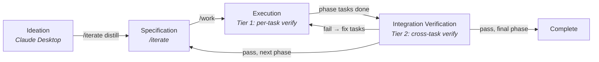

# System Overview

Single-document reference for the entire environment: lifecycle, features, design intent, and authoritative sources. Use this to understand the big picture, verify that implementations match intent, and spot drift.

---

## What This System Is

Domain-agnostic project execution environment for Claude Code: Spec → Execute → Verify. Specialist agents with separated concerns — implementation, verification, and research — ensure quality through independent validation. Works for software, research, procurement, renovation, or any spec-driven project.

---

## Complete Lifecycle

### Phase 0: Ideation

**Where:** Claude Desktop (or any brainstorming tool)
**What happens:** Explore the concept — features, phases, key decisions, human dependencies, technical landscape. Produce a vision document.
**Output:** A markdown document saved to `.claude/vision/`
**Authoritative file:** `support/reference/desktop-project-prompt.md`

**The desktop-project-prompt** streamlines brainstorming to capture spec-relevant information early: phase boundaries, key decisions, dependencies, ambiguities.

**A vision document** captures intent, philosophy, and ambitious scope. It's not a spec — no acceptance criteria, no YAML frontmatter, no task breakdowns. The spec extracts concrete buildable requirements.

**Every project starts with ideation.** Vision document required before spec creation. No spec-skipping path.

**Vision docs can be added throughout the project lifecycle** — not just at the start. If the user gets new ideas, receives additional documentation, or wants to incorporate external reference material, they save it to `.claude/vision/` and run `/iterate distill` to fold it into the spec. The vision folder is a living input, not a one-time artifact.

### Phase 1: Specification

**Where:** Claude Code, `/iterate` command
**What happens:** Transform ideas into a buildable specification with clear requirements and acceptance criteria.
**Two entry points:**
- `/iterate distill` — Extract spec from vision document via 4 core questions (value, features, scope, user path)
- `/iterate` on existing spec — Auto-detects weakest area and improves it

**If the spec is empty and no vision document exists**, Claude does not bootstrap a spec from scratch. It directs the user to brainstorm in Claude Desktop first (see Phase 0).

**Key rule — propose, approve, apply:** Claude proposes spec changes as an explicit change declaration — stating what will change, where in the document, and how the updated sections should read. The user reviews this declaration (in the CLI conversation, not a separate file) and approves or adjusts. On approval, Claude applies the changes with proper versioning (archive current → create new version → apply edits). Claude never makes spec changes without presenting the declaration first, and the user can modify or reject any part. This keeps the user in control of what gets built while eliminating copy-paste friction. The spec should stay high-level enough to remain readable as a project overview, while being precise enough for decomposition and decision-making.

**Output:** `.claude/spec_v{N}.md` with frontmatter (`version`, `status: draft`)
**Readiness:** Problem clear, users identified, acceptance criteria testable, key decisions documented, blocking questions resolved.
**Authoritative files:** `commands/iterate.md`, `support/reference/spec-checklist.md`

### Phase 2: Execution

**Where:** Claude Code, `/work` command
**What happens:** Decompose spec into tasks, then execute them through a two-agent cycle. Each task is individually verified immediately after implementation — there is no waiting.

**Decomposition:** `/work` breaks the spec into tasks (difficulty 1-6), assigns phases, maps dependencies, creates task JSON files, saves a spec snapshot for drift detection.

**Per-task cycle (atomic — implement + verify as one unit):**
1. implement-agent reads the task and spec section
2. Sets task to "In Progress", implements, self-reviews
3. Sets task to "Awaiting Verification"
4. Spawns verify-agent as a **separate agent** (fresh context, no implementation memory)
5. verify-agent checks: task fidelity (did the deliverables match the task description?), output quality, files exist, runtime validation (self-tests runnable outputs like CLIs, APIs, web UIs), integration boundaries, scope validation — this is **Tier 1 verification**
6. If runtime validation is partial (some checks need human eyes), or for `both`-owned tasks with runnable output, verify-agent writes a `test_protocol` and `interaction_hint` to guide human testing
7. Pass → "Finished". Fail → "In Progress" (fix and re-verify, max 3 attempts then escalate)

**Auto-continuation within phases:** After a task finishes (passes verification), `/work` automatically routes to the next eligible task — no user prompt, no pause. This continues until a natural stopping point: phase boundary (requires gate approval), blocking decision, blocking question, or verification failure requiring human escalation. The value of front-loaded decomposition and structured verification is that work flows autonomously between these stops. This applies equally to sequential and parallel modes.

**Parallel execution:** When multiple tasks have no file conflicts and all dependencies met, `/work` dispatches them concurrently. Each parallel task runs its own implement → verify cycle independently. Coordinator handles batching, result collection, and a single dashboard regeneration.

**Context transfer to verify-agent:** verify-agent receives the task JSON (including implement-agent's structured completion notes), the relevant spec section, and the files_affected list. Completion notes should document what was implemented, key decisions made, and known limitations — giving verify-agent useful signal without sharing the full implementation conversation.

**Output:** Completed deliverables, task JSON files with verification results
**Authoritative files:** `commands/work.md`, `support/reference/decomposition.md`, `agents/implement-agent.md`, `agents/verify-agent.md`

### Integration Verification (Tier 2)

**Where:** Claude Code, `/work` auto-detects when all tasks in the current phase are Finished with passing Tier 1 verification
**What happens:** verify-agent validates the phase's implementation against the spec acceptance criteria and checks decomposition completeness. This is **Tier 2 verification** — it catches cross-task integration issues that per-task (Tier 1) verification can't see because Tier 1 only checks each task against its own task description, and it identifies spec requirements that were never decomposed into tasks.

**Runs at phase boundaries, not just at the end.** In a multi-phase project, Tier 2 runs after each phase completes — before the phase gate. This catches integration problems within Phase N before Phase N+1 builds on top of them.

**Scope difference:** Tier 1 asks "did the implementation agent complete this task correctly?" — checking deliverables against the task description, catching incomplete work, subtle errors, and quality issues. The spec section provides context but the task description is the primary reference. Tier 2 asks "do the phase's deliverables work together, satisfy the spec's acceptance criteria, and cover all spec requirements?" At the final phase boundary, Tier 2 validates the full spec end-to-end. Tier 2 catches two things Tier 1 can't: cross-task integration issues (e.g., Task A's output format doesn't match what Task B expects) and decomposition gaps (spec requirements that no task addressed — these become new tasks, not fix tasks).

**Outcomes:**
- `pass` (mid-project) → Phase gate presented for user approval. After approval, `/iterate` suggested to flesh out next phase, then `/work` continues.
- `pass` (final phase) → Project complete. Out-of-spec recommendation tasks presented for user approval.
- `fail` → Fix tasks created (in-spec bugs). `/work` routes to implement-agent automatically, then re-verifies.

**Output:** `.claude/verification-result.json`
**Authoritative files:** `agents/verify-agent.md` (Phase-Level Verification Workflow), `commands/work.md` (If Verifying Phase-Level)

### Completion

**What happens:** Spec status updated to `complete`, dashboard shows completion summary, final checkpoint presented to user.
**Authoritative file:** `commands/work.md` (If Completing)

---

## Communication: Dashboard and CLI-Direct

The dashboard (`.claude/dashboard.md`) is the primary navigation hub, but not all human interaction routes through it. Claude selects the interaction channel per-task based on what minimizes friction.

**Two channels:**
- **Dashboard-mediated** — Async tasks: extended reading, batch review, design decisions, phase gate approvals. The dashboard surfaces what needs attention with links to specific files.
- **CLI-direct** — Synchronous tasks: testing a CLI/TUI, quick confirmations, command-guided walkthroughs. Presented immediately in the Claude Code conversation. Driven by `interaction_hint` and `test_protocol` fields on task JSON.

The dashboard remains the default. CLI-direct is used when the task is synchronous, terminal-oriented, and the user is already in the CLI — forcing them to open a separate file would add friction without value.

**Dashboard purpose:** Acts as a navigation hub — everything the user needs to know or do (for async tasks) is surfaced here with links to the specific files (decision records, task files, deliverables) that need attention. The user clicks through to those files when needed, but the dashboard tells them *which* files to look at and *why*, rather than requiring them to hunt through `.claude/` on their own.

**Sections (toggleable via checklist at top):**
| Section | Content |
|---------|---------|
| Action Required | Phase gates, verification status, pending decisions, user tasks, reviews |
| Progress | Phase breakdown, critical path, project overview diagram, timeline |
| Tasks | Full task list grouped by phase |
| Decisions | Decision log with status and selections — links to decision documents always shown regardless of resolution status |
| Notes | User's preserved section (never overwritten). Generated content is minimal: a single inline link to the questions file (when questions exist), no wrapper headings |
| Custom Views | User-defined inline views (optional, opt-in) |

**Key behaviors:**
- Regenerated automatically after every task change
- User content preserved via marker pairs and a sidecar file (`dashboard-state.json`)
- Section toggles let the user control what's shown
- Ships as a populated example (fictional renovation project) — replaced on first `/work` run

**Authoritative file:** `support/reference/dashboard-regeneration.md`

---

## Feature Catalog

Each feature below includes its purpose (why it exists), how it works (brief), and where the authoritative definition lives.

### Two-Agent Verification Architecture

**Purpose:** Eliminate self-validation blind spots. A single agent implementing and verifying its own work has confirmation bias.

**How it works:** implement-agent builds deliverables. verify-agent validates them in a separate context (spawned as a Task agent with no implementation memory). Neither agent does the other's job — implement-agent doesn't verify, verify-agent doesn't fix.

**Why separate contexts matter:** If verification runs in the same conversation that just implemented the task, the verifier has full memory of every implementation decision and tends to rubber-stamp. Spawning a separate agent gives genuine "fresh eyes."

**Tool preferences:** All three agents follow explicit tool preference guidelines — using dedicated tools (Read, Glob, Grep, Edit, Write) for file operations and reserving Bash for operations that genuinely require shell execution (git commands, running tests, executing deliverables, network requests). This reduces permission friction when agents run as subagents, since dedicated tools don't require per-invocation approval.

**Third agent — research-agent:** A separate specialist for investigating options and populating decision records. Not part of the build/verify cycle — it's invoked by `/research` (or by `/work`/`/iterate` when decisions need investigation). Populates evidence and comparison matrices but never makes selections.

**Authoritative files:** `agents/implement-agent.md`, `agents/verify-agent.md`, `agents/research-agent.md`, `support/reference/workflow.md` § "Agent Synergy"

### Two-Tier Verification

**Purpose:** Catch issues at two levels — per-task (immediately after each implementation) and integration-level (cross-task validation at phase boundaries).

**Tier 1 (Per-Task):** Runs immediately after each task's implementation, as part of the atomic implement → verify cycle. Primary question: "did the implementation agent complete this task correctly?" Checks: task fidelity (deliverables match the task description), output quality, files exist, runtime validation (self-tests runnable outputs), integration boundaries, scope validation. The task description is the primary reference; the spec section provides context. Result stored in `task_verification` field on the task JSON. Each task is verified individually — no waiting for other tasks. When runtime validation is partial (some checks need human confirmation), verify-agent writes a `test_protocol` for guided testing.

**Tier 2 (Integration):** Runs at each phase boundary when all phase tasks are Finished with passing Tier 1 verification. Primary question: "do the deliverables work together, satisfy the spec's acceptance criteria, and cover all spec requirements?" Catches two things Tier 1 can't: cross-task integration issues (e.g., output format mismatches between tasks) and decomposition gaps (spec requirements that no task addressed). Decomposition gaps become new tasks; failed acceptance criteria become fix tasks. Runs before the phase gate — integration problems are caught before the next phase builds on top of them. Result stored in `verification-result.json`.

**Verification results are binary: `pass` or `fail`.** No intermediate states.

**Authoritative files:** `agents/verify-agent.md`, `support/reference/workflow.md` § "Verify Phase"

### Runtime Validation and Guided Testing

**Purpose:** Self-test runnable outputs before involving humans, and minimize interaction friction by choosing the right channel (dashboard vs CLI) per-task.

**Runtime validation (Step T4b):** When a task produces something runnable (CLI, TUI, web UI, API, data pipeline), verify-agent executes it and checks the output against expected behavior from the spec. Results: `pass` (all checks automated), `fail` (defects found), `partial` (some checks need human eyes — visual layout, interactive flows), `not_applicable` (non-runnable output like documents or config). This is best-effort and additive — `not_applicable` doesn't affect verification; only `fail` contributes to failure.

**Interaction modes:** When a task needs human involvement, Claude selects the channel that minimizes friction:
- **Dashboard-mediated** (default) — async review, extended reading, design decisions, phase gates
- **CLI-direct** — synchronous testing, quick confirmations, command-guided walkthroughs

The `interaction_hint` field on the task JSON drives routing. When absent, defaults to dashboard (preserving current behavior).

**Guided testing:** When runtime validation is `partial`, verify-agent writes a `test_protocol` — structured steps with instructions, expected outcomes, and step types (`command` for Claude to run, `interactive` for user to test, `visual` for user to inspect). Combined with `interaction_hint: "cli_direct"`, `/work` walks the user through the steps directly in the CLI conversation instead of routing to the dashboard.

**Key principle:** Self-test first, then ask humans only for what Claude genuinely can't evaluate. Provide exact commands, not vague instructions. Consider switching cost — keep the user in one place.

**Authoritative files:** `agents/verify-agent.md` § Step T4b, `commands/work.md` § "Interaction Mode Selection" and "Guided Testing Flow", `support/reference/workflow.md` § "Interaction Modes and Runtime Validation"

### Phases

**Purpose:** Enforce natural project boundaries (e.g., "build prototype first, then production"). Phase N+1 work cannot begin until Phase N is complete and approved.

**How it works:** Spec sections define phases implicitly. During decomposition, tasks get a `phase` field. Dashboard groups tasks by phase. When all Phase N tasks finish, integration verification (Tier 2) runs first. After Tier 2 passes, a phase gate appears in the dashboard with checkboxes — auto-conditions (task counts, verification status) plus a manual approval checkbox. All must be checked before Phase N+1 unlocks.

**Phase transitions trigger a spec version bump** (archive current → create v{N+1} → suggest `/iterate` to flesh out next phase sections).

**No special configuration needed** — phases emerge from spec structure.

**Authoritative files:** `support/reference/extension-patterns.md` § "Phases", `support/reference/phase-decision-gates.md`, `commands/work.md` § Step 2b

### Decisions

**Purpose:** Track choices that block downstream work, with structured evaluation and a clear selection mechanism.

**How it works:** Decision records live in `.claude/support/decisions/decision-*.md`. Each has a comparison matrix, option details, optional weighted scoring, and a "Select an Option" section with checkboxes. The selection checkboxes appear at the top of the document (immediately after frontmatter), before any analysis — so the human action is immediately visible when opening the file. The user checks a box; `/work` auto-updates status to `approved` and unblocks dependent tasks.

**Two types:**
- **Pick-and-go:** After resolution, dependent tasks simply unblock. Default behavior.
- **Inflection point:** The outcome changes *what* gets built, not just how. After resolution, `/work` pauses and suggests `/iterate` to revisit the spec. Flagged with `inflection_point: true` in frontmatter. The `spec_revised` field tracks whether the spec has been updated post-decision.

**Authoritative files:** `support/reference/decisions.md`, `support/reference/extension-patterns.md` § "Decisions", `support/reference/phase-decision-gates.md`, `commands/work.md` § Step 2b

### Spec Drift Detection and Reconciliation

**Purpose:** Keep tasks aligned with the spec when the spec changes after decomposition, without forcing a complete re-decomposition.

**How it works:** Each task stores fingerprints (full spec hash + per-section hash) from decomposition time. When `/work` runs, it compares current fingerprints against stored ones. If different, it identifies which specific sections changed, shows diffs, groups affected tasks, and offers per-section options: Apply suggestions, Review individually, or Skip (creates a deferral).

**Drift budget:** Deferred reconciliations are tracked in `drift-deferrals.json`. Limits: max 3 deferred sections, max 14 days. Exceeding the budget blocks all work until reconciliation completes.

**Substantial changes** (>50% sections changed, sections added/deleted) trigger a version bump suggestion.

**Authoritative file:** `support/reference/drift-reconciliation.md`

### Parallel Execution

**Purpose:** Speed up execution by running independent tasks concurrently while preventing file conflicts.

**How it works:** After phase and decision checks, `/work` assesses eligible tasks (Pending, deps met, active phase, difficulty < 7, owner not human). Pairwise file conflict detection ensures no two tasks in a batch touch the same files. Tasks with conflicts are held back with a `conflict_note`. Each parallel agent runs the full implement → verify cycle independently. When an agent finishes and releases its files, held-back tasks can start immediately (incremental re-dispatch).

**Constraints:** Dashboard regeneration is coordinator-only (once after all agents finish). Parent auto-completion is deferred. Integration verification (Tier 2) remains sequential. Max batch size configurable (default: 3).

**Authoritative file:** `support/reference/parallel-execution.md`

### Spec Versioning

**Purpose:** Provide clean baselines at major transitions while keeping routine edits simple.

**Key invariant:** Exactly one `spec_v{N}.md` exists in `.claude/` at any time.

**Direct edits are always safe** — the decomposed snapshot preserves the before-state, and drift detection handles reconciliation. After editing the spec directly, run `/work` to continue building (it detects the changes via drift detection and reconciles affected tasks) or `/iterate` to keep refining the spec further. Version bumps are for major transitions (phase completion, inflection points, major pivots), not routine edits.

**Version Transition Procedure:** Confirm with user → Archive to `previous_specifications/` → Copy to v{N+1} → Bump frontmatter → Delete old file.

**Authoritative file:** `commands/iterate.md` § "Spec Versioning"

### Task System

**Purpose:** Track granular work items with clear ownership, dependencies, and verification status.

**8 status values:** Pending, In Progress, Awaiting Verification, Blocked, On Hold, Absorbed, Broken Down, Finished.

**Key rules:**
- Difficulty >= 7 must be broken down before starting
- "Finished" requires `task_verification.result == "pass"` (structurally enforced)
- "Awaiting Verification" is transitional — must proceed to verification immediately
- "On Hold" tasks are excluded from auto-routing; only user can resume
- "Absorbed" preserves audit trail (vs. deletion)
- Parent tasks auto-complete when all non-Absorbed subtasks finish

**3 owner values:** `claude` (autonomous), `human` (requires user action), `both` (collaborative — user reviews after Claude implements)

**Human deliverable validation:** When a human-owned task completes (or the user provides deliverables for a task — files, documents, configuration), `/work` runs a validation gate before continuing: check that the deliverables meet the task's stated requirements (expected quantity, format, content), verify they're usable by downstream tasks, and flag mismatches. If deliverables differ from what was planned (e.g., the task expected 2-3 CSV files but the user provided 1, or files have unexpected structure), `/work` surfaces the discrepancy and assesses whether dependent tasks need adjustment before proceeding.

**Authoritative files:** `support/reference/task-schema.md`, `support/reference/shared-definitions.md`

### Session Recovery

**Purpose:** Handle agent crashes, turn exhaustion, and session interruptions gracefully.

**How it works:** `/work` Step 0 scans all tasks for recoverable states before doing anything else:
- "Awaiting Verification" → Auto-recover: spawn verify-agent
- "Blocked" with `[VERIFICATION TIMEOUT]` and < 3 attempts → Retry with extended turns
- "Blocked" with `[VERIFICATION TIMEOUT]` and >= 3 attempts → Escalate to human review
- "Blocked" with `[AGENT TIMEOUT]` → Present options: Retry, Break down, Skip
- "In Progress" for > 24 hours → Present options: Continue, Reset, Hold

**Authoritative files:** `support/reference/session-recovery.md`, `commands/work.md` § Step 0

### Learnings

**Purpose:** Accumulate project-specific patterns discovered through experience, so implement-agent avoids repeating mistakes and builds on what's worked.

**How it works:** Markdown files in `.claude/support/learnings/` capture patterns by category (task strategies, API patterns, testing patterns, gotchas, etc.). implement-agent checks this directory during Step 4 before implementation begins. Learnings that mature into formal requirements graduate to the spec and are removed. Reviewed at phase completions for staleness.

**Not template-synced** — each project accumulates its own learnings.

**Authoritative file:** `support/learnings/README.md`

### Questions System

**Purpose:** Let agents accumulate questions for the user during execution and surface them at natural checkpoints.

**How it works:** During execution, when implement-agent or verify-agent encounter something they can't resolve autonomously — a spec ambiguity, a technical choice needing user input, a dependency question — they write it to `.claude/support/questions/questions.md` under categories (Requirements, Technical, Scope, Dependencies). Questions marked with `[BLOCKING]` halt work until answered. Non-blocking questions accumulate and are surfaced to the user in the dashboard's Action Required section at natural checkpoints (after a task completes or at a phase boundary).

**Authoritative file:** `commands/work.md` § Step 5

### Feedback System

**Purpose:** Let users capture fleeting ideas and improvement thoughts during project work without losing context, then triage them into actionable spec improvements or archive them.

**How it works:** `/feedback [text]` appends a new entry (ID format: `FB-NNN`) to `.claude/support/feedback/feedback.md` with status `new`. `/feedback review` walks through unreviewed items interactively — each can be refined (distilled to a core insight), archived (moved to `archive.md` with reason), skipped, or edited. Refined items surface in `/iterate` Step 1b for optional incorporation into the spec, completing the path from idea to specification.

**Dashboard integration:** A single derived line in Action Required when unhandled items exist: `📝 {N} feedback items awaiting attention ({X} new, {Y} refined) → /feedback review`. Computed during regeneration, not stored.

**Authoritative file:** `commands/feedback.md`

### Out-of-Spec Tasks

**Purpose:** Allow work beyond the spec without breaking verification integrity.

**How it works:** When a request doesn't align with the spec, `/work` offers: add to spec, proceed anyway (creates `out_of_spec: true` task), or skip. verify-agent can also create recommendation tasks with `out_of_spec: true`. Out-of-spec tasks are excluded from phase routing and completion conditions. They require explicit user approval (Accept/Reject/Defer) before execution.

**Authoritative file:** `commands/work.md` § "Out-of-spec task handling", `support/reference/workflow.md` § "Out-of-Spec Task Handling"

### Dashboard State Preservation

**Purpose:** Never lose user-authored content during dashboard regeneration.

**How it works:** User content lives between marker pairs (`<!-- USER SECTION -->`, `<!-- FEEDBACK:{id} -->`, `<!-- PHASE GATE -->`, etc.). Before regeneration, content is extracted and persisted to `dashboard-state.json` (sidecar file). If markers are damaged, the sidecar serves as fallback. Content is re-injected after the new dashboard is generated.

**Authoritative file:** `support/reference/dashboard-regeneration.md` § "Dashboard State Sidecar"

### Custom Views

**Purpose:** Let users define domain-specific tracking views directly in the dashboard.

**How it works:** Users write instructions between `<!-- CUSTOM VIEWS INSTRUCTIONS -->` markers describing what tables/summaries they want. Claude generates the rendered content fresh each `/work` cycle. Instructions are preserved; rendered content is regenerated.

**Authoritative file:** `support/reference/extension-patterns.md` § "Custom Views"

### Template Sync

**Purpose:** Keep project workflow files up to date with upstream template improvements.

**How it works:** `sync-manifest.json` defines which files sync (commands, agents, reference docs) vs. stay user-owned (CLAUDE.md, dashboard, tasks). `/health-check` compares local files against the template repo and presents changes grouped by workflow area.

**Authoritative file:** `commands/health-check.md` § Part 5

---

## Design Principles

These are the invariants and rules that should hold true across all implementations.

### The Spec Is the Source of Truth
All work aligns with the spec, or the spec is updated intentionally. Tasks follow the spec, not the other way around.

### Propose-Approve-Apply (Spec Authorship)
Claude proposes spec changes via explicit change declarations; the user reviews and approves before Claude applies them. Claude handles the mechanics (versioning, archiving, applying edits) but never modifies spec content without presenting the declaration and receiving approval first. The user can modify, reject, or redirect any proposed change.

### Verification Is Structurally Enforced
A task cannot reach "Finished" without `task_verification.result == "pass"`. This is checked by `/work`, `/health-check`, and the task schema. There is no way to bypass verification by marking tasks Finished directly.

### Context Separation Between Agents
verify-agent always runs as a separate Task agent, never inline in the implementation conversation. This applies to both sequential and parallel execution modes.

### The Dashboard Is the Navigation Hub (With CLI-Direct Escape Hatch)
During the build phase, the dashboard surfaces what needs attention and links to the specific files that require review. The user follows these links to inspect files directly — but the dashboard guides them there, so they don't need to browse `.claude/` on their own to figure out what's happening or what to do next. However, not all human interaction routes through the dashboard: synchronous tasks like testing a CLI, confirming output, or quick yes/no questions are presented directly in the CLI conversation to minimize context-switching friction. The dashboard remains the default; CLI-direct is the escape hatch for tasks where the dashboard adds unnecessary intermediation.

### Agents Minimize Shell Execution
Agents use dedicated tools (Read, Glob, Grep, Edit, Write) for all file operations and reserve Bash exclusively for operations requiring shell execution: git commands, running test suites, executing deliverables, and network requests. When Bash is necessary, agents consolidate related commands into single invocations and degrade gracefully if permission is denied (e.g., scope validation skips rather than blocks). This minimizes permission prompts when agents run as subagents.

### Domain Agnosticism
Nothing in the system assumes software development. Dashboard language, task tracking, verification, and all features adapt to whatever domain the project is in.

### Single-Spec Invariant
Exactly one `spec_v{N}.md` exists in `.claude/` at any time. Version transitions archive before creating. `/health-check` enforces this.

---

## Commands Reference

| Command | Purpose | Mode |
|---------|---------|------|
| `/work` | Main entry point — state detection, spec checking, decomposition, agent routing, completion | Read-write |
| `/work complete` | Complete a task (human/both-owned tasks, or tasks worked outside normal flow) | Read-write |
| `/iterate` | Spec review — improve existing spec or distill from vision | Read-write (proposes, applies on approval) |
| `/iterate distill` | Extract buildable spec from a vision document | Read-write (proposes, applies on approval) |
| `/review` | Implementation quality review — advisory assessment of completed work | Read-only |
| `/review {area}` | Focused implementation review on a specific area | Read-only |
| `/status` | Quick view of project state | Read-only |
| `/status --brief` | One-line summary | Read-only |
| `/status --tasks` | Task-focused view | Read-only |
| `/research` | Investigate options for decisions — spawns research-agent | Read-write |
| `/research {DEC-NNN}` | Research options for a specific existing decision | Read-write |
| `/feedback` | Quick capture an idea | Read-write |
| `/feedback list` | Show feedback summary and items | Read-only |
| `/feedback review` | Batch triage unreviewed feedback | Read-write |
| `/feedback review {id}` | Triage a single feedback item | Read-write |
| `/breakdown {id}` | Split a complex task into subtasks | Read-write |
| `/health-check` | Validate tasks, decisions, CLAUDE.md, archives, and template sync | Read-write (with user approval) |
| `/health-check --report` | Show issues only, no fix prompts | Read-only |

---

## File Map

See also `support/reference/paths.md` for the canonical paths reference used by commands and agents at runtime.

| File | Purpose | Managed By |
|------|---------|------------|
| `.claude/spec_v{N}.md` | Project specification (source of truth) | User via `/iterate` |
| `.claude/dashboard.md` | User-facing project dashboard | Auto-regenerated by `/work` |
| `.claude/dashboard-state.json` | Durable backup of user content from dashboard | Auto-managed |
| `.claude/verification-result.json` | Integration verification (Tier 2) outcome | verify-agent |
| `.claude/drift-deferrals.json` | Tracked deferred reconciliations | `/work` |
| `.claude/tasks/task-*.json` | Individual task data | `/work`, agents |
| `.claude/tasks/archive/` | Archived completed tasks (100+ threshold) | `/work` |
| `.claude/tasks/.last-clean-exit.json` | Session sentinel — tracks clean exit for fast recovery skip | `/work` |
| `.claude/vision/` | Vision documents and supplementary reference docs for distillation | User |
| `.claude/commands/*.md` | Command definitions | Template |
| `.claude/agents/*.md` | Agent definitions | Template |
| `.claude/support/reference/*.md` | Reference documentation | Template |
| `.claude/support/decisions/decision-*.md` | Decision records | `/work`, user |
| `.claude/support/previous_specifications/` | Archived spec versions and decomposition snapshots | `/work`, `/iterate` |
| `.claude/support/questions/questions.md` | Questions for human input | Agents, `/work` |
| `.claude/support/feedback/feedback.md` | Active feedback items (ideas, improvements) | `/feedback`, `/iterate` |
| `.claude/support/feedback/archive.md` | Archived feedback (not relevant, with reasons) | `/feedback review` |
| `.claude/support/workspace/` | Temporary working documents | Agents (ephemeral) |
| `.claude/support/documents/` | User-provided reference files | User |
| `.claude/support/learnings/` | Project-specific patterns | Agents |
| `.claude/sync-manifest.json` | Template sync file categories | Template |
| `.claude/version.json` | Template version tracking | Template |
| `.claude/settings.local.json` | Pre-approved Bash permissions for Claude Code | Template (user-customizable) |
| `.claude/README.md` | User-facing environment guide (quick start, commands, concepts) | Template (user-customizable) |
