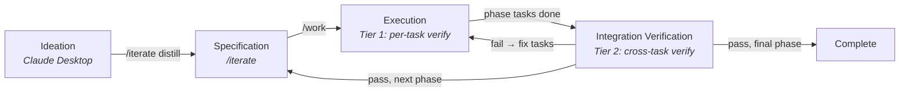

# System Overview

Single-document reference for the entire environment: lifecycle, features, design intent, and authoritative sources. **This is the template's source of truth** — all template changes should be consistent with the design intent described here.

**Version:** See `.claude/version.json` for the current template version.

### Change-Proposal Process (Template Maintenance)

When modifying template files (commands, agents, rules, reference docs), Claude must:

1. **Check consistency** — read this document to understand how the proposed change fits the overall design
2. **Assess impact** — identify which template files are affected and whether the change is additive, corrective, or reductive
3. **Propose atomically** — make focused changes rather than broad rewrites. Each change should be independently reviewable.
4. **Surface ambiguities** — if the change could go multiple ways, ask the user rather than deciding silently
5. **Update this document** — if the change introduces new features, principles, or structural changes, update the relevant section here

This is lightweight governance, not the full spec/task/dashboard workflow (which is template content, not a tool for managing the template itself).

### Pending Template Decisions

Some template improvements require architectural choices before implementation. Active decision records live in root `decisions/` (template-maintenance only — ephemeral, removed once resolved and encoded into template files). Check that folder before starting work on:

- **Subagent capability contract** — whether subagents spawned by `/work` own task state transitions (implement-agent Steps 6a/6b) or the orchestrator does. Relates to FB-010.
- **Phase gate flexibility** — how to let long-running human-owned tasks cross phase boundaries without breaking the software-domain invariant. Relates to FB-013.

When a decision record is resolved and its conclusions land in template files, remove it from root `decisions/`.

---

## What This System Is

Domain-agnostic project execution environment for Claude Code: Spec → Execute → Verify. Specialist agents with separated concerns — implementation, verification, and research — ensure quality through independent validation. Works for software, research, procurement, renovation, or any spec-driven project.

---

## Complete Lifecycle


```mermaid
graph LR
    A["Ideation<br><i>Claude Desktop</i>"] -->|/iterate distill| B["Specification<br><i>/iterate</i>"]
    B -->|/work| C["Execution<br><i>Tier 1: per-task verify</i>"]
    C -->|phase tasks done| D["Integration Verification<br><i>Tier 2: cross-task verify</i>"]
    D -->|fail → fix tasks| C
    D -->|pass, next phase| B
    D -->|pass, final phase| E[Complete]
```

### Phase 0: Ideation

**Where:** Claude Desktop (or any brainstorming tool)
**What happens:** Explore the concept — features, phases, key decisions, human dependencies, technical landscape. Produce a vision document.
**Output:** A markdown document saved to `.claude/vision/`
**Authoritative file:** `support/reference/desktop-project-prompt.md`

**The desktop-project-prompt** streamlines brainstorming to capture spec-relevant information early: phase boundaries, key decisions, dependencies, ambiguities.

**A vision document** captures intent, philosophy, and ambitious scope. It's not a spec — no acceptance criteria, no YAML frontmatter, no task breakdowns. The spec extracts concrete buildable requirements.

**Every project starts with ideation.** Vision document required before spec creation. No spec-skipping path.

**Vision docs can be added throughout the project lifecycle** — not just at the start. If the user gets new ideas, receives additional documentation, or wants to incorporate external reference material, they save it to `.claude/vision/` and run `/iterate distill` to fold it into the spec. The vision folder is a living input, not a one-time artifact.

### Phase 1: Specification

**Where:** Claude Code, `/iterate` command
**What happens:** Transform ideas into a buildable specification with clear requirements and acceptance criteria.
**Two entry points:**
- `/iterate distill` — Extract spec from vision document via 4 core questions (value, features, scope, user path)
- `/iterate` on existing spec — Auto-detects weakest area and improves it

**If the spec is empty and no vision document exists**, Claude does not bootstrap a spec from scratch. It directs the user to brainstorm in Claude Desktop first (see Phase 0).

**Key rule — propose, approve, apply:** Claude proposes spec changes as an explicit change declaration — stating what will change, where in the document, and how the updated sections should read. The user reviews this declaration (in the CLI conversation, not a separate file) and approves or adjusts. On approval, Claude applies the changes with proper versioning (archive current → create new version → apply edits). Claude never makes spec changes without presenting the declaration first, and the user can modify or reject any part. This keeps the user in control of what gets built while eliminating copy-paste friction. The spec should stay high-level enough to remain readable as a project overview, while being precise enough for decomposition and decision-making.

**Output:** `.claude/spec_v{N}.md` with frontmatter (`version`, `status: draft`)
**Readiness:** Problem clear, users identified, acceptance criteria testable, key decisions documented, blocking questions resolved.
**Authoritative files:** `commands/iterate.md`, `support/reference/spec-checklist.md`

### Phase 2: Execution

**Where:** Claude Code, `/work` command
**What happens:** Decompose spec into tasks, then execute them through a two-agent cycle. Each task is individually verified immediately after implementation — there is no waiting.

**Decomposition:** `/work` breaks the spec into tasks (difficulty 1-6), assigns phases, maps dependencies, creates task JSON files, saves a spec snapshot for drift detection.

**Per-task cycle (atomic — implement + verify as one unit):**
1. Orchestrator (`/work`) sets task to "In Progress" and dispatches implement-agent
2. implement-agent reads the task and spec section, implements, self-reviews, returns a structured report
3. Orchestrator reads the report, sets task to "Awaiting Verification", and dispatches verify-agent as a **separate agent** (fresh context, no implementation memory)
4. verify-agent checks: task fidelity (did the deliverables match the task description?), output quality, files exist, cross-file consistency (modified files are consistent with each other and with unmodified files that reference them — no stale references, no schema mismatches, no format drift, no broken cross-references), runtime validation (self-tests runnable outputs like CLIs, APIs, web UIs), integration boundaries, scope validation — this is **Tier 1 verification**
5. verify-agent returns a structured verification report. If runtime validation is partial (some checks need human eyes), or for `both`-owned tasks with runnable output, the report includes a `test_protocol` and `interaction_hint` that the orchestrator writes to the task JSON to guide human testing
6. Orchestrator writes `task_verification` from the report. Pass → "Finished". Fail → "In Progress" (fix and re-verify, max 3 attempts then escalate)

State persistence is centralized in the orchestrator because the Claude Code harness prohibits subagent writes to `.claude/` paths (see DEC-004). The atomic implement→verify contract is preserved: a task cannot reach "Finished" without `task_verification.result == "pass"`. Only the *writer* changed — agents judge, the orchestrator persists.

**Auto-continuation within phases:** After a task finishes (passes verification), `/work` automatically routes to the next eligible task — no user prompt, no pause. This continues until a natural stopping point: phase boundary (requires gate approval), blocking decision, blocking question, verification failure requiring human escalation, or all remaining tasks being non-actionable: human-owned, blocked, or on hold (fast-exit via Step 1d — skips the full analysis pipeline, outputs a brief summary with specific next steps per category). The value of front-loaded decomposition and structured verification is that work flows autonomously between these stops. This applies equally to sequential and parallel modes.

**Parallel execution:** When multiple tasks have no file conflicts and all dependencies met, `/work` dispatches them concurrently. Each parallel task runs its own implement → verify cycle independently. Coordinator handles batching, result collection, and a single dashboard regeneration.

**Context transfer to verify-agent:** verify-agent receives the task JSON (including implement-agent's structured completion notes), the relevant spec section, and the files_affected list. For the consistency check, verify-agent also scans for files that reference the modified files (via grep for filenames, anchors, or shared terminology) to detect stale cross-references. Completion notes should document what was implemented, key decisions made, and known limitations — giving verify-agent useful signal without sharing the full implementation conversation.

**Output:** Completed deliverables, task JSON files with verification results
**Authoritative files:** `commands/work.md`, `support/reference/decomposition.md`, `agents/implement-agent.md`, `agents/verify-agent.md`

### Integration Verification (Tier 2)

**Where:** Claude Code, `/work` auto-detects when all tasks in the current phase are Finished with passing Tier 1 verification
**What happens:** verify-agent validates the phase's implementation against the spec acceptance criteria and checks decomposition completeness. This is **Tier 2 verification** — it catches cross-task integration issues that per-task (Tier 1) verification can't see because Tier 1 only checks each task against its own task description, and it identifies spec requirements that were never decomposed into tasks.

**Runs at phase boundaries, not just at the end.** In a multi-phase project, Tier 2 runs after each phase completes — before the phase gate. This catches integration problems within Phase N before Phase N+1 builds on top of them.

**Scope difference:** Tier 1 asks "did the implementation agent complete this task correctly?" — checking deliverables against the task description, catching incomplete work, subtle errors, and quality issues. The spec section provides context but the task description is the primary reference. Tier 2 asks "do the phase's deliverables work together, satisfy the spec's acceptance criteria, and cover all spec requirements?" At the final phase boundary, Tier 2 validates the full spec end-to-end. Tier 2 catches two things Tier 1 can't: cross-task integration issues (e.g., Task A's output format doesn't match what Task B expects) and decomposition gaps (spec requirements that no task addressed — these become new tasks, not fix tasks).

**Outcomes:**
- `pass` (mid-project) → Phase gate presented for user approval. After approval, `/iterate` suggested to flesh out next phase, then `/work` continues.
- `pass` (final phase) → Project complete. Out-of-spec recommendation tasks presented for user approval.
- `fail` → Fix tasks created (in-spec bugs). `/work` routes to implement-agent automatically, then re-verifies.

**Output:** `.claude/verification-result.json`
**Authoritative files:** `agents/verify-agent.md` (Phase-Level Verification Workflow), `commands/work.md` (If Verifying Phase-Level)

### Completion

**What happens:** Spec status updated to `complete`, dashboard shows completion summary, final checkpoint presented to user.
**Authoritative file:** `commands/work.md` (If Completing)

---

## Communication: Dashboard and CLI-Direct

The dashboard (`.claude/dashboard.md`) is the primary navigation hub, but not all human interaction routes through it. Claude selects the interaction channel per-task based on what minimizes friction.

**Two channels:**
- **Dashboard-mediated** — Async tasks: extended reading, batch review, design decisions, phase gate approvals. The dashboard surfaces what needs attention with links to specific files.
- **CLI-direct** — Synchronous tasks: testing a CLI/TUI, quick confirmations, command-guided walkthroughs. Presented immediately in the Claude Code conversation. Driven by `interaction_hint` and `test_protocol` fields on task JSON.

The dashboard remains the default. CLI-direct is used when the task is synchronous, terminal-oriented, and the user is already in the CLI — forcing them to open a separate file would add friction without value.

**Dashboard purpose:** Acts as a navigation hub — everything the user needs to know or do (for async tasks) is surfaced here with links to the specific files (decision records, task files, deliverables) that need attention. The user clicks through to those files when needed, but the dashboard tells them *which* files to look at and *why*, rather than requiring them to hunt through `.claude/` on their own.

**Sections (toggleable via checklist at top):**
| Section | Content |
|---------|---------|
| Action Required | Phase gates, verification status, pending decisions, user tasks, reviews |
| Progress | Phase breakdown, critical path, project overview diagram, timeline |
| Tasks | Full task list grouped by phase |
| Decisions | Decision log with status and selections — links to decision documents always shown regardless of resolution status |
| Notes | User's preserved section (never overwritten). Generated content is minimal: a single inline link to the questions file (when questions exist), no wrapper headings |
| Custom Views | User-defined inline views (optional, opt-in) |

**Key behaviors:**
- **Tiered communication strategy** — dashboard does NOT regenerate on every task change:
  - *Tier 1 (Strategic Dashboard Regen):* Only at key moments — decomposition complete, parallel batch end, session boundaries, `/work complete`, phase gates, decision resolution, freshness check (Step 1a)
  - *Tier 2 (Inline CLI Messages):* Brief contextual updates for routine changes — task starts, verification passes/fails, human tasks unblock, contextual command suggestions at stopping points (when no agent dispatch occurs, `/work` suggests the most relevant next command)
- Freshness timestamp shown after completion % line: `*Updated [YYYY-MM-DD HH:MM] — may not reflect changes made outside /work*`
- Hidden metadata block tracks `task_hash`, `spec_fingerprint`, `verification_debt`, `drift_deferrals` for freshness detection
- User content preserved via marker pairs and a sidecar file (`dashboard-state.json`) with fields: `user_notes`, `section_toggles`, `phase_gates`, `inline_feedback`, `custom_views_instructions`, `updated`
- Section toggles let the user control what's shown
- Ships as a populated example (fictional renovation project) — replaced on first `/work` run

**Dashboard visualization features:**
- **Critical path** — computed from dependency graph: longest path with parallel branches shown in `[ | ]` notation, owner tags (`❗` human, `🤖` claude, `👥` both), decision nodes included
- **Orientation diagram** — inline diagram in the Progress section showing where the user is now and what's next, with dependency detail on upcoming tasks. Not a full-project overview: completed phases collapse, pending far-future work is deferred, the active frontier gets the focus. Mermaid is preferred but not required — representation may shift to alternatives (focused sub-graph, phase-grouped list, script-generated SVG) when diagrams stop aiding orientation. Driven by rules in `support/reference/dashboard-regeneration.md` § "Project Overview Diagram".
- **Completed task summarization** — phases with 10+ finished tasks render as a summary line (`N tasks finished`) instead of listing each individually
- **Partially actionable phase status** — phases not yet "Active" but with tasks whose dependencies are all satisfied show as `Partially Actionable` instead of `Blocked`, with eligible task IDs listed
- **Repair indicator** — Finished tasks with multiple verification attempts show as `Finished (N retries)` in the Tasks section
- **Acceptance criteria checklist** — when `verification-result.json` has a `criteria` array, renders pass/fail checklist with notes and summary count
- **Spec drift surfacing** — when `drift-deferrals.json` has active entries, renders warnings in Action Required with affected task count and deferral age
- **Out-of-spec task approval UI** — unapproved tasks appear in Action Required with `[A]` Accept, `[R]` Reject, `[D]` Defer, `[AA]` Accept all actions; rejected tasks are archived
- **Conditional phase gates** — auto-conditions (task counts, verification status) render as pre-checked boxes; manual approval checkbox required; custom gate conditions from spec ("Gate Conditions" / "Transition Criteria" sections) become additional checkboxes

**Authoritative file:** `support/reference/dashboard-regeneration.md`

---

## Feature Catalog

Each feature below includes its purpose (why it exists), how it works (brief), and where the authoritative definition lives.

### Two-Agent Verification Architecture

**Purpose:** Eliminate self-validation blind spots. A single agent implementing and verifying its own work has confirmation bias.

**How it works:** implement-agent builds deliverables and returns a structured report. verify-agent validates them in a separate context (spawned as a Task agent with no implementation memory) and returns a structured verification report. The `/work` orchestrator persists all task state from these reports — agents judge, orchestrator writes. Neither agent does the other's job — implement-agent doesn't verify, verify-agent doesn't fix.

**Why separate contexts matter:** If verification runs in the same conversation that just implemented the task, the verifier has full memory of every implementation decision and tends to rubber-stamp. Spawning a separate agent gives genuine "fresh eyes." This property depends on verify-agent running in its own context — independent of who writes the resulting `task_verification` JSON. State persistence is centralized in the orchestrator (see DEC-004); verification independence is about *judgment*, not about *writes*.

**Tool preferences:** All three agents follow explicit tool preference guidelines — using dedicated tools (Read, Glob, Grep, Edit, Write) for file operations and reserving Bash for operations that genuinely require shell execution (git commands, running tests, executing deliverables, network requests). This reduces permission friction when agents run as subagents, since dedicated tools don't require per-invocation approval.

**Third agent — research-agent:** A separate specialist for investigating options and populating decision records. Not part of the build/verify cycle — it's invoked by `/research` (or by `/work`/`/iterate` when decisions need investigation). Populates evidence and comparison matrices but never makes selections.

**Authoritative files:** `agents/implement-agent.md`, `agents/verify-agent.md`, `agents/research-agent.md`, `support/reference/workflow.md` § "Agent Synergy"

### Two-Tier Verification

**Purpose:** Catch issues at two levels — per-task (immediately after each implementation) and integration-level (cross-task validation at phase boundaries).

**Tier 1 (Per-Task):** Runs immediately after each task's implementation, as part of the atomic implement → verify cycle. Primary question: "did the implementation agent complete this task correctly?" Checks: task fidelity (deliverables match the task description), output quality, files exist, cross-file consistency (modified files checked against each other and against files that reference them for stale references, schema mismatches, and formatting drift), runtime validation (self-tests runnable outputs), integration boundaries, scope validation. The consistency check is scoped to the task's blast radius — `files_affected` plus any files that import, reference, or link to them — not a full project scan. This catches the common case where editing a document breaks references in related documents, without duplicating Tier 2's full integration scope. The task description is the primary reference; the spec section provides context. verify-agent returns a structured per-task report; the orchestrator writes `task_verification` to the task JSON. Each task is verified individually — no waiting for other tasks. When runtime validation is partial (some checks need human confirmation), the report includes a `test_protocol` that the orchestrator writes to the task JSON for guided testing.

**Tier 2 (Integration):** Runs at each phase boundary when all phase tasks are Finished with passing Tier 1 verification. Primary question: "do the deliverables work together, satisfy the spec's acceptance criteria, and cover all spec requirements?" Catches two things Tier 1 can't: cross-task integration issues (e.g., output format mismatches between tasks) and decomposition gaps (spec requirements that no task addressed). Decomposition gaps become new tasks; failed acceptance criteria become fix tasks. Runs before the phase gate — integration problems are caught before the next phase builds on top of them. Result stored in `verification-result.json`.

**Verification results are binary: `pass` or `fail`.** No intermediate states.

**Authoritative files:** `agents/verify-agent.md`, `support/reference/workflow.md` § "Verify Phase"

### Runtime Validation and Guided Testing

**Purpose:** Self-test runnable outputs before involving humans, and minimize interaction friction by choosing the right channel (dashboard vs CLI) per-task.

**Runtime validation (Step T4b):** When a task produces something runnable (CLI, TUI, web UI, API, data pipeline), verify-agent executes it and checks the output against expected behavior from the spec. Results: `pass` (all checks automated), `fail` (defects found), `partial` (some checks need human eyes — visual layout, interactive flows), `not_applicable` (non-runnable output like documents or config). This is best-effort and additive — `not_applicable` doesn't affect verification; only `fail` contributes to failure.

**Interaction modes:** When a task needs human involvement, Claude selects the channel that minimizes friction:
- **Dashboard-mediated** (default) — async review, extended reading, design decisions, phase gates
- **CLI-direct** — synchronous testing, quick confirmations, command-guided walkthroughs

The `interaction_hint` field on the task JSON drives routing. When absent, defaults to dashboard (preserving current behavior).

**Guided testing:** When runtime validation is `partial`, verify-agent includes a `test_protocol` in its return report — structured steps with instructions, expected outcomes, and step types (`command` for Claude to run, `interactive` for user to test, `visual` for user to inspect). The orchestrator writes the protocol to the task JSON. Combined with `interaction_hint: "cli_direct"`, `/work` walks the user through the steps directly in the CLI conversation instead of routing to the dashboard. Protocol flow: each step is presented with its instruction and expected outcome; `command` steps show `[R]` to run, others show `[P]` pass / `[F]` fail; freeform feedback is captured at the end; results are recorded in the task's `user_feedback` field.

**Key principle:** Self-test first, then ask humans only for what Claude genuinely can't evaluate. Provide exact commands, not vague instructions. Consider switching cost — keep the user in one place.

**Authoritative files:** `agents/verify-agent.md` § Step T4b, `commands/work.md` § "Interaction Mode Selection" and "Guided Testing Flow", `support/reference/workflow.md` § "Interaction Modes and Runtime Validation"

### Implementation Review (`/review`)

**Purpose:** Fill the gap between per-task verification (Tier 1) and integration verification (Tier 2). Provides an advisory quality assessment of completed work — purely read-only, no modifications.

**How it works:** `/review` scans completed work across six focus areas: Architecture Coherence (structural patterns, layering violations), Integration Quality (cross-component contracts, data flow), Pattern Consistency (naming, error handling, conventions), Cross-Cutting Concerns (logging, security, configuration), Technical Debt (complexity, duplication, missing abstractions), and Decision Implementation Audit (anchor validation, decision-implementation alignment). `/review {area}` runs a focused review on a specific area. Output is advisory: findings are presented but no tasks are created or files modified.

**Authoritative file:** `commands/review.md`

### Phases

**Purpose:** Enforce natural project boundaries (e.g., "build prototype first, then production"). Phase N+1 work cannot begin until Phase N is complete and approved.

**How it works:** Spec sections define phases implicitly. During decomposition, tasks get a `phase` field. Dashboard groups tasks by phase. When all Phase N tasks finish, integration verification (Tier 2) runs first. After Tier 2 passes, a phase gate appears in the dashboard with checkboxes — auto-conditions (task counts, verification status) rendered as pre-checked `[x]` boxes that cannot be unchecked, plus a manual approval checkbox the user must check. Custom gate conditions from spec sections ("Gate Conditions" or "Transition Criteria" headings) become additional checkboxes. If auto-conditions are NOT met, they render with detail (e.g., `All verifications passed (8/10 — 2 tasks have verification debt)`). All must be satisfied before Phase N+1 unlocks.

**Partially actionable phases:** A phase that isn't yet "Active" (previous phase not fully complete) may still have individual tasks whose task-level dependencies are all satisfied. These phases show as `Partially Actionable` in the dashboard instead of `Blocked`, surfacing eligible tasks so users can start early where dependencies allow.

**Phase transitions trigger a spec version bump** (archive current → create v{N+1} → suggest `/iterate` to flesh out next phase sections).

**No special configuration needed** — phases emerge from spec structure.

**Authoritative files:** `support/reference/extension-patterns.md` § "Phases", `support/reference/phase-decision-gates.md`, `commands/work.md` § Step 2b

### Decisions

**Purpose:** Track choices that block downstream work, with structured evaluation and a clear selection mechanism.

**How it works:** Decision records live in `.claude/support/decisions/decision-*.md`. Each has a comparison matrix, option details, optional weighted scoring, and a "Select an Option" section with checkboxes. The selection checkboxes appear at the top of the document (immediately after frontmatter), before any analysis — so the human action is immediately visible when opening the file. The user checks a box; `/work` auto-updates status to `approved` and unblocks dependent tasks.

**Two types:**
- **Pick-and-go:** After resolution, dependent tasks simply unblock. Default behavior.
- **Inflection point:** The outcome changes *what* gets built, not just how. After resolution, `/work` pauses and suggests `/iterate` to revisit the spec. Flagged with `inflection_point: true` in frontmatter. The `spec_revised` field tracks whether the spec has been updated post-decision.

**Implementation anchors:** When a decision reaches `implemented` status, it gains `implementation_anchors` — references linking the decision to where it was realized (fields: `file`, `line` (optional), `description`). `/health-check` and `/review` validate that anchors are still valid (files exist, content matches).

**Authoritative files:** `support/reference/decisions.md`, `support/reference/extension-patterns.md` § "Decisions", `support/reference/phase-decision-gates.md`, `commands/work.md` § Step 2b

### Spec Drift Detection and Reconciliation

**Purpose:** Keep tasks aligned with the spec when the spec changes after decomposition, without forcing a complete re-decomposition.

**How it works:** Each task stores fingerprints (full spec hash + per-section hash) from decomposition time. When `/work` runs, it compares current fingerprints against stored ones. If different, it identifies which specific sections changed, shows diffs, groups affected tasks, and offers per-section options: Apply suggestions, Review individually, or Skip (creates a deferral).

**Drift budget:** Deferred reconciliations are tracked in `drift-deferrals.json`. Limits: max 3 deferred sections, max 14 days. Exceeding the budget blocks all work until reconciliation completes.

**Substantial changes** (>50% sections changed, sections added/deleted) trigger a version bump suggestion.

**Authoritative file:** `support/reference/drift-reconciliation.md`

### Parallel Execution

**Purpose:** Speed up execution by running independent tasks concurrently while preventing file conflicts.

**How it works:** After phase and decision checks, `/work` assesses eligible tasks (Pending, deps met, active phase, difficulty < 7, owner not human). Pairwise file conflict detection ensures no two tasks in a batch touch the same files. Tasks with conflicts are held back with a `conflict_note`. Each parallel agent runs the full implement → verify cycle independently. When an agent finishes and releases its files, held-back tasks can start immediately (incremental re-dispatch).

**Constraints:** Dashboard regeneration is coordinator-only (once after all agents finish). Parent auto-completion is deferred. Integration verification (Tier 2) remains sequential. Max batch size configurable (default: 3).

**Authoritative file:** `support/reference/parallel-execution.md`

### Spec Versioning

**Purpose:** Provide clean baselines at major transitions while keeping routine edits simple.

**Key invariant:** Exactly one `spec_v{N}.md` exists in `.claude/` at any time.

**Direct edits are always safe** — the decomposed snapshot preserves the before-state, and drift detection handles reconciliation. After editing the spec directly, run `/work` to continue building (it detects the changes via drift detection and reconciles affected tasks) or `/iterate` to keep refining the spec further. Version bumps are for major transitions (phase completion, inflection points, major pivots), not routine edits.

**Version Transition Procedure:** Confirm with user → Archive to `previous_specifications/` → Copy to v{N+1} → Bump frontmatter → Delete old file.

**Authoritative file:** `commands/iterate.md` § "Spec Versioning"

### Task System

**Purpose:** Track granular work items with clear ownership, dependencies, and verification status.

**8 status values:** Pending, In Progress, Awaiting Verification, Blocked, On Hold, Absorbed, Broken Down, Finished.

**Key rules:**
- Difficulty >= 7 must be broken down before starting
- "Finished" requires `task_verification.result == "pass"` (structurally enforced — human tasks satisfy this via auto-generated self-attestation on `/work complete`)
- "Awaiting Verification" is transitional — must proceed to verification immediately
- "On Hold" tasks are excluded from auto-routing; only user can resume
- "Absorbed" preserves audit trail (vs. deletion)
- Parent tasks auto-complete when all non-Absorbed subtasks finish

**3 owner values:** `claude` (autonomous), `human` (requires user action), `both` (collaborative — user reviews after Claude implements)

**Human task completion:** When a user runs `/work complete` for a human-owned task, the system: (1) auto-generates a `task_verification` record with `checks: { "self_attested": "pass" }` — satisfying the verification invariant without spawning verify-agent, since there is no Claude-produced implementation to verify; (2) asks for completion notes inline in the CLI conversation (the primary feedback path — dashboard FEEDBACK markers remain as an async fallback); (3) validates any deliverables the task required (quantity, usability, downstream plan validity).

**Verification debt:** Tasks with verification issues: status "Awaiting Verification" (incomplete), "Finished" without valid `task_verification` (bypass — rare for human tasks which auto-generate), or `task_verification.result` is "fail". Verification debt blocks project completion and is surfaced by `/health-check`, `/status`, and the dashboard metadata block.

**Auto-archive:** When active task count exceeds 100, `/work` identifies finished tasks older than 7 days, moves them to `.claude/tasks/archive/`, updates `archive-index.json` with summaries, and regenerates the dashboard.

**Authoritative files:** `support/reference/task-schema.md`, `support/reference/shared-definitions.md`

### Session Recovery

**Purpose:** Handle agent crashes, turn exhaustion, and session interruptions gracefully.

**How it works:** `/work` Step 0 scans all tasks for recoverable states before doing anything else. A session sentinel file (`.claude/tasks/.last-clean-exit.json`) enables fast-path recovery skip — if the last session exited cleanly with no recoverable states, the scan is skipped.

**Session start summary (Step 0c):** When no handoff or recovery is needed (clean start), `/work` produces a brief orientation summary before the full state analysis: last session timestamp, recently completed tasks (48h window), active work, and next human actions. This re-uses data that Step 1 will also read — it's surfaced earlier so the user can re-orient immediately. Complements (not duplicates) the spec state summary in Step 1c.

**Six recovery cases:**
- "Awaiting Verification" → Auto-recover: spawn verify-agent
- "Blocked" with `[VERIFICATION TIMEOUT]` and < 3 attempts → Retry with extended turns
- "Blocked" with `[VERIFICATION TIMEOUT]` and >= 3 attempts → Escalate to human review
- "Blocked" with `[AGENT TIMEOUT]` → Present options: Retry, Break down, Skip
- "In Progress" for > 24 hours → Present options: Continue, Reset, Hold
- Malformed task files → Flag and skip (don't crash the scan)

**Authoritative files:** `support/reference/session-recovery.md`, `commands/work.md` § Step 0

### Proactive Context Transitions

**Purpose:** Work with Claude Code's compaction and plan-mode cycle rather than just recovering from interruptions. Session Recovery is reactive (fixes stuck tasks after crashes). Context Transitions are proactive (preserves reasoning and strategic context before compaction clears it).

**The problem:** When a long `/work` session approaches the context window limit, Claude Code auto-compacts — summarizing conversation to free space. This preserves the general thread but loses environment-specific context: which agent step was active, what the user said in conversation that shaped approach, informal decisions not yet in records, and the strategic reasoning behind current work. Task JSON statuses survive (they're on disk), but the "why" and "what was I thinking" layer disappears.

**How it works:** A structured handoff file (`.claude/tasks/.handoff.json`) captures the reasoning layer before context is cleared. Two paths produce it:

- **User-initiated** (`/work pause`) — Graceful wind-down. Claude reaches the nearest clean boundary (finishes self-review, writes completion notes), updates task JSON with `[PARTIAL]` notes, writes the handoff file. Preferred path.
- **Automatic** (PreCompact hook) — Safety net. When auto-compaction triggers, the hook writes the handoff file with whatever context is available. Lighter-touch than the user path — writes the handoff only, doesn't modify task JSON (avoids risk of corrupting state from a constrained hook environment).

On next `/work` run, Step 0 detects the handoff file before the existing session recovery scan. It presents a brief summary, uses the strategic context for smarter routing, and deletes the file after restoration.

**What the handoff captures that existing state doesn't:**

| Existing state | Already on disk | Handoff adds |
|----------------|----------------|--------------|
| Task status | Yes (task JSON) | Which agent step within that status |
| Completion notes | Yes (when task finishes) | Partial notes when task is mid-implementation |
| Project position | Derivable from task statuses | Phase context, what prior phases established |
| User preferences | Only if in CLAUDE.md or spec | Preferences stated in conversation |
| Next action | Derivable from routing logic | Explicit recovery instructions from current session |

### Three Persistence Mechanisms

Three mechanisms serve different time horizons and audiences. They are complementary, not overlapping:

| Mechanism | Time Horizon | Purpose | Created By | Consumed By |
|-----------|-------------|---------|------------|-------------|
| **Handoff file** | Next session only | Task routing context — which step, what was promised, recovery state | `/work pause` or PreCompact hook | `/work` Step 0 (auto-deleted after read) |
| **Plan file** | Until explicitly done | Human-reviewable execution plan — approach, reasoning, steps | User asks Claude to write to workspace | User directive, or `/work` Step 0 discovery |
| **Auto-memory** | Permanent | Patterns, preferences, hazard warnings | Claude (automatic) | Every session (auto-loaded) |

**Which mechanism when:**

| I want to... | Do this |
|--------------|---------|
| Stop for the day, continue with `/work` | `/work pause` → handoff file |
| Stop for the day, continue with `--continue` | Just close (conversation preserved natively) |
| Execute a plan with fresh context | Write plan to workspace → `/clear` → "read and execute the plan" (or `/work` auto-discovers it) |
| Record a hazard for future sessions | Auto-memory (automatic, no action needed) |
| Resume from a crash | Automatic (PreCompact hook + session recovery) |

**Explore → Plan → Execute** (named workflow):

1. **Explore:** Plan mode or conversation — research, iterate, discuss
2. **Persist:** "Write this plan to `.claude/support/workspace/plan-{topic}.md`"
3. **Fresh context:** `/clear` (same session) or new session
4. **Execute:** "Read the plan and execute it" — or just `/work` (which discovers plan files at Step 0)

**`/work` Step 0 Three-Source Context Gathering:**

On startup, `/work` gathers context from all three mechanisms before making execution decisions:
1. **Handoff file** (existing) — task routing and recovery state
2. **Plan files** (new) — scan workspace for recent `plan-*.md` files
3. **Auto-memory hazards** (new) — check for project-level warnings before executing dangerous operations

**Design principle:** Don't fight compaction, complement it. The handoff file is authoritative environment state; Claude Code's compact summary is best-effort conversation context. Together they give the next session both the structured state and the narrative thread.

**Authoritative files:** `support/reference/context-transitions.md`, `commands/work.md` § Step 0, `rules/session-management.md`

### Learnings

**Purpose:** Accumulate project-specific patterns discovered through experience, so implement-agent avoids repeating mistakes and builds on what's worked.

**How it works:** Markdown files in `.claude/support/learnings/` capture patterns by category (task strategies, API patterns, testing patterns, gotchas, etc.). implement-agent checks this directory during Step 4 before implementation begins. Learnings that mature into formal requirements graduate to the spec and are removed. Reviewed at phase completions for staleness.

**Capture at completion:** When the project completes, `/work` prompts: `"Project complete. Any patterns or learnings to capture? [L] Share [S] Skip"`. If the user selects `[L]`, input is appended to `.claude/support/learnings/project-learnings.md`.

**Not template-synced** — each project accumulates its own learnings.

**Authoritative file:** `support/learnings/README.md`

### Questions System

**Purpose:** Let agents accumulate questions for the user during execution and surface them at natural checkpoints.

**How it works:** During execution, when implement-agent or verify-agent encounter something they can't resolve autonomously — a spec ambiguity, a technical choice needing user input, a dependency question — they write it to `.claude/support/questions/questions.md` under categories (Requirements, Technical, Scope, Dependencies). Questions marked with `[BLOCKING]` halt work until answered. Non-blocking questions accumulate and are surfaced to the user in the dashboard's Action Required section at natural checkpoints (after a task completes or at a phase boundary).

**Note:** The questions system handles execution-time blockers (spec ambiguities, dependency questions). For capturing user ideas and improvement suggestions, the feedback system (`/feedback`) is the primary mechanism — it provides a full lifecycle from capture through triage to spec incorporation.

**Authoritative file:** `commands/work.md` § Step 5

### Feedback System

**Purpose:** Let users capture fleeting ideas and improvement thoughts during project work without losing context, then triage them into actionable spec improvements or archive them with clear disposition. Nothing reaches the spec without structured assessment and explicit user approval.

**How it works:** `/feedback [text]` appends a new entry (ID format: `FB-NNN`) to `.claude/support/feedback/feedback.md` with status `new`. `/feedback review` runs a 3-phase process that takes items from capture to spec-readiness:

1. **Overview & Grouping** — Show all active items. Claude suggests which could combine (shared themes, affected areas). User confirms or adjusts. Combined items' originals are absorbed (status `absorbed`, moved to `archive.md` with pointer to new combined entry).
2. **Refinement** — Per item: Claude asks directed questions, distills the core insight into a `**Refined:**` line, confirms the user is satisfied. Status → `refined`.
3. **Impact Assessment** — User-initiated, per item. Claude reads the spec and active task files, presents structured assessment (spec sections affected, active task impact, scope change, decision conflicts, phase impact). User approves → status → `ready`. User can also close items here.

**Review notes persistence:** At the end of Phase 2 refinement Q&A and on `[Y] Approve` in Phase 3, Claude explicitly prompts the user for 2-4 sentences of review context — scoping decisions, motivation, priority signals, and "explicitly not X" boundaries. These `**Review notes:**` persist alongside the refined insight so `/iterate` sessions in fresh conversations carry forward the reasoning that shaped the refinement.

**Promote path (Phase 2):** When a captured item is already well-structured and doesn't need clarifying Q&A, the user can select `[P] Promote` — Claude marks the item `refined` using the capture text as-is, skipping refinement Q&A. Phase 3 keeps its `[Y] Approve` gate; there is no promote-without-assessment shortcut.

Only `ready` items are eligible for `/iterate`. This ensures feedback is never incorporated without explicit assessment of its impact on existing work.

**Status lifecycle:**
```
new → reviewing → refined → ready → promoted (auto-archived)
new → absorbed (combined into another, immediately archived)
new → closed (investigated, decided against, archived)
new → archived (not relevant, quick triage)
```

`feedback.md` is an inbox — only actionable items (`new`, `reviewing`, `refined`, `ready`). All terminal states (`promoted`, `absorbed`, `closed`, `archived`) live in `archive.md` with dates and reasons.

**Dashboard integration:** A single derived line in Action Required when unhandled items exist: `📝 **{N} feedback items** awaiting attention ({X} new, {Y} refined, {Z} ready) → /feedback review`. Computed during regeneration, not stored.

**Authoritative file:** `commands/feedback.md`

### Cross-Project Interaction Logs

**Purpose:** Automated feedback loop from projects using the template back to the template repo. Captures friction moments and design pushback opportunities to drive targeted template improvements.

**How it works:** Dual-track capture system:
- **Track 1 (automated markers):** Agents emit structured friction markers to `.claude/support/workspace/.session-log.jsonl` during execution. Captures verification failures, workflow deviations, spec drift, informal decisions, scope creep, and template gaps. Runs every session, including crashes.
- **Track 2 (Claude assessment):** At graceful exits (`/work pause`), Claude generates an interaction assessment capturing design pushback opportunities and workflow friction patterns that require conversation context to identify. Only available on graceful exits.

At session end, both tracks compile into a unified export (`.session-export-YYYY-MM-DD.json`). Exports flow to the template repo via local filesystem (`template_inbox_path` in `version.json`).

**Processing pipeline** (runs as Part 7 of `/health-check` in the template repo): Ingests exports, categorizes friction events by template area, aggregates patterns across projects, generates insight documents, and routes high-confidence insights to `/feedback` for the normal review pipeline.

**Authoritative files:** Agent definitions (marker emission), `work.md` § "Context Transition" (Track 2 + export), `pre-compact-handoff.sh` (Track 1 fallback export), `health-check.md` Part 7 (processing pipeline).

**Decision record:** DEC-001 in `decisions/`.

### Out-of-Spec Tasks

**Purpose:** Allow work beyond the spec without breaking verification integrity.

**How it works:** When a request doesn't align with the spec, `/work` offers: add to spec, proceed anyway (creates `out_of_spec: true` task), or skip. verify-agent can also create recommendation tasks with `out_of_spec: true`. Out-of-spec tasks are excluded from phase routing and completion conditions. They require explicit user approval before execution.

**Dashboard presentation:** Unapproved out-of-spec tasks appear in both "Action Required > Reviews" and "Tasks" section with a warning prefix. User actions: `[A]` Accept (approve for execution), `[R]` Reject (archived), `[D]` Defer (remains visible but not routed), `[AA]` Accept all. Approved tasks retain the warning prefix only in the Tasks section to indicate their out-of-spec origin.

**Authoritative file:** `commands/work.md` § "Out-of-spec task handling", `support/reference/workflow.md` § "Out-of-Spec Task Handling"

### Dashboard State Preservation

**Purpose:** Never lose user-authored content during dashboard regeneration.

**How it works:** User content lives between marker pairs (`<!-- USER SECTION -->`, `<!-- FEEDBACK:{id} -->`, `<!-- PHASE GATE -->`, etc.). Before regeneration, content is extracted and persisted to `dashboard-state.json` (sidecar file). If markers are damaged, the sidecar serves as fallback. Content is re-injected after the new dashboard is generated.

**Authoritative file:** `support/reference/dashboard-regeneration.md` § "Dashboard State Sidecar"

### Custom Views

**Purpose:** Let users define domain-specific tracking views directly in the dashboard.

**How it works:** Users write instructions between `<!-- CUSTOM VIEWS INSTRUCTIONS -->` markers describing what tables/summaries they want. Claude generates the rendered content fresh each `/work` cycle. Instructions are preserved; rendered content is regenerated.

**Authoritative file:** `support/reference/extension-patterns.md` § "Custom Views"

### Instruction Architecture (CLAUDE.md, Rules, Ownership)

**Purpose:** Give Claude the right instructions at the right time without bloating the context window. Separate environment instructions (how the workflow works) from project instructions (what's being built).

**Three-layer model:**

| Layer | File | Loaded | Content | Owned By |
|-------|------|--------|---------|----------|
| Environment core | `.claude/CLAUDE.md` | Always (session start) | Minimal: model requirement, navigation pointers, critical invariants | Template (sync) |
| Environment rules | `.claude/rules/*.md` | Always (unconditional) | Modular workflow rules — task management, spec workflow, decisions, dashboard, agents, archiving, session management | Template (sync) |
| Project instructions | `./CLAUDE.md` (root) | Always (session start) | Tech stack, conventions, gotchas, project-specific context | User/Claude |

**Why three layers:**
- `.claude/CLAUDE.md` is loaded into every session. It must stay lean (~50-70 lines) — just enough for Claude to orient: where things are, what the critical invariants are, and where to find more detail. Detailed command behavior lives in command files (loaded on-demand when commands run). Modular workflow rules live in `.claude/rules/`.
- `.claude/rules/*.md` uses Claude Code's native rules mechanism. Each file covers one topic (task management, spec workflow, etc.) and loads at session start. This keeps rules organized and maintainable without cramming everything into a single CLAUDE.md. All environment rules are template-synced — they update when the template updates.
- `./CLAUDE.md` (root) is the user's file. It contains project-specific instructions that Claude needs to know: tech stack, naming conventions, build commands, gotchas. The template ships a starter with sections to fill in. When this file grows too large, verbose sections are extracted to `.claude/support/reference/` as project-owned reference docs.

**Ownership boundaries:**
- `.claude/CLAUDE.md` — **template-owned, never edited by users.** `/health-check` compares it against the template repo. Deviations are flagged and the user is asked whether to revert, keep, or merge. Users who need to add instructions use `./CLAUDE.md` (root) or project-specific rule files.
- `.claude/rules/{template-rule}.md` — **template-owned, synced.** Updated through the normal template sync flow. Users who need project-specific rules create additional files (e.g., `.claude/rules/project-api-rules.md`) which are project-owned and never touched by sync.
- `./CLAUDE.md` — **user-owned.** Audited by `/health-check` for bloat (soft limit: 100 lines warning, hard limit: 200 lines error). When over the soft limit, the health check suggests extracting verbose sections to `.claude/support/reference/` as project-owned reference docs, linked from the root CLAUDE.md. The health check also validates that any file paths referenced in root CLAUDE.md actually exist and are in the correct location.

**What goes where — the loading test:** Claude reads command files on-demand when commands run, and reads agent definitions when agents spawn. So detailed command/agent behavior doesn't need to be in always-loaded context. What CLAUDE.md and rules must cover is: (1) things Claude needs before encountering a command — navigation, file locations, orientation; (2) invariants that apply across all contexts — spec is source of truth, verification required, use the project task system; (3) things Claude might violate without immediate visibility — "don't use built-in TaskCreate", "don't create files in project root."

**Reference document locations:** All reference documents — whether supporting the environment CLAUDE.md or the project root CLAUDE.md — live in `.claude/support/reference/`. Environment reference docs (e.g., `task-schema.md`, `workflow.md`) are template-owned and synced. Project reference docs (e.g., `api-conventions.md`, `database-patterns.md`) are project-owned, created when the root CLAUDE.md extracts verbose sections. The health check validates that referenced docs exist and are in the correct folder.

**Authoritative files:** `commands/health-check.md` Part 2, `.claude/rules/*.md`, `sync-manifest.json`

### Template Sync

**Purpose:** Keep project workflow files up to date with upstream template improvements.

**How it works:** The template repo is tracked as a git remote (`template`). `/health-check` fetches from this remote and uses git diff to compare local sync files against the upstream versions — no API calls, no file-by-file fetching. `sync-manifest.json` defines which files are compared: `sync` (commands, agents, reference docs), `customize` (user-owned, never touched), and `ignore` (project data like tasks and dashboard). `version.json` stores the `template_repo` URL and the last-synced `template_version`.

**Update flow:** When upstream changes exist, `/health-check` presents them grouped by workflow area (e.g., "verification pipeline update" when multiple related files changed). The user accepts all, selects individually, or skips. Accepted changes are applied and the local version is updated. Local-only files (project-specific additions) are never flagged.

**Note:** `/health-check` also validates beyond template sync — workspace staleness, verification debt, decision anchors, and other structural health checks.

**Authoritative file:** `commands/health-check.md` Part 5

---

## Design Principles

These are the invariants and rules that should hold true across all implementations.

### The Spec Is the Source of Truth
All work aligns with the spec, or the spec is updated intentionally. Tasks follow the spec, not the other way around.

### Propose-Approve-Apply (Spec Authorship)
Claude proposes spec changes via explicit change declarations; the user reviews and approves before Claude applies them. Claude handles the mechanics (versioning, archiving, applying edits) but never modifies spec content without presenting the declaration and receiving approval first. The user can modify, reject, or redirect any proposed change.

**Transparency requirement:** Every change declaration must separate user-requested changes (`[requested]`), Claude-proposed changes (`[proposed]`), and assumptions Claude made (`[assumption]`). This applies to `/iterate` proposals. During `/iterate distill`, Claude must also tag each proposed section with origin labels AND flag interpretive choices (scope decisions, inferred requirements, ambiguity resolutions) in a separate "Assumptions & Interpretations" section. When Claude encounters ambiguities during `/work`, it must surface them to the user (create decision record, resolve inline, or skip) rather than deciding silently. This is a behavioral requirement, not a structurally enforced invariant. Core principle: Claude surfaces choices, the user makes them.

### Verification Is Structurally Enforced
A task cannot reach "Finished" without `task_verification.result == "pass"` — the orchestrator writes this field based on verify-agent's returned judgment. This is checked by `/work`, `/health-check`, and the task schema. There is no way to bypass verification by marking tasks Finished directly. Human-owned tasks satisfy this invariant via auto-generated self-attestation (`checks.self_attested`) when the user runs `/work complete` — the invariant is universal, but the verification method differs by owner type.

### Context Separation Between Agents
verify-agent always runs as a separate Task agent, dispatched by the `/work` orchestrator — never inline in the implementation conversation. This applies to both sequential and parallel execution modes. "Fresh eyes" is preserved because the verifier evaluates in its own context with no implementation memory; the orchestrator (not the verify-agent) writes the verification result to the task JSON, which does not affect verification independence. See DEC-004.

### The Dashboard Is the Navigation Hub (With CLI-Direct Escape Hatch)
During the build phase, the dashboard surfaces what needs attention and links to the specific files that require review. The user follows these links to inspect files directly — but the dashboard guides them there, so they don't need to browse `.claude/` on their own to figure out what's happening or what to do next. However, not all human interaction routes through the dashboard: synchronous tasks like testing a CLI, confirming output, or quick yes/no questions are presented directly in the CLI conversation to minimize context-switching friction. The dashboard remains the default; CLI-direct is the escape hatch for tasks where the dashboard adds unnecessary intermediation.

### Agents Minimize Shell Execution
Agents use dedicated tools (Read, Glob, Grep, Edit, Write) for all file operations and reserve Bash exclusively for operations requiring shell execution: git commands, running test suites, executing deliverables, and network requests. When Bash is necessary, agents consolidate related commands into single invocations and degrade gracefully if permission is denied (e.g., scope validation skips rather than blocks). This minimizes permission prompts when agents run as subagents.

### Dangerous Operations Require Safety Checks

Before executing resource-intensive or potentially destructive operations (dev servers, builds, heavy processes), Claude consults auto-memory and `.claude/support/reference/known-issues.md` for known hazards, then confirms with the user when warnings exist. `/work` Step 0 gathers hazard context before any execution decisions, and Step 4 gates dangerous process launches behind user confirmation when prior warnings are found. The rule: never auto-execute something a previous session flagged as dangerous.

### Edits Preserve File Integrity
When modifying structured documents (Markdown, JSON, YAML), agents prefer full file rewrites over incremental piecemeal edits when changes touch multiple sections or more than a third of the document. Incremental Edit is appropriate for surgical single-point changes; Write (full rewrite) is safer when changes are distributed across the file. Agents never use shell text manipulation (sed, awk) for document editing — these are error-prone for structured content and have caused file corruption in practice. After multi-file changes within a single task, implement-agent flags the scope in its completion notes so verify-agent can calibrate its consistency check.

### Flat Project Layout
The app owns the repo root. `.claude/` is a dotfile directory within the project, like `.git/` or `.vscode/`. The template does not wrap the user's app in a subdirectory — it lives alongside the app as invisible infrastructure. This follows the universal convention of AI coding tools (Cursor, Windsurf, Copilot, Devin) and avoids framework tooling conflicts (Turbopack, Vite, etc.) that occur when apps don't live at the repo root. See DEC-003 in `decisions/` for the full research.

### Domain Agnosticism
Nothing in the system assumes software development. Dashboard language, task tracking, verification, and all features adapt to whatever domain the project is in.

### Instructions Are Layered and Lean
Environment instructions (`.claude/CLAUDE.md` + `.claude/rules/*.md`) are template-owned and stay lean. Project instructions (`./CLAUDE.md`) are user-owned and audited for bloat. Detailed behavior lives in command and agent files (loaded on-demand), not in always-loaded context. Each instruction file serves one audience and stays under 200 lines.

### Single-Spec Invariant
Exactly one `spec_v{N}.md` exists in `.claude/` at any time. Version transitions archive before creating. `/health-check` enforces this.

---

## Commands Reference

| Command | Purpose | Mode |
|---------|---------|------|
| `/work` | Main entry point — state detection, spec checking, decomposition, agent routing, completion | Read-write |
| `/work pause` | Graceful wind-down — write handoff context, reach nearest clean boundary, prepare for compaction | Read-write |
| `/work complete` | Complete a task (human/both-owned tasks, or tasks worked outside normal flow) | Read-write |
| `/iterate` | Spec review — improve existing spec or distill from vision | Read-write (proposes, applies on approval) |
| `/iterate distill` | Extract buildable spec from a vision document | Read-write (proposes, applies on approval) |
| `/review` | Implementation quality review — 6 focus areas (architecture, integration, patterns, cross-cutting, tech debt, decision audit) | Read-only |
| `/review {area}` | Focused review on a specific area (e.g., `/review integration`, `/review architecture`) | Read-only |
| `/status` | Quick view of project state | Read-only |
| `/status --brief` | One-line summary | Read-only |
| `/status --tasks` | Task-focused view | Read-only |
| `/research` | Investigate options for decisions — spawns research-agent | Read-write |
| `/research {DEC-NNN}` | Research options for a specific existing decision | Read-write |
| `/feedback` | Quick capture an idea | Read-write |
| `/feedback list` | Show feedback summary and items | Read-only |
| `/feedback review` | 3-phase review: grouping, refinement, impact assessment | Read-write |
| `/feedback review {id}` | Review a single item (adapts to current status) | Read-write |
| `/breakdown {id}` | Split a complex task into subtasks | Read-write |
| `/health-check` | Validate tasks, decisions, instruction files, archives, and template sync | Read-write (with user approval) |
| `/health-check --report` | Show issues only, no fix prompts | Read-only |

---

## File Map

See also `support/reference/paths.md` for the canonical paths reference used by commands and agents at runtime.

| File | Purpose | Managed By |
|------|---------|------------|
| `.claude/spec_v{N}.md` | Project specification (source of truth) | User via `/iterate` |
| `.claude/dashboard.md` | User-facing project dashboard | Auto-regenerated by `/work` |
| `.claude/dashboard-state.json` | Durable backup of user content from dashboard | Auto-managed |
| `.claude/verification-result.json` | Integration verification (Tier 2) outcome | verify-agent |
| `.claude/drift-deferrals.json` | Tracked deferred reconciliations | `/work` |
| `.claude/tasks/task-*.json` | Individual task data | `/work`, agents |
| `.claude/tasks/archive/` | Archived completed tasks (100+ threshold) | `/work` |
| `.claude/tasks/.last-clean-exit.json` | Session sentinel — tracks clean exit for fast recovery skip | `/work` |
| `.claude/tasks/.handoff.json` | Context transition handoff — reasoning and strategic context preserved before compaction | `/work pause`, PreCompact hook |
| `.claude/vision/` | Vision documents and supplementary reference docs for distillation | User |
| `.claude/CLAUDE.md` | Environment instructions — minimal core (model req, navigation, invariants) | Template (sync) |
| `.claude/rules/*.md` | Environment workflow rules — modular, topic-based | Template (sync) |
| `./CLAUDE.md` | Project-specific instructions (tech stack, conventions, gotchas) | User/Claude |
| `.claude/commands/*.md` | Command definitions | Template |
| `.claude/agents/*.md` | Agent definitions | Template |
| `.claude/support/reference/*.md` | Reference documentation (template-owned + project-owned) | Template / User |
| `.claude/support/decisions/decision-*.md` | Decision records | `/work`, user |
| `.claude/support/previous_specifications/` | Archived spec versions and decomposition snapshots | `/work`, `/iterate` |
| `.claude/support/questions/questions.md` | Questions for human input | Agents, `/work` |
| `.claude/support/feedback/feedback.md` | Active feedback items (ideas, improvements) | `/feedback`, `/iterate` |
| `.claude/support/feedback/archive.md` | Archived feedback — all terminal states: promoted (into spec), absorbed (combined), closed (decided against), not relevant (quick triage) | `/feedback review`, `/iterate` |
| `.claude/support/workspace/` | Temporary working documents | Agents (ephemeral) |
| `.claude/support/documents/` | User-provided reference files | User |
| `.claude/support/learnings/` | Project-specific patterns | Agents |
| `.claude/hooks/pre-compact-handoff.sh` | PreCompact hook script — writes structural handoff from disk state | Template |
| `.claude/sync-manifest.json` | Template sync file categories | Template |
| `.claude/version.json` | Template version tracking | Template |
| `.claude/settings.json` | Template-owned base `permissions.allow` — shipped read-only set | Template (sync) |
| `.claude/settings.local.json` | User-owned settings — additional permissions, hooks, env, theme; merges with base at runtime | User |
| `.claude/README.md` | User-facing environment guide (quick start, commands, concepts) | Template (user-customizable) |
