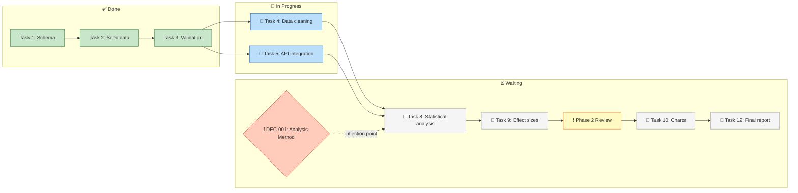

# Scenario 13: Critical Path Visualization

Verify that the Critical Path section communicates the dependency chain effectively for complex projects. Tests whether the current text format is sufficient or whether a mermaid diagram would better serve the user's need to quickly grasp the project shape.

## Context

The user wants to glance at the Critical Path and immediately understand: what's the sequence, who owns each step, what's blocking what. For simple projects (3-4 steps), a numbered list works. For complex projects with parallel branches and decision gates, a visual representation communicates faster.

## State

- Phase 1: 3 tasks done, 2 in progress
- Phase 2: 5 tasks pending (1 blocked by DEC-001, 2 blocked by Phase 1, 2 ready when Phase 1 completes)
- Phase 3: 3 tasks pending (blocked by Phase 2)
- DEC-001: proposed (inflection point), blocks task 8
- Multiple parallel-eligible paths exist
- Human and Claude tasks interleaved on the critical path

---

## Trace 13A: Current text format (numbered list)

- **Path:** dashboard.md → Critical Path format hints; work.md → Critical Path Generation

### Current format (from dashboard.md format hints)

```markdown
## 🛤️ Critical Path

**Next steps to completion:**

1. 🤖 **Claude**: Finish data cleaning (task 4) — *blocks step 2*
2. 🤖 **Claude**: Finish API integration (task 5) — *blocks step 3*
3. ❗ **You**: Resolve DEC-001 (Analysis Method) — *inflection point, blocks step 4*
4. 🤖 **Claude**: Run statistical analysis (task 8) — *blocks step 5*
5. 🤖 **Claude**: Calculate effect sizes (task 9) — *blocks step 6*
6. ❗ **You**: Review Phase 2 results — *phase checkpoint, blocks step 7*
7. 🤖 **Claude**: Generate publication charts (task 10) — *blocks step 8*
8. 👥 **Both**: Final report compilation (task 12) — *blocks completion*

*8 steps remaining on critical path*
```

### Strengths

- Clear owner indicators (❗/🤖/👥)
- Sequential steps are easy to follow
- Blocking relationships shown

### Limitations for complex projects

- Doesn't show parallel branches (tasks 4 and 5 could run in parallel but appear sequential)
- Doesn't visually distinguish decision gates from implementation steps
- Doesn't show which steps are already done vs upcoming
- Long list (8+ steps) requires reading carefully — not glanceable
- Can't show convergence points (where parallel paths meet)

### Pass criteria

- [ ] Owner indicators are present on every step
- [ ] Blocking relationships are stated
- [ ] User can determine "what do I need to do" vs "what is Claude doing" at a glance
- [ ] The format works for projects with <= 5 critical path steps

### Fail indicators

- Steps listed without owner indicators
- No blocking relationships shown (just a flat list)
- Parallel paths shown as sequential (misleading about what can happen concurrently)
- User can't quickly find their own action items in a long list

---

## Trace 13B: Mermaid diagram format (proposed enhancement)

- **Path:** extension-patterns.md → Mermaid Diagram Patterns

### Proposed Critical Path as mermaid



### Advantages over text format

- Parallel paths visible at a glance (T4 and T5 branch and converge)
- Decision gates visually distinct (diamond shape, different color)
- Done/Active/Waiting states use color coding
- Human action items highlighted (yellow)
- Convergence points show where parallel work must synchronize
- Status is glanceable without reading 8 numbered items

### Rendering considerations

- Mermaid renders in VS Code with extensions, GitHub markdown, and most markdown previewers
- If the editor doesn't render mermaid, the code block is still readable (node labels contain the key info)
- Diagram can group related tasks into subgraph boxes (reducing visual clutter)

### When to use which format

| Project complexity | Tasks on critical path | Parallel branches | Recommended format |
|-------------------|----------------------|-------------------|-------------------|
| Simple | 1-4 | None | Numbered list |
| Medium | 5-8 | 1-2 | Either (user preference) |
| Complex | 8+ | 2+ | Mermaid diagram |

### Pass criteria

- [ ] extension-patterns.md defines a mermaid template for Critical Path
- [ ] The mermaid diagram uses distinct shapes for: tasks (rectangles), decisions (diamonds), gates (special shape)
- [ ] Color coding distinguishes: done (green), active (blue), human-required (yellow), blocked (grey)
- [ ] Parallel branches are visually parallel (not serialized)
- [ ] Task labels include owner indicator and short title
- [ ] The diagram degrades gracefully (readable as code if mermaid doesn't render)

### Fail indicators

- Mermaid diagram loses owner information (no ❗/🤖/👥)
- All nodes look the same (no visual distinction between types)
- Diagram is too complex to parse (too many nodes without grouping)
- No fallback for environments that don't render mermaid

---

## Trace 13C: Hybrid approach (summary + diagram)

### Proposed structure

```markdown
## 🛤️ Critical Path

**You:** Resolve DEC-001 (Analysis Method) → *inflection point, blocks Phase 2*
**Claude:** 2 tasks in progress, 5 tasks ready after your action
**Next milestone:** Phase 2 start (after DEC-001 + Phase 1 completion)

<details>
<summary>Dependency diagram</summary>

[mermaid diagram here]

</details>
```

### Advantages

- Summary line gives the instant answer: "What's blocking me?"
- User action item is the FIRST thing shown (not buried in step 7 of 12)
- Diagram available on demand (expandable) for those who want detail
- Works in editors that support HTML `<details>` tags

### Pass criteria

- [ ] Critical Path has a 1-3 line summary that answers "what's blocking completion?"
- [ ] User action items appear before Claude action items
- [ ] Detailed dependency chain is available but doesn't dominate the section
- [ ] Format works in standard markdown editors

### Fail indicators

- Summary is just "8 steps remaining" without saying what the next user action is
- User action buried after 5 Claude steps
- Detail section is always expanded (defeats the purpose of being collapsible)
