# Scenario 13: Critical Path Visualization

Verify that the critical path one-liner in the Progress section communicates the dependency chain effectively for complex projects. Tests whether the current one-liner format is sufficient or whether a mermaid diagram would better serve the user's need to quickly grasp the project shape.

## Context

The user wants to glance at the critical path one-liner and immediately understand: what's the sequence, who owns each step, what's blocking what. For simple projects (3-4 steps), the one-liner works well. For complex projects with parallel branches and decision gates, a supplementary mermaid diagram may communicate faster.

## State

- Phase 1: 3 tasks done, 2 in progress
- Phase 2: 5 tasks pending (1 blocked by DEC-001, 2 blocked by Phase 1, 2 ready when Phase 1 completes)
- Phase 3: 3 tasks pending (blocked by Phase 2)
- DEC-001: proposed (inflection point), blocks task 8
- Multiple parallel-eligible paths exist
- Human and Claude tasks interleaved on the critical path

---

## Trace 13A: Text format with parallel branch notation

- **Path:** dashboard.md → Progress section (critical path one-liner); work.md → Critical Path Generation

### Current format (from work.md § Critical Path Generation)

The critical path is a one-liner within the Progress section, with `[ | ]` notation for parallel branches:

```markdown
# Sequential only:
**Critical path:** ❗ Resolve DEC-001 → 🤖 Build API → 🤖 Phase verification → Done *(3 steps)*

# With parallel branches:
**Critical path:** ❗ Resolve DEC-001 → [🤖 Data cleaning | 🤖 API integration] → 🤖 Analysis → Done *(4 steps)*
```

### Strengths

- Glanceable — entire critical path in one line
- Owner indicators (❗/🤖/👥) show who owns each step
- Parallel branches visible via `[step A | step B]` notation — shows fork/join structure
- User actions stand out because they're fewer
- Step count includes all parallel steps

### Design constraints

- Max 3 branches per `[ | ]` group (more → collapse to `[🤖 N parallel tasks]`)
- No nested brackets — flatten to separate groups
- Mixed-owner parallel branches show each owner: `[❗ Review | 🤖 Build]`

### Pass criteria

- [ ] Owner indicators are present on every step in the one-liner
- [ ] Arrow notation shows sequential flow
- [ ] Parallel branches use `[ | ]` notation showing fork/join points
- [ ] User can determine "what do I need to do" vs "what is Claude doing" at a glance
- [ ] The format works for projects with <= 6 critical path steps
- [ ] Step count in `*(N steps)*` includes parallel branches

### Fail indicators

- Steps listed without owner indicators
- One-liner is so long it wraps multiple times (defeating the purpose)
- User can't quickly find their own action items in the line
- Parallel branches shown as sequential (losing the parallelism information)
- Critical path is a numbered list instead of a one-liner (old format)

---

## Trace 13B: Mermaid diagram format (proposed enhancement)

- **Path:** extension-patterns.md → Mermaid Diagram Patterns

### Proposed Critical Path as mermaid

```mermaid
flowchart LR
    subgraph done["✅ Done"]
        T1[Task 1: Schema] --> T2[Task 2: Seed data]
        T2 --> T3[Task 3: Validation]
    end

    subgraph active["🔄 In Progress"]
        T4[🤖 Task 4: Data cleaning]
        T5[🤖 Task 5: API integration]
    end

    subgraph blocked["⏳ Waiting"]
        DEC1{❗ DEC-001: Analysis Method}
        T8[🤖 Task 8: Statistical analysis]
        T9[🤖 Task 9: Effect sizes]
        GATE1[❗ Phase 2 Review]
        T10[🤖 Task 10: Charts]
        T12[👥 Task 12: Final report]
    end

    T3 --> T4
    T3 --> T5
    T4 --> T8
    T5 --> T8
    DEC1 -.->|inflection point| T8
    T8 --> T9
    T9 --> GATE1
    GATE1 --> T10
    T10 --> T12

    classDef done fill:#c8e6c9,stroke:#2e7d32
    classDef active fill:#bbdefb,stroke:#1565c0
    classDef human fill:#fff9c4,stroke:#f57f17
    classDef decision fill:#ffccbc,stroke:#bf360c
    classDef blocked fill:#f5f5f5,stroke:#9e9e9e

    class T1,T2,T3 done
    class T4,T5 active
    class DEC1 decision
    class GATE1 human
    class T8,T9,T10,T12 blocked
```



### Advantages over text format

- Parallel paths visible at a glance (T4 and T5 branch and converge)
- Decision gates visually distinct (diamond shape, different color)
- Done/Active/Waiting states use color coding
- Human action items highlighted (yellow)
- Convergence points show where parallel work must synchronize
- Status is glanceable without reading 8 numbered items

### Rendering considerations

- Mermaid renders in VS Code with extensions, GitHub markdown, and most markdown previewers
- If the editor doesn't render mermaid, the code block is still readable (node labels contain the key info)
- Diagram can group related tasks into subgraph boxes (reducing visual clutter)

### When to use which format

| Project complexity | Tasks on critical path | Parallel branches | Recommended format |
|-------------------|----------------------|-------------------|-------------------|
| Simple | 1-4 | None | One-liner (sequential) |
| Medium | 5-8 | 1-2 | One-liner with `[ \| ]` notation |
| Complex | 8+ | 2+ | One-liner + inline Project Overview diagram |

### Pass criteria

- [ ] work.md § "Project Overview Diagram" defines the generation rules; extension-patterns.md describes the pattern
- [ ] The mermaid diagram uses distinct shapes for: tasks (rectangles), decisions (diamonds), gates (special shape)
- [ ] Color coding distinguishes: done (green), active (blue), human-required (yellow), blocked (grey)
- [ ] Parallel branches are visually parallel (not serialized)
- [ ] Task labels include owner indicator and short title
- [ ] The diagram degrades gracefully (readable as code if mermaid doesn't render)

### Fail indicators

- Mermaid diagram loses owner information (no ❗/🤖/👥)
- All nodes look the same (no visual distinction between types)
- Diagram is too complex to parse (too many nodes without grouping)
- No fallback for environments that don't render mermaid

---

## Trace 13C: Hybrid approach (one-liner + optional diagram)

### Current structure

The critical path one-liner lives inside the Progress section, with parallel branch notation:

```markdown
## 📊 Progress

| Phase | Done | Total | Status |
...

**Critical path:** ❗ Resolve DEC-001 → [🤖 Data cleaning | 🤖 API integration] → ❗ Review → 🤖 Phase 3 → Done *(5 steps)*

*This week: 3 tasks completed*
```

For complex projects (4+ remaining tasks), an inline Mermaid diagram in the Progress section supplements the one-liner with a full dependency overview.

### Advantages

- One-liner gives the instant answer: "What's the sequence?"
- User action items (❗) stand out visually
- Diagram available on demand for complex projects (separate file, not inline)
- No section overhead — it's one line within Progress

### Pass criteria

- [ ] Critical path one-liner answers "what's blocking completion?" in one line
- [ ] User action items (❗) appear visibly in the line
- [ ] For complex projects (4+ remaining tasks), an inline Mermaid diagram appears in the Progress section
- [ ] One-liner format works in all markdown editors

### Fail indicators

- One-liner is just "8 steps remaining" without saying what the next user action is
- User action buried among many Claude steps
- Critical path takes more than 2 lines (should be a one-liner)
